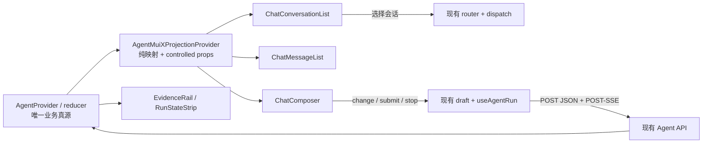

# AI 研究工作台 — 前端设计（v3 重设计）

> 状态：✅ 已实现并验收（2026-08-04）
> 创建日期：2026-08-04
> 路由：`/agent`、`/agent/:conversationId`
> 主入口：`src/sections/agent/view/agent-view.tsx`
> 设计视角：资深金融产品经理 + 资深二级市场研究员 + 资深 UI/UE 设计师
> 实施边界：只重构 UI 与展示桥接层；Agent API、POST-SSE、状态机、权限和业务流程保持不变

---

## 一、功能要点提炼与补充（PM 视角）

### 1.1 用户原始诉求复述

本轮必须同时满足用户此前给出的全部约束：

> “那开始调研一下这一块的ui重构吧，这里的界面太丑了，据我所知andt design x就是做这种ai交互的库，你可以调研一下，当然我并不是限制你只能用这个库，你可以看看还有没有其他更合适的ui库，能够适配到我们mui风格的，做好技术调研，出一个方案以及对应的ui稿”

> “你是不是跑偏了范围，我让你做的ui重构你怎么还涉及功能重构呢”

> “重新设计吧，可以用mui x”

> “@mui/x-chat我都完全搜不到代码里面有啊？你用在哪了？”

> “重新设计吧，我服了”

纠偏结论：

- 真正使用 `@mui/x-chat`，不能只参考外观或只写进设计文档。
- 保持 UI-only，不把接入 UI 库扩张成 Agent runtime、API 或业务状态重写。
- 提交对应 UI 稿，覆盖完成、执行、失败和移动端，不只给文字描述。
- 建立可机器检查的验收门禁，杜绝“等价实现”被描述成“已经接入”。

### 1.2 模块定位与价值主张

- 30 秒内：让研究员看清“研究命题、当前结论、执行状态、引用依据”。
- 3 分钟内：完成追问、核对数据口径、检查工具记录、保存研究报告。
- 边界：本模块负责 AI 研究交互与结果核验，不新增策略配置、行情详情或会话治理能力。

### 1.3 功能要点提炼

| # | 功能点 | 用户决策场景 | 数据来源 | 本轮变化 |
| --- | --- | --- | --- | --- |
| 1 | 会话导航 | 切换历史研究、继续上下文 | 现有会话列表接口 | 用 `ChatConversationList` 重做展示 |
| 2 | 研究命题 | 确认当前问题与发送状态 | 现有用户消息 | 从巨型右侧气泡改为紧凑命题块 |
| 3 | 研究正文 | 阅读模型输出和富响应块 | 现有消息与 SSE 投影 | 用 `ChatMessageList` 承载列表，保留现有 renderer |
| 4 | 执行轨迹 | 判断运行阶段、工具成功或失败 | 现有 run/tool call 状态 | 合并为紧凑 disclosure，不展示私有思维链 |
| 5 | 证据核验 | 核对引用、发布方、日期和数据口径 | 现有 citations/provenance | 使用 `ChatMessageSources` + 既有口径组件 |
| 6 | 连续追问 | 输入、发送、停止、恢复草稿 | 现有 draft/run 回调 | 使用 `ChatComposer` 复合组件 |
| 7 | 模型与辅助动作 | 选择模型、查看报告/记忆/通知 | 现有权限与回调 | 只重排顶部动作 |

### 1.4 资深从业者补充

- 突出“结论—依据—数据日期”链路。研究文本漂亮但无法追溯，比普通聊天更危险。
- 区分“执行轨迹”和“思考过程”。前者来自阶段、工具、错误和引用；后者若后端未提供，不模拟、不补写。
- 把用户问题呈现为“研究命题”，减少社交聊天气泡感，更接近投研工作台。
- 保留工具失败、模型截断、断线恢复等异常的高可见度；完成态才弱化技术信息。
- 避免在证据栏添加置信分、来源评级等后端不存在的推断字段。

### 1.5 待确认清单

- [x] **Q1：精确锁定 `@mui/x-chat@9.0.0-alpha.15`。** 同时锁定其运行时所需的 `@mui/icons-material@7.3.10`。
- [x] **Q2：采用“受控投影桥”方案。** 现有 `AgentProvider` 保持唯一业务真源；MUI X Chat 只消费投影并把 UI 事件回调给现有 hooks。
- [x] **Q3：采用“Research Dossier + Live Trace”。** 用户问题为左对齐研究命题块，Assistant 为研究正文，工具与证据降为可核验侧层。

未收到反对意见时，阶段二按以上推荐项实施。

---

## 二、现状盘点与不足

### 2.1 现有功能与代码基线

| 区域 | 入口文件 | 当前实现 | 关键行为 |
| --- | --- | --- | --- |
| 页面壳 | `view/agent-view.tsx` | `AgentProvider` + `AgentShell` | 路由会话 ID、满高工作区 |
| 总编排 | `components/agent-shell.tsx` | 372 行 MUI Core 组合 | 会话、消息、运行、证据、报告、记忆、通知 |
| 会话栏 | `components/conversation-sidebar.tsx` | MUI List + 搜索 + Drawer | 新建、选择、分页、活动运行标记 |
| 消息列表 | `components/message-viewport.tsx` | `react-virtuoso` | 历史分页、底部跟随、回到最新 |
| 消息正文 | `components/message-item.tsx` | 自定义消息与富块 | Markdown、表格、图表、K 线、财务、风险 |
| Composer | `components/composer.tsx` | MUI `InputBase` | IME、10k、草稿、发送、停止 |
| 工具记录 | `components/tool-call-card.tsx` | MUI Accordion | 摘要、详情、失败与进行状态 |
| 证据 | `citation-list.tsx`、`evidence-rail.tsx` | 自定义列表/侧栏 | citations、provenance、移动 Drawer |
| 业务状态 | `state/*`、`hooks/*` | normalized reducer + hooks | generation、sequence、恢复、取消、重试 |
| 网络 | `src/api/agent.ts`、`agent-stream.ts` | POST JSON + POST-SSE | Agent 全链路请求和流恢复 |

Agent section 当前约 6,105 行；扫描未发现 `TODO/FIXME/HACK/XXX`。复杂度主要来自已落地能力，不应在 UI 重构中重写。

### 2.2 API 与事件映射（保持不变）

| 场景 | 现有端点 | MUI X UI 触发点 | 业务归属 |
| --- | --- | --- | --- |
| 新建会话 | `POST /agent/conversations/create` | 外部“新建研究”按钮 | `useAgentRun` |
| 会话列表 | `POST /agent/conversations/list` | `ChatConversationList` 投影 | `useConversationList` |
| 会话详情 | `POST /agent/conversations/detail` | 顶部标题/模型 | `useConversation` |
| 历史消息 | `POST /agent/conversations/messages/list` | `ChatMessageList.onReachTop` | `useConversation` |
| 发送问题 | `POST /agent/messages/send` | `ChatComposer` submit 回调 | `useAgentRun.send` |
| 运行事件 | `POST /agent/runs/events`，`text/event-stream` | 消息/状态投影刷新 | `streamAgentRun` |
| 运行状态 | `POST /agent/runs/status` | 顶部状态带 | `useAgentRun` |
| 停止运行 | `POST /agent/runs/cancel` | Composer 停止按钮 | `useAgentRun.stop` |
| 重新生成 | `POST /agent/runs/regenerate` | 消息动作 | `useAgentRun.regenerate` |
| 工具记录 | `POST /agent/runs/tool-calls/list` | 执行轨迹 disclosure | `useAgentToolCalls` |
| 模型目录/更新 | `POST /agent/models/list`、`POST /agent/conversations/model/update` | 顶部模型控件 | 现有模型组件 |

禁止新增 query string、GET、URL path ID 或 MUI X 自带的第二套后端请求。

### 2.3 已确认问题

| # | 严重性 | 问题 | 影响 |
| --- | --- | --- | --- |
| 1 | P0 | `package.json` 和 `src/` 中 `@mui/x-chat` 为 0 处 | 已确认方案与真实实现不一致 |
| 2 | P0 | 旧稿允许“门禁失败后 MUI Core 等价实现” | 为静默偏离方案留下出口 |
| 3 | P0 | 当前宽屏中央留白过大，用户问题块过宽 | 研究主线松散，视觉像空日志页 |
| 4 | P1 | MUI Core 手工组件承担聊天列表、Composer、来源结构 | 重复维护可访问性、键盘和流式 UI 细节 |
| 5 | P1 | 完成、运行、失败态结构差异不够明确 | 用户难以快速判断当前可执行动作 |
| 6 | P1 | 工具、引用、口径仍有多层框体 | 正文阅读被技术信息打断 |
| 7 | P1 | 旧稿同时写“选择性接入”和“未引入” | 文档不可作为阶段二施工合同 |

### 2.4 MUI X Chat 官方能力核验

核验日期：2026-08-04。

| 项目 | 官方现状 | 本项目判断 |
| --- | --- | --- |
| 版本 | npm 当前 `9.0.0-alpha.15`，官方标记 unstable | 必须精确锁版，不使用 `^` |
| 兼容 | React 17/18/19；MUI Material `^7.3.0` 或 MUI 9 | 当前 React 19.1、MUI 7.3.10 满足 peer 范围 |
| 会话 | `ChatConversationList` 提供 listbox、选中态、slots | 接入，替换会话列表展示层 |
| 消息 | `ChatMessageList` 提供滚动容器、自动滚动、顶部/底部回调、roving focus；当前 alpha 不提供真实虚拟化 | 接入并替换 Agent 内 `Virtuoso` 展示层；消息行补 `content-visibility` |
| 输入 | `ChatComposer` 提供 IME-safe、自动增长、Enter/Shift+Enter、disabled | 接入，保留 10k 与停止按钮定制 |
| 来源 | `ChatMessageSources` 提供有序来源结构与 slots | 接入，承载 citations 视觉结构 |
| 状态 | `ChatProvider` 支持 controlled messages/conversations/composer | 仅作受控投影，不成为业务真源 |
| 全量壳 | `ChatBox` 自建 Provider/runtime | 不接入，避免接管现有 SSE/状态机 |

官方资料：

- [MUI X Chat 总览](https://mui.com/x/react-chat/)
- [Controlled state](https://mui.com/x/react-chat/backend/controlled-state/)
- [ChatMessageList](https://mui.com/x/react-chat/material/message-list/)
- [ChatConversationList](https://mui.com/x/react-chat/material/conversation-list/)
- [ChatComposer](https://mui.com/x/react-chat/material/composer/)
- [Material customization](https://mui.com/x/react-chat/material/customization/)
- [npm 包页](https://www.npmjs.com/package/@mui/x-chat)

### 2.5 重设计应对策略

| 对应问题 | 应对策略 | 取舍说明 |
| --- | --- | --- |
| 1、2、7 | 增加依赖/导入/锁版/生产渲染四重门禁 | 不能用文档引用代替代码接入 |
| 3 | 采用 256 / flexible / 312 布局；正文形成 880px 研究卷宗列 | 降低空旷感，不压缩图表宽度 |
| 4 | 用 MUI X Chat 接管聊天展示组件与可访问性骨架 | Agent reducer/API 继续原样工作 |
| 5 | 完成、执行、失败分别定义状态带、轨迹与 CTA | 不新增业务状态，只映射现有字段 |
| 6 | 正文无卡片；命题块、执行 disclosure、证据栏各有单一边界 | 每层只保留一种结构线索 |

---

## 三、功能细化拆分

### 3.1 模块结构树

```text
AgentView
└─ AgentProvider（现有业务真源，不改）
   └─ AgentShell
      └─ AgentMuiXProjectionProvider（新增受控投影桥）
         ├─ ResearchConversationRail
         │  ├─ NewResearchButton（现有回调）
         │  ├─ ConversationSearch（现有客户端过滤）
         │  ├─ ChatConversationList（MUI X，必须）
         │  └─ LoadMore / Error / Empty
         ├─ ResearchThread
         │  ├─ ThreadHeader（标题、模型、既有动作）
         │  ├─ RunStateStrip（现有 run 投影）
         │  ├─ ChatMessageList（MUI X，必须）
         │  │  └─ ResearchMessageRenderer
         │  │     ├─ ResearchQuestion
         │  │     └─ AssistantDossier
         │  │        ├─ ExistingRichBlocks
         │  │        ├─ ExecutionDisclosure
         │  │        └─ ExistingMessageActions
         │  └─ ResearchComposer
         │     ├─ ChatComposer（MUI X，必须）
         │     ├─ ChatComposerTextArea
         │     ├─ ChatComposerHelperText
         │     └─ ChatComposerSendButton / ExistingStopButton
         └─ EvidenceRail / Drawer
            ├─ ChatMessageSources（MUI X，必须）
            └─ DataProvenance（现有）
```

### 3.2 受控投影桥

职责：把现有 Agent entity 映射为 MUI X Chat 需要的 UI model；不反向复制业务状态机。

| 投影 | 输入 | 输出 | 反向事件 |
| --- | --- | --- | --- |
| 会话 | `AgentConversationEntity[]` | `ChatConversation[]` | active ID → 现有路由/选择回调 |
| 消息 | `AgentMessageEntity[]` | `ChatMessage[]` | 消息动作继续调用现有 handlers |
| Composer | `useComposerDraft` | controlled `composerValue` | change/submit → 现有 draft/run |
| Streaming | `AgentRunProjection` | UI disabled/streaming/label | stop/continue → 现有 run callbacks |
| 来源 | citations/provenance | `ChatMessageSources` items | 链接/定位保持现有语义 |

约束：

- `AgentProvider` 始终是唯一业务真源。
- `ChatProvider` 不自行请求会话、历史消息或 SSE。
- adapter 的 `sendMessage` 只委托 `useAgentRun.send()`；不解析响应流。
- MUI X 的内部消息变更不得直接 dispatch 到 Agent reducer。
- 映射函数必须纯函数、可单测、缺失字段不造默认业务值。

### 3.3 会话栏

- 保留新建、客户端搜索、选择、加载更多、错误重试、运行标记。
- 使用 `ChatConversationList` 的 `itemContent` slot 展示标题、最后时间和运行状态。
- 取消日期大分组标题，改为每项相对时间，降低视觉断层；排序仍由现有接口结果决定。
- 桌面宽 256px；`900–1199px` 降为 232px；`<900px` 使用现有 Drawer。
- 选中态使用主题 `action.selected` + 左侧 2px 主色线；不使用整块蓝色高亮。

### 3.4 研究消息

#### ResearchQuestion

- 左对齐显示，不再渲染占据半屏的右侧灰色气泡。
- 使用“研究命题”眉题 + 问题正文 + 时间/发送状态。
- 最大宽 720px，背景只用 `action.hover`；失败时增加错误文案和重试，不靠红色填满整块。

#### AssistantDossier

- 使用“研究助理 / 当前状态 / 时间”作为 12px 元信息行。
- 正文最大宽 880px，14–15px、行高 1.75；段落、表格、图表继续使用现有 renderer。
- 引用编号内联；完整来源进入证据栏或移动 Drawer。
- 完成态不重复渲染“完成”大标签；失败/断线才提升语义色。
- 保留复制、重新生成、保存报告动作，默认弱化，hover/focus 时增强。

### 3.5 执行轨迹

- 合并 `RunStatusBar` 与成功工具记录的视觉层级，但不合并业务数据。
- 运行中显示当前阶段、进度、已用工具数和停止按钮。
- 成功后收起为“执行轨迹 · N 个工具 · 已完成”；失败时自动展开失败项。
- Tool 详情继续按需请求并脱敏；参数、结果、错误保持现有字段。
- 不显示模型私有思维链。只有后端未来明确提供可展示 reasoning summary 时，才映射 MUI X `reasoning` part；本期不预留假内容。

### 3.6 证据栏

- `>=1440px` 固定 312px；`1200–1439px` 可收起；`<1200px` 使用右侧 Drawer。
- `ChatMessageSources` 展示编号、标题/域名、发布方、定位、时间。
- `DataProvenance` 展示数据日期、时区、报告期、质量标记；不造置信分。
- 证据默认跟随最新有引用的 Assistant 消息；用户点正文引用时定位同一序号。
- 无引用时整栏不占位，正文扩展；不是显示空白面板。

### 3.7 Composer

- 使用 `ChatComposer`、`ChatComposerTextArea`、`ChatComposerHelperText`、`ChatComposerSendButton`。
- 继续支持 IME、Enter 发送、Shift+Enter 换行、10,000 字、草稿恢复、发送中、防重复提交。
- 禁用附件能力；不增加模板、工具 chips、反馈或 page context。
- 运行中用现有停止按钮替换发送按钮；MUI X 只负责外壳、输入和交互基础。
- 错误提示放在 Composer 上方单行 Alert；不挤压正文滚动位置。

### 3.8 数据流与状态管理



---

## 四、UI/UE 设计（设计师视角）

### 4.1 设计概念关键词

**Research Dossier + Live Trace**

- Research Dossier：回答像可核验的研究卷宗，不像客服聊天气泡。
- Live Trace：运行阶段、工具和错误形成轻量轨迹，不抢占研究正文。

### 4.2 视觉规范

| 项目 | 规范 |
| --- | --- |
| 色彩 | 仅用 `theme.palette.*` / `varAlpha(...)`；涨红跌绿只用于金融数据 |
| 字体 | 沿用项目 DM Sans；Barlow 用于标题和 tabular numerics；中文使用现有回退链 |
| 字号 | 正文 14–15px；辅助信息 12px；绝不低于 12px |
| 间距 | 8px 基线；消息区主要节奏 16/24/32px |
| 边界 | 只给命题块、Composer、执行 disclosure、证据栏边界；正文无外框 |
| 圆角 | Composer 12px；局部交互面 8px；正文不做大圆角卡片 |
| 动效 | 150–200ms；只用于展开、状态切换和新内容；遵循 reduced motion |
| 数字 | 时间、计数、金额使用 tabular nums，金融格式沿用现有工具函数 |

### 4.3 桌面布局

```text
┌────────────── 256 ──────────────┬──────────────── flexible ───────────────┬──── 312 ────┐
│ AI 研究               新建研究 │ 贵州茅台基本面与估值   模型  报告  ⋯    │ 证据  3      │
│ [搜索会话…………………]           ├───────────────────────────────────────────┤ 引用来源      │
│ ▌贵州茅台基本面与估值  13:42   │ 执行完成 · 2 个工具 · 数据日期 08-04    │ 01 公司概览   │
│   沪深300今日表现      12:18   ├───────────────────────────────────────────┤    数据库/日期 │
│   组合回撤归因          昨天    │ 研究命题                                  │ 02 财务指标   │
│                                  │ 请分析贵州茅台最新经营与估值风险          │    报告期/定位 │
│                                  │                                           │               │
│                                  │ 研究助理 · 已完成 · 13:42                 │ 数据口径      │
│                                  │ 核心结论                                  │ 交易日        │
│                                  │ 正文、指标、表格、图表、内联引用 [01]     │ 时区/复权     │
│                                  │                                           │ 质量标记      │
│                                  │ [执行轨迹 · 2 个工具 · 已完成]            │               │
│                                  │ 复制   重新生成   保存报告                 │               │
│                                  ├───────────────────────────────────────────┤               │
│                                  │ [继续追问………………………………………]  发送 │               │
└──────────────────────────────────┴───────────────────────────────────────────┴───────────────┘
```

布局规则：

- 研究正文内部最大宽 880px；页面宽度增加时扩大边距，不把段落拉成超长行。
- 用户命题与 Assistant 正文统一左轴，消除左右气泡造成的视线跳跃。
- 证据栏与正文同高滚动，但不跟随 token 自动跳动；点击引用才定位。
- Composer 与正文同轴，固定在 thread 底部，不遮挡最后一条消息。

### 4.4 移动布局

```text
┌──────────────────────────────┐
│ ☰  贵州茅台基本面与估值  ⋯  │
├──────────────────────────────┤
│ 执行中 · 财务分析       停止 │
├──────────────────────────────┤
│ 研究命题                     │
│ 请分析贵州茅台最新经营与风险 │
│                              │
│ 研究助理 · 13:42             │
│ 核心结论                     │
│ 正文 / 表格 / 图表           │
│ [执行轨迹 · 2]               │
│ [引用与数据口径 · 3]         │
│ 复制  重新生成  保存报告     │
├──────────────────────────────┤
│ [继续追问…………………………] │
│ 0 / 10,000             发送  │
└──────────────────────────────┘
```

- 会话列表使用左 Drawer；证据使用右 Drawer；两者不同时打开。
- 顶部只保留标题、会话按钮和更多菜单；模型/报告/记忆/通知进入更多菜单。
- 宽表和图表只在自身容器横向滚动；页面不横向滚动。
- Composer 适配安全区，输入增长最多 6 行。

### 4.5 状态稿

| 状态 | 顶部状态带 | 消息区 | Composer 主动作 |
| --- | --- | --- | --- |
| 完成 | 收敛为一行摘要 | 正文优先，轨迹折叠 | 发送 |
| 执行中 | 阶段 + 进度 + 停止 | 流式正文 + 当前工具 | 停止 |
| 断线恢复 | warning + 重连次数 + 继续 | 保留已有正文 | 视 run 状态禁用/停止 |
| 失败 | error + 原因 | 失败位置展开，给重试/重新生成 | 发送或重试 |
| 空态 | 不显示状态带 | 一句研究引导，无模板卡阵列 | 发送 |
| 无可展示内容 | 完成摘要 | 显示专业空文案 | 继续追问 |

### 4.6 关键交互

- 使用 `ChatMessageList` 原生 roving focus；Enter 进入消息动作，Escape 返回消息行。
- 使用 `onReachTop` 触发现有历史分页；列表离底后显示 MUI X 回到底部 affordance。
- 引用编号可键盘聚焦，激活后打开/定位证据栏。
- Tool disclosure 默认：运行中展开、成功收起、失败展开。
- 切换会话时保持每会话草稿隔离；不得在 projection 层清空草稿。
- 发送成功后由现有 `useAgentRun` 决定清空；MUI X 不抢先制造成功状态。

### 4.7 暗色 / 亮色适配

- 使用 `theme.vars.palette.*Channel` 和 `varAlpha()`；不写死 hex/rgba。
- 亮色背景使用 neutral 层次区分 workspace/thread；暗色依靠 divider 和 surface 明度，不加发光边框。
- focus-visible 使用主题 primary ring；错误同时使用图标、文案和语义色。
- 阴影只用于 Composer 与 Drawer，使用主题 shadow 或通道色。

---

## 五、实现步骤与要点

### 5.1 实现顺序

#### Phase 0：兼容门禁

1. 精确安装 `@mui/x-chat@9.0.0-alpha.15`，禁止 caret/tilde。
2. 验证 React 19.1、MUI 7.3.10、Vite 6、TypeScript 5.8 构建兼容。
3. 建立最小受控 Provider 测试，验证 messages/conversations/composer 不切换受控模式。
4. 验证 `ChatMessageList` 历史分页、自动滚动、中文 IME 和自定义 renderer。
5. 任一硬门禁失败：停止实施、保留失败证据并回报；禁止静默切回 MUI Core。

#### Phase 1：投影桥与主题隔离

1. 新增 `components/mui-x-chat/agent-mui-x-provider.tsx`。
2. 新增 `components/mui-x-chat/agent-chat-mappers.ts` 与单元测试。
3. 在局部 wrapper 集中使用 `@mui/x-chat/headless`；Agent 业务层不直接依赖 MUI X 类型。
4. 增加 `themeAugmentation` 类型导入和 `MuiChat*` 局部主题 overrides。

#### Phase 2：会话与消息

1. `conversation-sidebar.tsx` 接入 `ChatConversationList`，保留搜索、新建、加载更多、Drawer。
2. `message-viewport.tsx` 接入 `ChatMessageList`，用 `renderItem` 复用现有 `MessageItem`。
3. 用 MUI X `onReachTop/autoScroll` 替换 Agent 内 Virtuoso 行为；其他模块如仍使用 Virtuoso，不移除依赖。
4. 验证历史插入不跳位、流式离底不强制跟随、会话切换不串消息。

#### Phase 3：Composer 与证据

1. `composer.tsx` 改用 `@mui/x-chat/ChatComposer` 子路径组件。
2. 通过 controlled composer value 接回 `useComposerDraft`；submit 委托现有 `handleSubmit`。
3. 运行中保留现有 stop callback；禁用 attachments/helper 中不存在的功能。
4. `evidence-rail.tsx` 用 `ChatMessageSources` 重排 citations；provenance 继续使用现有组件。

#### Phase 4：视觉与状态

1. 落地 ResearchQuestion、AssistantDossier、ExecutionDisclosure。
2. 覆盖完成、执行、断线、失败、空态、无正文状态。
3. 覆盖 320/375/768/1024/1440/1920 与 light/dark。
4. 保持报告、记忆、通知、模型控件及权限判断原样。

#### Phase 5：验证与文档

1. 执行 Agent 单测、projection contract 测试、真实 POST-SSE 联调。
2. 执行项目规定的 ESLint fix → ESLint 零输出 → build。
3. 使用浏览器核对依赖导入、DOM class（`.MuiChat*`）、响应式和状态稿。
4. 构建通过后更新功能盘点、已有功能汇总和 README 状态。

### 5.2 明确文件落点

| 文件 | 允许改动 | 禁止改动 |
| --- | --- | --- |
| `package.json` / `yarn.lock` | 精确新增 `@mui/x-chat` | 模糊版本范围 |
| `components/mui-x-chat/*` | Provider、mapper、局部 wrapper | API/SSE 实现 |
| `conversation-sidebar.tsx` | MUI X 会话列表展示 | 会话业务规则 |
| `message-viewport.tsx` | MUI X 消息列表/滚动 | 消息 reducer |
| `composer.tsx` | MUI X Composer 结构 | 草稿/发送业务逻辑 |
| `evidence-rail.tsx` | MUI X 来源结构 | 新来源字段/评分 |
| `agent-shell.tsx` | 组合与布局 | Agent hooks 行为 |
| `state/*` | 原则上零改 | generation/sequence/竞态逻辑 |
| `src/api/agent*.ts` | 零改 | 端点、请求、SSE parser |

### 5.3 依赖接入验收合同

阶段二完成时，下列命令必须命中生产代码；只命中文档视为失败：

```bash
rg -F '"@mui/x-chat": "9.0.0-alpha.15"' package.json
rg -F "@mui/x-chat/headless" src/sections/agent
rg -F "@mui/x-chat/ChatConversationList" src/sections/agent
rg -F "@mui/x-chat/ChatMessageList" src/sections/agent
rg -F "@mui/x-chat/ChatComposer" src/sections/agent
rg -F "@mui/x-chat/ChatMessageSources" src/sections/agent
```

运行时还必须在真实 `/agent/:conversationId` DOM 中出现对应 `.MuiChat*` 根类；tree-shaken、测试专用、未渲染 wrapper 均不算接入。

### 5.4 风险与回退

| 风险 | 预防 | 回退 |
| --- | --- | --- |
| alpha API 变动 | 精确锁版 + wrapper + contract test | 回退到上一提交，不伪装完成 |
| 双状态源 | controlled projection，Agent 单向真源 | 关闭 MUI X projection feature flag |
| 列表滚动回归 | 历史插入/离底/流式 E2E | 单独回退 MessageList 接入 |
| Composer 双发 | adapter 委托 + sendingRef + IME 测试 | 单独回退 Composer 接入 |
| 富块丢失 | `renderItem` 继续使用现有 `MessageItem` | 回退消息 renderer，不动 API |
| 主题污染 | `MuiChat*` 局部 overrides | 删除局部 override，不动全局 palette |

回退只代表本次实现失败，不得把 MUI Core fallback 宣称为本设计已完成。

---

## 六、验收方式与细节

### 6.1 范围验收

- [x] Agent API method、URL、body、SSE 事件和调用时序无设计性变化。
- [x] `state/agent-reducer.ts` 的 generation/sequence/恢复/取消逻辑无功能重写。
- [x] 工具权限、模型权限、报告/记忆/通知权限条件保持一致。
- [x] 未增加附件、模板、反馈、上下文注入、会话治理等功能。
- [x] 不展示后端未提供的思考过程或置信分。

### 6.2 MUI X Chat 真实性验收

- [x] `package.json` 精确依赖 `@mui/x-chat@9.0.0-alpha.15`。
- [x] 生产代码真实导入 `ChatProvider`、`ChatConversationList`、`ChatMessageList`、`ChatComposer`、`ChatMessageSources`。
- [x] `/agent/:conversationId` 运行时 DOM 可见对应 `.MuiChat*` 组件根类。
- [x] 依赖不是仅出现在设计文档、测试、dead code 或未挂载 wrapper。
- [x] 兼容门禁通过，没有使用 MUI Core 等价实现代替。

### 6.3 功能同等验收

- [x] 新建、选择、搜索、分页会话与移动 Drawer 行为一致。
- [x] 发送、IME、Shift+Enter、10k、草稿、停止、断线恢复、重试、重新生成一致。
- [x] 历史消息分页、离底跟随和回到最新由组件测试覆盖；长列表行启用 `content-visibility`。
- [x] Tool 详情、Citation、Provenance、富响应块字段无损。
- [x] 复制、保存报告、模型、记忆、报告、通知入口完整；移动模型入口收纳到更多菜单。
- [x] 模型真实调用 `get_stock_overview` 并展示引用与数据口径。

### 6.4 UI/UE 验收

- [x] 1024/1440px 保持 232px 会话栏与宽正文；≥1720px 使用 256px 会话栏、312px 证据栏，正文列不超过 880px。
- [x] 用户问题显示为紧凑研究命题，不出现占半屏的巨型气泡。
- [x] Assistant 正文无整块外框；执行轨迹与证据各只有一层边界。
- [x] 完成、执行、停止、失败状态使用既有真实状态映射。
- [x] 375/1024/1440/1920 浏览器验收无页面级横向滚动；宽表/图表仅自身滚动。
- [x] light/dark、hover、focus-visible、disabled、error 使用 MUI 状态与主题 token。
- [x] 字号不低于 12px，颜色全部来自主题 token。

### 6.5 可访问性验收

- [x] 会话列表保留 listbox/option 与 `aria-selected`。
- [x] 消息列表使用 MUI X roving focus 语义。
- [x] 流式 live region 不逐 token 重复播报。
- [x] Composer label、字数、错误和发送/停止有可理解名称。
- [x] Drawer 使用 MUI 焦点约束并返回触发入口。
- [x] 引用编号可键盘访问并定位证据项。

### 6.6 工程门禁

```bash
node_modules/.bin/eslint --fix "src/**/*.{ts,tsx}"
node_modules/.bin/eslint "src/**/*.{ts,tsx}"
yarn build
yarn vitest run src/sections/agent/__tests__ src/api/__tests__/agent.test.ts src/api/__tests__/agent-stream.test.ts
```

并执行真实后端：创建会话 → 发送研究问题 → 模型调用工具 → POST-SSE 完成 → 引用/证据展示 → 停止/恢复 → 会话切换续接。

### 6.7 验收样例

| 样例 | 输入 | 必看结果 |
| --- | --- | --- |
| 正常完成 | 查询 `600519.SH` 最新概览与可用日期 | Tool、正文、引用、provenance 完整 |
| 长正文 | 多指标基本面与估值分析 | 消息行延迟渲染、表格/图表、证据定位正常 |
| 执行失败 | 模型结构化输出截断或工具失败 | 失败原因明确、轨迹展开、可重试 |
| 用户离底 | 流式时上滚阅读旧段落 | 不强制拉回底部，出现回到最新 |
| 中文输入 | 拼音输入法候选阶段按 Enter | 不误发送；候选确认后可发送 |
| 移动端 | 375px 查看同一会话 | 会话/证据 Drawer、Composer 安全区正常 |
