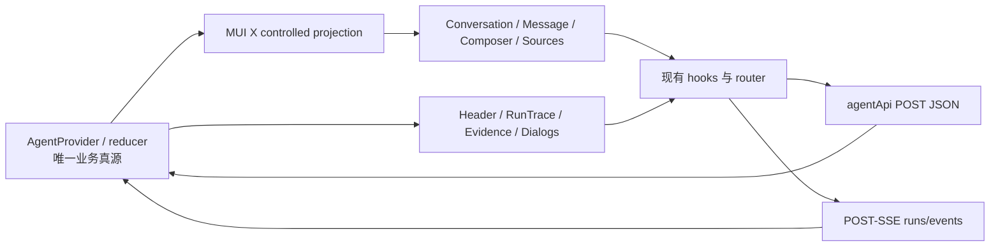

# AI 研究工作台 — 前端设计（v4 重设计）

> 状态：📐 设计确认，待实现（阶段一）
> 创建日期：2026-08-05
> 路由：`/agent`、`/agent/:conversationId`
> 主入口：`src/sections/agent/view/agent-view.tsx`
> 设计视角：资深金融产品经理 + 资深二级市场研究员 + 资深 UI/UE 设计师
> 实施边界：桌面端 UI-only；Agent API、POST-SSE、业务状态机、工具权限与业务流程保持不变

---

## 一、功能要点提炼与补充（PM 视角）

### 1.1 用户原始诉求复述

本版必须同时满足用户已明确表达的要求：

> “那开始调研一下这一块的ui重构吧，这里的界面太丑了，据我所知andt design x就是做这种ai交互的库，你可以调研一下，当然我并不是限制你只能用这个库，你可以看看还有没有其他更合适的ui库，能够适配到我们mui风格的，做好技术调研，出一个方案以及对应的ui稿”

> “你是不是跑偏了范围，我让你做的ui重构你怎么还涉及功能重构呢”

> “重新设计吧，可以用mui x”

> “@mui/x-chat我都完全搜不到代码里面有啊？你用在哪了？”

> “不要直接改了，先出设计稿吧，我被你搞怕了，所有功能，全部出设计稿，现在你先出一个最新的给我看看是否合格”

> “图要16:9的，你之前出的这个图给谁看呢？”

> “可以，看着不错，就按这个设计吧”

> “不需要设计移动端”

据此锁定：

- 采用已确认的 16:9 “金融研究卷宗 + 实时执行轨迹”视觉方向。
- 全部核心桌面功能先有设计稿，再进入代码实现。
- 继续真实使用 MUI X Chat，但不谎称 MUI X 提供整页壳、报告、记忆、通知等业务组件。
- 不重构 API、SSE、reducer、工具权限或业务流程。
- 不设计、不实现移动端；本版只验收 1440px 与 1920px 桌面布局。

### 1.2 模块定位与价值主张

- **30 秒内**：看清研究命题、当前结论、执行阶段、工具状态、证据来源和数据口径。
- **3 分钟内**：完成追问、模型切换、工具核验、引用定位、报告保存、记忆维护和通知重试。
- **核心差异**：把聊天记录组织为“可核验的研究卷宗”，不是把普通聊天气泡换一套颜色。
- **相邻边界**：不承接策略配置、个股详情、回测、组合管理；不把后台已有但当前 Agent 页面未接入的定时研究偷偷加入本次 UI-only 重构。

### 1.3 功能要点提炼

| # | 功能点 | 用户决策场景 | 数据来源 | v4 设计稿 |
| --- | --- | --- | --- | --- |
| 1 | 会话导航 | 新建、搜索、切换、继续历史研究 | 会话列表/详情接口 | 主工作台 |
| 2 | 研究命题 | 确认当前问题、时间与发送状态 | 用户消息 | 主工作台 |
| 3 | 运行阶段 | 判断理解、取数、分析、结论阶段 | run progress / plan summary | 主工作台、状态矩阵 |
| 4 | 研究卷宗 | 阅读结论、指标、正文和风险 | Assistant 消息与富块 | 主工作台 |
| 5 | 工具轨迹 | 核验工具、耗时、参数和失败 | tool-calls | 主工作台、状态矩阵 |
| 6 | 引用与口径 | 核对来源、日期、时区、单位、复权 | citations / provenance | 主工作台 |
| 7 | 连续追问 | 输入、发送、停止、草稿恢复 | Composer / run | 主工作台、状态矩阵 |
| 8 | 模型选择 | 切换可用模型并理解禁用原因 | 模型目录/会话模型 | 模型选择稿 |
| 9 | 长期记忆 | 创建、纠正、删除研究偏好 | memory API | 长期记忆稿 |
| 10 | 研究报告 | 预览、保存、查看、删除研究报告 | report API | 报告稿 |
| 11 | 通知投递 | 配置、测试渠道，检查并重试失败投递 | notification API | 通知稿 |
| 12 | 异常恢复 | 处理断线、模型失败、工具失败、空内容 | run/error projection | 状态矩阵 |

### 1.4 资深从业者补充（行业最佳实践）

- **先结论，再依据，再口径**：正文首屏必须能把判断与证据编号对应起来。
- **展示研究计划摘要，不展示私有思维链**：只展示后端明确提供的 `planSummary`、阶段、工具、引用和错误。
- **保持数据时点显性**：行情交易日、财务报告期、获取时间、时区、单位和复权不能藏进 Tooltip。
- **异常时保留已有研究成果**：断线或工具失败不得清空已收到的正文；重连使用事件游标，避免重复消息。
- **报告默认不带技术噪音**：引用和数据口径默认进入报告；执行轨迹默认关闭，由研究员选择。
- **敏感记忆不外泄**：敏感记忆不得进入共享报告或通知正文，保存前必须二次确认。

### 1.5 待确认清单

- [x] **Q1：视觉方向。** 采用 1920×1080 主稿所示的深色“Research Dossier + Live Trace”。
- [x] **Q2：交付范围。** 只做桌面端；不设计移动端。
- [x] **Q3：技术边界。** UI-only；API、POST-SSE、reducer、权限和业务流程不改。
- [ ] **Q4：定时研究。** 后端已有 schedule 接口，但当前 Agent 页面没有对应 UI；本次排除。如需接入，单独进入新功能设计，不混入本次重构。

---

## 二、现状盘点与不足

### 2.1 现有功能与组件清单

| 区域 | 入口文件 | 当前技术 | 已有行为 |
| --- | --- | --- | --- |
| 页面壳 | `view/agent-view.tsx` | `AgentProvider` + `AgentShell` | 路由会话 ID、工作区组合 |
| 总编排 | `components/agent-shell.tsx` | MUI Core | 会话、消息、证据、模型、记忆、报告、通知 |
| MUI X 桥 | `components/mui-x-chat/*` | `ChatProvider` 受控投影 | 会话/消息/Composer UI 映射 |
| 会话栏 | `conversation-sidebar.tsx` | `ChatConversationList` + MUI | 新建、搜索、选择、分页、运行标记 |
| 消息列表 | `message-viewport.tsx` | `ChatMessageList` | 历史分页、自动跟随、回到最新 |
| 消息正文 | `message-item.tsx` | `ChatMessage` + 自研 renderer | Markdown、表格、图表、K 线、财务、风险 |
| Composer | `composer.tsx` | `ChatComposer` | IME、10k、草稿、发送、停止 |
| 工具记录 | `tool-call-card.tsx` | MUI Accordion | 状态、耗时、脱敏输入/输出、错误 |
| 证据 | `citation-list.tsx`、`evidence-rail.tsx` | `ChatMessageSources` + MUI | citations、provenance |
| 模型 | `conversation-model-control.tsx` | MUI Select/Menu | 模型目录、可用性、会话模型更新 |
| 长期记忆 | `agent-memory-drawer.tsx` | MUI Drawer/Dialog | 列表、创建、纠正、删除、确认 |
| 报告 | `agent-report-*.tsx` | MUI Dialog | 两阶段预览、保存、报告库、详情、删除 |
| 通知 | `notification-channel-settings.tsx` | MUI Dialog/Tabs | 渠道 CRUD、测试、投递历史、重试 |
| 状态与网络 | `state/*`、`hooks/*`、`src/api/agent*.ts` | reducer + POST-SSE | generation、sequence、恢复、取消、重试 |

### 2.2 API 端点映射

当前前端 facade 共 34 个 JSON 端点，另有 1 个 POST-SSE 事件端点。本次设计使用现有接口，不新增、不改 URL 和请求方式。

| 分类 | 端点 | 设计入口 |
| --- | --- | --- |
| 会话 | `conversations/create`、`list`、`detail`、`messages/list`、`model/update` | 会话栏、Header、历史分页 |
| 模型 | `models/list` | 模型选择稿 |
| 消息/运行 | `messages/send`、`runs/regenerate`、`status`、`cancel`、`tool-calls/list` | Composer、状态带、执行轨迹 |
| 流事件 | `runs/events`（POST-SSE） | 流式正文、阶段、重连 |
| 记忆 | `memories/list`、`create`、`update`、`delete` | 长期记忆稿 |
| 报告 | `reports/list`、`detail`、`save`、`delete` | 报告稿 |
| 通知 | `notification-channels/list/create/update/test/delete`、`notification-deliveries/list/retry` | 通知稿 |
| 定时研究 | `schedules/create/list/detail/update/pause/resume/delete/executions/list` | 本次不接入 |

### 2.3 MUI X Chat 真实使用边界

| 能力 | 当前真实使用 | v4 决策 |
| --- | --- | --- |
| `ChatProvider` | 受控 UI 投影 | 保留；Agent reducer 仍为唯一业务真源 |
| `ChatConversationList` | 会话列表语义骨架 | 保留；重做 slot 内容和视觉密度 |
| `ChatMessageList` / `ChatMessage` | 消息列表和消息语义 | 保留；研究卷宗由自研 renderer 负责 |
| `ChatComposer*` | 输入、辅助文案、发送按钮 | 保留；外观按确认稿重做 |
| `ChatMessageSources` | 引用来源结构 | 保留；与右侧证据栏联动 |
| 页面壳/Header/状态带 | MUI Core 自研 | 继续自研；MUI X 没有这些业务组件 |
| 富块/工具/报告/记忆/通知 | MUI Core 自研 | 继续自研；不得描述为 MUI X 全页能力 |

结论：v4 是“MUI X Chat 交互骨架 + MUI Core 金融研究业务界面”。“整页 MUI X Chat”不是该库的真实能力边界。

### 2.4 不足之处（按严重性排序）

| # | 严重性 | 问题 | 影响 |
| --- | --- | --- | --- |
| 1 | P0 | 自研消息 renderer 决定大部分视觉，v3 接入 MUI X 后外观变化过小 | 用户无法感知重构价值 |
| 2 | P0 | 页面仍像稀疏聊天/日志页，研究正文缺少明确的信息架构 | 结论、证据和动作难以扫读 |
| 3 | P1 | `planSummary` 已进入状态，但主界面没有展示 | 用户只见结果，不见可核验计划摘要 |
| 4 | P1 | Run 状态带与 Tool 轨迹分裂 | 阶段、工具和失败原因不在一条链上 |
| 5 | P1 | Tool 详情按展开加载，未展开时无法可靠展示真实数量 | 摘要容易误导 |
| 6 | P1 | Citation/Provenance 在正文和证据栏重复 | 信息噪音增加 |
| 7 | P1 | 证据跟随“最新含引用回答”，缺少当前消息选择联动 | 多轮研究时来源对应关系模糊 |
| 8 | P1 | 证据栏仅超宽屏固定，1440px 主区仍可能显空或证据入口过弱 | 常用桌面尺寸体验不稳定 |
| 9 | P2 | 完成、运行、断线、失败、空内容的视觉差异不足 | 用户难判断下一步动作 |
| 10 | P2 | Header 图标入口语义弱 | 模型、记忆、通知、报告和证据可发现性低 |

### 2.5 重设计应对策略

| 对应问题 | v4 策略 | 取舍 |
| --- | --- | --- |
| 1、2 | 采用研究卷宗层级：命题 → 结论 → 指标 → 风险 → 轨迹 | 保留富块 renderer，只改布局与视觉 |
| 3、4、5 | 将计划摘要、阶段和工具放进同一执行系统；运行展开、完成收起、失败自动展开 | 不新增后端字段，不伪造工具数量 |
| 6、7 | 正文只保留内联编号；详情集中到证据栏，并随当前回答联动 | 需要新增纯 UI selected-message projection |
| 8 | 1920 固定证据栏；1440 改为可收起桌面 Drawer | 不压缩正文到不可读宽度 |
| 9 | 为运行、重连、失败、空内容定义独立状态结构和 CTA | 仍映射既有业务状态 |
| 10 | Header 保留图标，增加 Tooltip、状态点和打开态反馈 | 不增加新入口 |

---

## 三、功能细化拆分

### 3.1 模块结构树

```text
AgentView
└─ AgentProvider（业务真源，保持不变）
   └─ AgentShell
      └─ AgentMuiXProjectionProvider
         ├─ ResearchConversationRail
         │  ├─ NewResearchButton
         │  ├─ ConversationSearch
         │  ├─ ChatConversationList
         │  └─ Pagination / Loading / Empty / Error
         ├─ ResearchThread
         │  ├─ ResearchThreadHeader
         │  │  ├─ ConversationModelControl
         │  │  ├─ Memory / Notification / Report / Evidence actions
         │  │  └─ Run status chip
         │  ├─ ResearchRunTrace
         │  │  ├─ Plan summary
         │  │  ├─ Stage progress
         │  │  └─ Tool disclosures
         │  ├─ ChatMessageList
         │  │  ├─ ResearchQuestion
         │  │  └─ AssistantDossier
         │  │     ├─ Markdown / Table / Chart / Kline / Financial / Risk
         │  │     ├─ Inline citations
         │  │     └─ Copy / Regenerate / Save report / Feedback
         │  └─ ResearchComposer
         ├─ EvidenceRail / desktop Drawer
         ├─ AgentMemoryDrawer
         ├─ AgentReportDialog
         └─ NotificationSettingsDialog
```

### 3.2 会话栏

- **职责**：建立研究上下文导航，不承担会话治理。
- **数据**：会话列表、当前会话 ID、消息数、相对时间、后台运行/新消息状态。
- **交互**：新建、搜索、选择、加载更多；选择后更新路由并保留每会话草稿。
- **状态**：使用 Skeleton 加载；失败显示原位重试；无结果区分“没有会话”和“搜索无匹配”。
- **边界**：长标题单行省略，Tooltip 展示完整标题；运行点、完成勾、未读点语义互斥。

### 3.3 Thread Header 与模型选择

- **职责**：展示当前研究身份和低频操作。
- **数据**：标题、证券标识、run 状态、模型目录、当前模型、权限。
- **交互**：模型菜单显示工具能力、延迟倾向、禁用原因；切换成功更新 Header，失败保留原值。
- **状态**：运行中切换只影响后续消息；不得中断当前 run。
- **边界**：记忆、通知、报告、证据均保留 Tooltip、红点/计数和打开态，不增加文本按钮占宽。

### 3.4 研究命题与 Assistant Dossier

- **职责**：把聊天消息组织为研究问题与结构化结果。
- **数据**：消息 role、createdAt、status、blocks、citations、provenance。
- **交互**：复制、重新生成、保存报告、反馈；引用编号定位证据项。
- **状态**：用户发送失败显示小型重试；Assistant 流式更新不整卡闪烁；无正文但有轨迹时保留轨迹。
- **边界**：不新增置信度业务字段；确认稿已改为后端可验证的“已关联引用 2 条”。

### 3.5 运行计划与工具轨迹

- **职责**：呈现可公开核验的执行过程。
- **数据**：`planSummary`、progress、tool start/complete/fail、model start/fallback、run status/error。
- **交互**：运行中展开当前工具；成功收起；失败自动展开；详情按需请求。
- **状态**：running / reconnecting / completed / failed / cancelled。
- **边界**：不得显示私有 Chain-of-Thought；工具输入/输出、Webhook、错误摘要继续脱敏。

### 3.6 引用与数据口径

- **职责**：建立结论到来源和数据时点的可追溯链路。
- **数据**：citation number/title/publisher/url/time/location 与 provenance 字段。
- **交互**：点击正文编号打开并定位；选择不同 Assistant 回答时刷新当前证据集合。
- **状态**：无引用时不占固定空栏；来源失败显示不可访问原因，不删除正文编号。
- **边界**：不生成来源评级、可信分或后端不存在的定位信息。

### 3.7 Composer 与流恢复

- **职责**：连续追问、停止和草稿恢复。
- **数据**：per-conversation draft、10,000 字计数、run 状态、发送错误。
- **交互**：Enter 发送、Shift+Enter 换行、IME 安全、发送防重、停止、继续接收。
- **状态**：running 显示停止；reconnecting 禁止重复发送；failed 允许重新生成或继续追问。
- **边界**：不新增附件、模板、工具选择或单次记忆开关；确认稿已移除这些占位。

### 3.8 长期记忆

- **职责**：管理研究偏好、数据口径和关注项。
- **数据**：内容、分类、敏感级别、来源、创建/更新时间、到期时间。
- **交互**：搜索、分类筛选、创建、纠正、删除；保存前确认，删除使用确认对话框。
- **状态**：列表加载/错误/空态；写入失败保留草稿；敏感项使用文案与图标双重标识。
- **边界**：敏感记忆不得进入共享报告或通知正文。

### 3.9 研究报告

- **职责**：把当前回答转成可保存、可继续更新的研究产物。
- **数据**：标题、正文、citations、provenance、报告类型、会话来源、保存时间。
- **交互**：预览、勾选引用/口径/轨迹、确认保存、报告库搜索、详情、删除。
- **状态**：预览生成中、保存中、保存失败、报告库空态、详情加载失败。
- **边界**：保存为两阶段确认；执行轨迹默认不进入报告。

### 3.10 通知与投递

- **职责**：管理站内和签名 Webhook 渠道，核验投递结果。
- **数据**：渠道类型、名称、启停、测试状态、签名配置摘要、投递状态、错误摘要、幂等键。
- **交互**：新建、编辑、测试、启停、删除；筛选历史、查看详情、失败重试。
- **状态**：测试中、测试失败、投递成功/失败/跳过、重试中。
- **边界**：密钥不回显；请求/响应摘要必须脱敏；重试不得创建重复通知。

### 3.11 数据流与状态管理



约束：v4 不新增第二套 store，不让 `ChatProvider` 自行请求，不把 MUI X 内部状态直接 dispatch 成业务实体。

---

## 四、UI/UE 设计（设计师视角）

### 4.1 设计概念关键词

**Research Dossier + Live Trace**

- **Research Dossier**：研究结果像编辑过的投研卷宗；标题、结论、指标、风险和来源形成明确阅读顺序。
- **Live Trace**：计划摘要、阶段与工具形成一条细轨迹；运行和失败时增强，完成后退居次级。

### 4.2 视觉基线与项目规范

| 项目 | 设计规则 |
| --- | --- |
| 主题 | 深色稿为已确认基线；实现必须使用 theme token 保持亮色可用 |
| 色彩 | 主色只表达选择/动作；绿/黄/红用于成功、运行、失败；涨跌色只用于金融数据 |
| 字号 | 生产 UI 最小 12px；正文 14–15px；标题 16–24px；数字使用 tabular nums |
| 间距 | 8px 基线；组件内 8/12/16，区域间 16/24 |
| 边界 | 1px divider 区分 surface；阴影只用于 Composer、Menu、Drawer、Dialog |
| 圆角 | Menu/Drawer 内容 8–12px；报告纸张 10px；禁止大面积胶囊卡片 |
| 动效 | 150–200ms；只用于状态、展开、定位和 Dialog/Drawer；支持 reduced motion |
| 实现 | 只用 `theme.palette.*`、`theme.vars.palette.*Channel`、`varAlpha()`，禁止硬编码颜色 |

### 4.3 1920px 主布局

```text
┌──── Dashboard Nav ────┬── 264 会话轨 ──┬──────────── Research Thread ────────────┬── 320 证据 ──┐
│ QuantDesk             │ AI 研究         │ Header：标题 / 状态 / 模型 / 辅助动作 │ 引用与证据    │
│                       │ 新建 / 搜索      ├─────────────────────────────────────────┤ 来源卡        │
│                       │ 会话列表         │ 计划摘要 + 四阶段进度                  │ 数据口径      │
│                       │                 │ 研究命题                                │ 本轮事件      │
│                       │                 │ Assistant Research Dossier             │               │
│                       │                 │ 结论 / 指标 / 风险 / 引用              │               │
│                       │                 │ 执行轨迹 / 消息动作                     │               │
│                       │                 ├─────────────────────────────────────────┤               │
│                       │                 │ Composer                                │               │
└───────────────────────┴─────────────────┴─────────────────────────────────────────┴───────────────┘
```

- Dashboard Nav 继续由现有 `DashboardLayout` 管理。
- Agent 会话轨固定 256–264px；Thread 使用剩余宽度；证据栏 312–320px。
- 研究正文段落最大行宽约 880px，但卷宗表格/图表可使用 Thread 可用宽度。
- Composer 固定于 Thread 底部，不覆盖最后一条消息。

### 4.4 1440px 桌面布局

- 会话轨缩为 240–248px。
- 证据栏默认收起为 Header 入口；点击后打开 360px 桌面 Drawer。
- Thread 最小有效宽度 760px；低于该宽度优先收起证据，不压缩正文。
- 不设计 1200px 以下布局；移动端与窄屏不在本版范围。

### 4.5 关键组件设计

- **研究命题**：右对齐紧凑块，最大占 Thread 72%；眉题与时间同一行。
- **Research Dossier**：单层 surface；编辑式大标题、摘要、指标带、结论/风险分栏。
- **执行轨迹**：与计划摘要共用一条信息链；成功绿、运行黄、失败红，同时配图标和文案。
- **证据栏**：当前回答的来源、口径和事件集中展示；正文只保留引用编号。
- **模型菜单**：展示名称、能力、延迟倾向、可用状态和禁用原因。
- **长期记忆**：桌面右 Drawer，展示分类、敏感级别、来源和到期时间。
- **研究报告**：大尺寸三栏 Dialog：报告库、纸张预览、保存设置。
- **通知**：大尺寸两栏 Dialog：渠道与投递历史；失败详情就地展开。
- **状态矩阵**：运行、重连、失败、空内容分别定义告警、正文处理和主 CTA。

### 4.6 16:9 设计稿清单

所有稿件均为 1920×1080；不包含移动端。

| # | 稿件 | 覆盖功能 | 文件 |
| --- | --- | --- | --- |
| 01 | 主工作台 | 会话、Header、命题、卷宗、进度、工具、证据、Composer | `ai-research-v4-16x9.png` |
| 02 | 模型选择 | 可用模型、能力、禁用原因、切换说明 | `ai-research-v4-model-16x9.png` |
| 03 | 长期记忆 | 列表、分类、敏感级别、来源、到期、创建 | `ai-research-v4-memory-16x9.png` |
| 04 | 研究报告 | 预览、报告库、保存选项、确认 | `ai-research-v4-report-16x9.png` |
| 05 | 通知投递 | 渠道、测试、启停、投递历史、失败重试 | `ai-research-v4-notifications-16x9.png` |
| 06 | 状态矩阵 | 运行、断线恢复、失败、空内容 | `ai-research-v4-states-16x9.png` |

设计稿目录：`/Users/chenpengxiang/.codex/visualizations/2026/08/04/019fca20-ef5f-7c33-9544-c676fbb97892/`

### 4.7 微交互

- 点击正文引用编号：打开/聚焦证据栏并闪烁对应来源边界 200ms。
- Tool disclosure：运行中保持展开；成功后自动收起一次；失败保持展开。
- 切换会话：保留各会话草稿，不清空后台运行状态。
- 流式离底：不强制拉回，显示“回到最新”；点击后恢复自动跟随。
- 模型切换：成功使用 Snackbar；失败保留原模型并给出服务端原因。
- 报告/记忆/通知写操作：按钮显示局部 loading，不冻结整个 Dialog/Drawer。

### 4.8 亮色 / 暗色适配

- 暗色依靠 surface 明度与 divider 建层，不使用发光边框。
- 亮色依靠 background/paper/action 层次，不把暗色 hex 直接反转。
- focus-visible 使用 `primary.main` ring；错误同时具备图标、文案和语义色。
- 阶段二需提供 1440/1920 light/dark 共四张真实运行时截图；无需新增另一套设计稿。

---

## 五、实现步骤与要点

### 5.1 实现顺序

1. **锁定边界**：保留 `@mui/x-chat@9.0.0-alpha.15` 受控投影，不改 API/SSE/reducer。
2. **页面壳**：在 `agent-shell.tsx` 落地 1920/1440 桌面列宽、Header 和证据栏策略。
3. **会话/消息**：保留 MUI X 列表语义，重做 slot 和 `MessageItem` 的卷宗层级。
4. **运行轨迹**：把 `planSummary`、progress 和 tool projection 组合到新展示组件；不改业务事件。
5. **证据联动**：增加纯 UI 当前消息选择；正文编号与证据项双向定位。
6. **Composer**：按确认稿重做 MUI X Composer 外观；只展示现有输入、字数、发送/停止和自动记录说明。
7. **模型/记忆/报告/通知**：按 02–05 稿重排现有组件，不增加 API。
8. **状态覆盖**：完成 06 稿中的 running/reconnecting/failed/empty/no-content。
9. **测试与验收**：更新对应 `__tests__/`，执行 lint、build、Agent 测试与真实 POST-SSE 联调。
10. **阶段三文档**：实现与验收通过后再更新功能盘点、功能汇总和 README 状态。

### 5.2 文件级施工边界

| 文件 | 允许改动 | 禁止改动 |
| --- | --- | --- |
| `components/agent-shell.tsx` | 布局、入口、Dialog/Drawer 组合 | 改 run 调用时序 |
| `conversation-sidebar.tsx` | slot、密度、选中/运行视觉 | 改搜索/分页/路由规则 |
| `message-item.tsx` | ResearchQuestion / Dossier 层级 | 改消息实体 |
| `run-status-bar.tsx` | 计划摘要与阶段视觉 | 伪造 progress/tool 数量 |
| `tool-call-card.tsx` | disclosure 与失败展示 | 改按需加载与脱敏 |
| `evidence-rail.tsx` | 当前回答联动与桌面 Drawer | 生成新来源字段 |
| `composer.tsx` | MUI X 外观与 CTA | 改草稿、发送、停止逻辑 |
| `conversation-model-control.tsx` | Menu 内容与状态 | 改服务端模型目录 |
| `agent-memory-drawer.tsx` | 桌面 Drawer 布局 | 改记忆规则 |
| `agent-report-*.tsx` | 三栏预览/报告库布局 | 改保存流程 |
| `notification-channel-settings.tsx` | 两栏设置/历史布局 | 改签名、幂等与重试规则 |
| `state/*`、`hooks/*` | 原则上零改；仅必要的 UI selector | 重写 reducer/SSE 状态机 |
| `src/api/agent*.ts` | 零改 | 改端点、方法、body、parser |

### 5.3 关键技术点

- 保持 `AgentProvider` 为唯一业务真源；MUI X Chat 只消费纯映射。
- 使用现有 selector 派生“当前回答证据”和“可展示计划摘要”，避免组件内重复扫描实体。
- Tool 数量只在接口返回后显示；未知时显示“查看执行轨迹”，不显示假计数。
- 富块仍受 feature flag 控制；关闭时给出明确降级，不让整个工具记录无提示消失。
- 消息行继续使用 `content-visibility` 或现有列表优化，避免长研究会话渲染退化。
- Header/Drawer/Dialog 使用 MUI Core；Chat 语义组件继续从 `@mui/x-chat` 子路径导入。

### 5.4 风险与回退

| 风险 | 预防 | 回退 |
| --- | --- | --- |
| UI-only 变成功能重写 | 文件边界 + API/reducer 零改检查 | 单独回退展示组件 |
| alpha 组件升级破坏 | 精确锁版 + wrapper + contract test | 保留当前锁版，不临时升级 |
| 证据联动串消息 | 以 message ID 派生，切会话清理 UI selection | 回退到最新回答策略 |
| Tool 摘要不准确 | 未加载不显示数量 | 回退为无数量 disclosure |
| Dialog 信息过密 | 固定三栏/两栏最小宽度，1440 仍完整 | 报告改 2 步 Dialog，不压缩字体 |
| 亮色主题失真 | 全部使用 theme token | 回退局部 override，不改全局 theme |

---

## 六、验收方式与细节

### 6.1 功能验收清单

- [x] 新建、搜索、选择、分页、深链会话保持可用。
- [x] 中文 IME、Enter、Shift+Enter、10k、草稿、停止、防重复发送保持可用。
- [x] 流式、断线恢复、继续接收、取消、重新生成保持现有行为。
- [x] Markdown、表格、图表、K 线、财务指标、风险提示字段无损。
- [x] Tool 状态、耗时、脱敏输入/输出、错误和数据时点完整。
- [x] Citation、Provenance 与当前 Assistant 回答正确联动。
- [x] 模型、记忆、报告、通知全部入口和写操作可用。
- [x] 不展示私有思维链；只展示计划摘要和执行轨迹。
- [x] 不新增定时研究、附件、模板或工具选择功能。
- [x] 不新增移动端专用设计或验收任务；保留原有移动端行为以避免功能回退。

### 6.2 UI/UE 验收清单

- [x] 1920px 与主设计稿保持：会话轨、卷宗、证据栏、Composer 全部可见。
- [x] 1440px 证据使用桌面 Drawer，Thread 不小于 760px。
- [x] 用户问题为紧凑研究命题；Assistant 为结构化卷宗，不是巨型聊天气泡。
- [x] Run/Tool/Plan Summary 形成一条执行链；失败自动展开失败项。
- [x] 完成、运行、重连、失败、空内容的主 CTA 与状态稿一致。
- [x] 模型、记忆、报告、通知弹层不越界、不低于 12px 字号。
- [x] Light/Dark 均无硬编码颜色问题，focus/disabled/error 清晰。
- [x] 通过阶段二末 `web-design-guidelines` 审查。

### 6.3 MUI X Chat 真实性验收

- [x] 生产代码仍真实导入并渲染 `ChatProvider`、`ChatConversationList`、`ChatMessageList`、`ChatComposer`、`ChatMessageSources`。
- [x] `/agent/:conversationId` DOM 可见对应 `.MuiChat*` 根类。
- [x] MUI X Chat 未接管 Agent API、SSE 或业务状态机。
- [x] Header、卷宗、Tool、报告、记忆、通知明确归属 MUI Core/自研业务层，不虚假标注为 MUI X Chat。

### 6.4 性能与质量验收

```bash
node_modules/.bin/eslint --fix "src/**/*.{ts,tsx}"
node_modules/.bin/eslint "src/**/*.{ts,tsx}"
yarn build
yarn vitest run src/sections/agent/__tests__ src/api/__tests__/agent.test.ts src/api/__tests__/agent-stream.test.ts
```

- [x] ESLint 退出码 0 且无输出。
- [x] Build 出现 `✓ built in ...`。
- [x] 长会话流式更新不造成整页重绘；离底阅读不被强制拉回。
- [x] 1440/1920 页面无横向滚动；Dialog/Drawer 不裁切操作区。
- [x] 关键状态、写操作和 MUI X 投影均有组件/契约测试。

### 6.5 真实联调验收样例

| 样例 | 操作 | 必看结果 |
| --- | --- | --- |
| 正常研究 | 查询 `600519.SH` 最新经营与估值风险 | 阶段、Tool、卷宗、引用、口径完整 |
| 模型切换 | 完成后切换可用模型并追问 | 当前运行不受影响，后续消息使用新模型 |
| 工具失败 | 制造工具错误 | 已有正文保留，失败项展开，可重试 |
| SSE 断线 | 流式时中断连接 | 从游标恢复，无重复 token/消息 |
| 无正文 | run 完成但无展示块 | 显示专业空文案，保留轨迹与继续追问 |
| 记忆写入 | 创建敏感且有到期时间的记忆 | 二次确认，标签和期限正确 |
| 报告保存 | 保存当前回答为投资日志 | 预览、引用、口径、报告库记录一致 |
| 通知重试 | 对失败 Webhook 重试 | 幂等、不重复投递、详情脱敏 |
