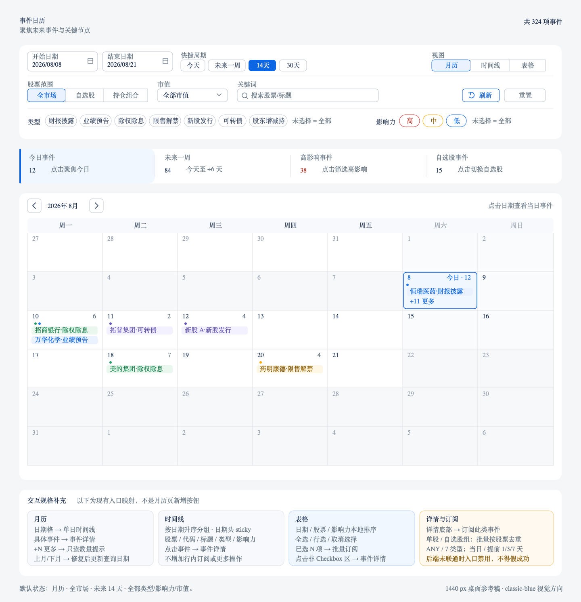

# 事件日历 — 重构 v3 前端设计

> 状态：🟡 Round 2 自动化验收通过；默认 PC 浏览器业务回归待主任务完成<br>
> 验收日期：2026-08-08；完整筛选、三视图同源、详情、订阅、URL 与请求竞态门禁已由定向测试覆盖；不将 Round 1 历史浏览器记录视为本轮完成证据<br>
> 归档说明：实现与定向自动化完成；默认 PC 浏览器回归仍由 active QA 跟踪。<br>
> 创建日期：2026-08-08<br>
> 适用仓库：`client-code`；联调仓库：`server-code`<br>
> 页面入口：`/alert`<br>
> 桌面设计稿：`docs/archive/assets/事件日历-v3-桌面设计稿.png`、`docs/archive/assets/事件日历-v3-桌面设计稿.svg`<br>
> 设计视角：资深金融产品经理 + 事件研究从业者 + UI/UE 设计师<br>
> 设计基线：以 2026-08-08 仓库真实实现为准；功能不变是硬门禁，确认 BUG 单列修复

---

## 一、功能提炼

### 1.1 用户原始诉求

> 2. 事件日历，筛选栏是重灾区

> 记住，功能不变是硬性门禁，除非你发现确认是BUG

本轮只重排筛选控件、收紧信息层级、改善月历密度和三视图一致性。不得新增筛选语义、页头动作或数据字段；现有条件仍即时生效，不改成草稿/应用模式。

### 1.2 页面核心任务

1. 用开始日期、结束日期或快捷周期确定事件窗口。
2. 用全市场/自选股/持仓组合、市值、关键词、7 类事件和 3 级影响力收窄结果。
3. 在月历、时间线、表格间切换观察方式。
4. 从统计入口快速聚焦今日、未来一周、高影响或自选股事件。
5. 打开事件详情，查看个股、详情、指标、历史同类表现和公告。
6. 从详情订阅单事件，或从表格多选后批量订阅。

### 1.3 功能不变硬门禁

| 门禁对象 | 必须保留的现有行为 | v3 允许变化 | 禁止变化 |
| --- | --- | --- | --- |
| 路由/状态 | `/alert`；start/end/scope/wl/pf/types/impact/caps/q/view URL 状态 | 修复非法值和 BUG 后保持深链恢复 | 改路由、删除有效深链 |
| 日期 | 独立“开始日期/结束日期”DatePicker；今天、未来一周、14天、30天四个按钮 | 修正“本周”文案和 14/30 天 off-by-one；紧凑排布 | 合并成新范围控件、增加自定义 Apply、改交易日窗口 |
| 视图 | 月历、时间线、表格 ToggleButtonGroup | 调整位置、密度；修复切 view 重请求 | 删除视图或改变筛选集合 |
| 范围 | `ALL/WATCHLIST/PORTFOLIO`：全市场/自选股/持仓组合 | 视觉重排 | 新增组选择器、删除范围或改变归属语义 |
| 市值 | 全部市值 + 大盘/中盘/小盘单选 | 修复前后端桶映射 | 改成多选或增加新档位 |
| 关键词 | “搜索股票/标题”文本框，200ms 请求去抖 | 修复后端标题搜索或纠正文案 | 增加搜索语法/建议器 |
| 操作 | 筛选区“刷新”“重置” | 调整按钮层级 | 移到页头、改变重置范围 |
| 类型 | 财报披露、业绩预告、除权除息、限售解禁、新股发行、可转债、股东增减持 7 个 Chip 多选 | 调整排列；修复后端类型契约 | 收入高级面板、删除类型、增加 Apply |
| 影响力 | 高/中/低 3 个 Chip 多选 | 调整排列 | 删除等级、改成单选或增加 Apply |
| 统计入口 | 今日事件、未来一周、高影响事件、自选股事件 4 项可点击 | 合并成紧凑分段容器、修正文案 | 变成不可点击 KPI 或增加新指标 |
| 月历 | 上月/下月、日期格、类型点、最多 3 条事件、`+N 更多`；日期进单日时间线，事件开详情 | 修复月份导航；改善密度与键盘语义 | 增加密度模式、未来节点或新动作 |
| 时间线 | 日期升序分组、sticky 日期头、事件行开详情 | 改行布局 | 改排序语义或增加行操作 |
| 表格 | 日期/股票/影响力本地排序；全选/行选；批量订阅；日期/股票/类型/标题/影响力字段 | sticky 与密度优化；修复幽灵选择 | 新增分页、列配置、服务端排序或删除选择 |
| 详情 | 股票/代码、个股链接、类型、影响力、日期、标题、detail、metrics、历史趋势、公告、订阅 | 格式化与空值兜底 | 调用不存在的 calendar/detail、虚构字段 |
| 订阅 | 详情单事件、表格批量；单股/自选股组；ANY/7 类型；当日/提前 1/3/7 天 | 修复后端契约和错误反馈 | 增加页头全局订阅、组合订阅或新提醒时间 |
| API | `apiClient.post()` + Body；日期 `YYYYMMDD` | 修复已确认 DTO/枚举问题 | GET/query string、非 8 位日期 |

### 1.4 本次设计目标

| 目标 | 验收口径 |
| --- | --- |
| 筛选层级清楚 | 1440px 固定三行：日期/周期/视图、范围/市值/关键词/动作、类型/影响力 |
| 条件不丢失 | 所有原控件直接可见；不藏高级筛选、不增加 active rail |
| 请求语义不变 | 条件即时写 URL，200ms 后请求；刷新手动重取；重置清空 URL |
| 三视图一致 | 同一事件集合可在三视图切换；只切 view 不再额外请求（确认 BUG） |
| 入口不越界 | 页头只有标题和总数；订阅只从详情或表格多选进入 |
| 项目风格统一 | 使用现有 MUI、DashboardContent、Iconify、theme tokens 和 A 股涨跌色约定 |

### 1.5 非目标

- 不新增高级筛选 Popover/Drawer、draft、Apply/Cancel、active-chip rail。
- 不新增页头刷新、全局订阅、帮助、板块、密度、导出、研究、热键或列配置。
- 不把 `sectorCodes`、`subTypes`、`dataAsOf`、`currentTradeDate`、`truncated`、`nextCursor` 等类型预留画成现有功能。
- 不新增分页、跨页选择或服务端排序；表格继续使用当前完整前端集合的本地排序。
- 不调用前端声明但服务端不存在的 `POST /api/alert/calendar/detail`。
- 不在阶段一修改 `src/`、后端、汇总文档或 README。

## 二、现状盘点

### 2.1 当前页面与真实能力

| 区域 | 当前能力 | 关键实现 |
| --- | --- | --- |
| 页面编排 | 标题、总事件数、错误、筛选、统计、三视图、详情、订阅 Snackbar | `src/sections/alert/view/alert-calendar-view.tsx` |
| URL 状态 | start/end/scope/wl/pf/types/impact/sectors/caps/q/sort/view 解析与即时写回 | `calendar/use-calendar-state.ts` |
| 数据请求 | 200ms debounce、自动 AbortController、手动刷新、当前先清空旧集合 | `calendar/use-calendar-events.ts` |
| 筛选 | 两日期、四周期、三视图、三范围、单选市值、关键词、刷新/重置、7 类型多选、3 影响力多选 | `calendar/calendar-filters.tsx` |
| 统计 | 今日事件、本周事件（实为未来 7 天）、Top 影响力、自选相关 4 张可点击卡 | `calendar/calendar-stats-row.tsx` |
| 月历 | 本地月份光标、上/下月、日期/类型点/事件条/更多数、日期与事件点击 | `calendar/calendar-grid-view.tsx` |
| 时间线 | 日期升序分组、sticky 日期、事件详情入口 | `calendar/calendar-timeline-view.tsx` |
| 表格 | 日期/股票/影响力本地排序、全选/行选、批量订阅、sticky header | `calendar/calendar-table-view.tsx` |
| 详情 | 列表事件字段、个股链接、历史趋势、公告、订阅此类事件 | `calendar/event-detail-drawer.tsx` |
| 订阅 | 单股/自选股组/批量股票，ANY/7 类型，当日/提前 1/3/7 天 | `calendar/subscribe-dialog.tsx` |

`sectorCodes` 和 `sortBy/sortOrder` 虽可从 URL 解析并进入请求类型，但当前筛选 UI 没有板块或全局排序控件；表格使用自己的本地排序状态。v3 不把这些内部/兼容状态升级成新入口。

### 2.2 筛选栏问题

当前四段内容依靠 `flexWrap` 自然折行：日期/周期/视图、范围/市值/关键词/动作、类型、影响力。问题集中在排版而非功能不足：

1. 第一行包含两个 DatePicker、四个周期按钮和三视图，宽度竞争明显。
2. 第二行范围、搜索和低权重动作同排，刷新/重置容易漂到下一行。
3. 类型与影响力各自占整行，横向留白大，但窄屏又无稳定组序。
4. 即时条件在视觉上没有清晰分组，用户容易把视图切换误认为筛选条件。
5. 后端契约未兑现部分已有控件，造成“看似能筛、实际无效或报错”。

v3 用 CSS Grid/稳定断点重排为三行，保留所有控件与即时请求方式，不引入新的提交机制。

### 2.3 当前前后端契约差异

| 项目 | 前端现状 | 服务端现状 | 处理边界 |
| --- | --- | --- | --- |
| 7 类事件 | UI/类型含 7 类 | DTO 仅 4 类 | CAL-B01 修复；未修前禁用不支持项，不删除入口 |
| scope/组 ID | 发送 ALL/WATCHLIST/PORTFOLIO、wl/pf | whitelist 剥离，结果未收窄 | CAL-B02 修复权限过滤 |
| 市值 | UI 三档：`<100/100–500/≥500亿` | 服务四档阈值不同 | CAL-B03 做请求映射，UI 不改档 |
| 关键词 | placeholder 含“标题” | 只查代码/名称 | CAL-B08 扩 title 或纠正文案 |
| EVENT 订阅 | 前端发送 EVENT_* / EVENT_ANY | 数据模型仅价格规则枚举 | CAL-B04 修复；未联通前不得假成功 |
| 月历历史 | 前端按百分数直接 `toFixed(2)%` | 返回小数收益 | CAL-B06 展示前 ×100 |
| 响应预留 | 前端类型含 dataAsOf/truncated 等可选字段 | 当前 list 只提供 start/end/total/events | 不在 v3 UI 展示或预留位置 |
| detail API | 前端 API 声明 detail | 当前控制器无端点 | 详情继续用列表事件 + history-trend |

### 2.4 已确认 BUG：独立修复轨

下表只列可由当前代码/契约复现的问题；视觉重排不得借机增加功能。

| 编号 | 级别 | 确认问题 | 修复口径 |
| --- | --- | --- | --- |
| CAL-B01 | P0 | 前端可选 7 类，后端 DTO 仅 4 类，后三类会失败 | 补齐服务能力；未完成前 disabled+原因，不允许可点后报错 |
| CAL-B02 | P0 | scope/watchlistId/portfolioId 被 whitelist 丢弃，自选统计点击无真实过滤 | 服务端按当前用户过滤并校验组归属；越权返回 403/404 |
| CAL-B03 | P0 | UI 三档市值与服务四档阈值不一致 | 保持 UI 三档，用 mapper 映射；固定 100/500 亿边界测试 |
| CAL-B04 | P0 | EVENT_* 订阅与 Prisma 价格规则枚举不一致 | 完成事件规则枚举/创建/扫描/去重；未完成前入口禁用且不报成功 |
| CAL-B05 | P1 | 月历上/下月只改本地 cursor，不更新日期或请求；外部日期变化也不复位 cursor | 月份导航更新 start/end；外部 startDate 同步月份 |
| CAL-B06 | P1 | history 小数收益被直接显示成百分比 | 展示前 ×100，null 为“—”，正负号遵循项目约定 |
| CAL-B07 | P1 | 14天/30天用 add(14/30)，含首尾实际为 15/31 天；默认亦为 15 天 | 结束日改为 +13/+29；默认含今天共 14 天 |
| CAL-B08 | P1 | “搜索股票/标题”承诺标题，后端仅搜索代码/名称 | 推荐服务端补 title；否则改文案为“股票代码/名称” |
| CAL-B09 | P1 | 表格 selected Set 不随 events 变化求交集 | 新集合到达后剔除不存在的 row key，批量数量与数组一致 |
| CAL-B10 | P1 | 手动刷新 Controller 不被后续筛选取消，旧响应可能覆盖 | 自动/手动请求共用 request manager 或 sequence |
| CAL-B11 | P1 | 筛选加载前清空 events/total，时间线/表格短暂显示“无事件” | 首载 Skeleton；后续保留旧结果并显示更新中 |
| CAL-B12 | P2 | view 属于 fetch callback 依赖，单纯切换视图也重请求 | query key 排除 view；三视图只重绘同一集合 |
| CAL-B13 | P2 | 月历日期、事件和时间线事件使用 Box onClick，键盘语义不足 | ButtonBase/原生 button 语义，Enter/Space 与 focus ring |
| CAL-B14 | P2 | 快捷按钮/统计写“本周”，实际计算今天至 +6 天 | 统一改名“未来一周”，日期意图不变 |

### 2.5 视觉与交互问题

- 四张大统计卡都是快捷筛选入口，视觉占用大于信息量。
- 月历每格最多显示 3 条事件，密集日期易拥挤；`+N 更多`目前只是数量提示，不是独立动作。
- 时间线股票、代码、标题、类型和影响力同一横排，长文案容易挤压。
- detail/metrics 原始 key 和 history 百分比缺乏业务化格式。
- 事件类型中 IPO/可转债共享 secondary 色，必须用文字/图标共同区分。
- 当前没有页头订阅或帮助；旧稿相关按钮属于虚构入口。

## 三、功能细化

### 3.1 v3 信息架构

```text
事件日历 /alert
├─ 页头：标题 + 共 N 项事件
├─ 筛选工作台（条件即时生效）
│  ├─ 行 1：开始日期、结束日期、今天/未来一周/14天/30天、月历/时间线/表格
│  ├─ 行 2：ALL/WATCHLIST/PORTFOLIO、市值、关键词、刷新、重置
│  └─ 行 3：7 类型多选 + 3 影响力多选
├─ 四统计入口：今日事件 / 未来一周 / 高影响事件 / 自选股事件
├─ 当前视图
│  ├─ 月历
│  ├─ 时间线
│  └─ 表格
├─ 事件详情 Drawer
└─ 订阅 Dialog（详情单事件 / 表格批量）
```

### 3.2 筛选工作台

#### 3.2.1 第一行：时间与观察方式

| 入口 | 当前语义 | v3 施工规格 |
| --- | --- | --- |
| 开始日期 | 独立 DatePicker，写入 start | 保持独立字段，不合并；显示格式由组件负责，Body 固定 `YYYYMMDD` |
| 结束日期 | 独立 DatePicker，写入 end | 与开始日期并排；错误贴近日期组 |
| 今天 | start=end=今天 | 点击立即写 URL 并进入现有请求链 |
| 未来一周 | 今天至 +6 天 | 仅修正“本周”文案 |
| 14天 | 今天至 +13 天（CAL-B07 修复后） | 默认选中态按日期范围推导，不新增 preset 状态 |
| 30天 | 今天至 +29 天（CAL-B07 修复后） | 同上 |
| 月历/时间线/表格 | `view=grid/timeline/table` | 保留 ToggleButtonGroup；置于行尾，与时间条件拉开间距 |

日期变化继续即时提交并沿用当前 DatePicker/API 校验链；本轮不新增独立校验流程或“应用”按钮。

#### 3.2.2 第二行：范围、收窄与动作

- 范围继续用分段按钮：全市场、 自选股、持仓组合，对应 `ALL/WATCHLIST/PORTFOLIO`。不增加具体自选组/组合选择器。
- 市值继续是单选 Select：全部市值、大盘（≥500亿）、中盘（100–500亿）、小盘（<100亿）。
- 关键词继续为单个 TextField。URL 每次键入即时更新，数据请求沿用 200ms debounce；不增加搜索建议或 Enter-only 提交。
- “刷新”调用现有 `refresh()`，只重新获取当前条件；仍位于筛选栏。
- “重置”调用现有 `reset()` 清空全部 search params：日期回默认未来 14 天、scope 回 ALL、类型/影响力/市值/关键词清空、view 回默认月历。不得改成“保留当前视图”。

#### 3.2.3 第三行：类型与影响力

- 事件类型按当前 `EVENT_TYPE_LIST` 顺序保留 7 个多选 Chip：财报披露、业绩预告、除权除息、限售解禁、新股发行、可转债、股东增减持。
- 类型空数组仍表示全部；不新增“全选/清空”、下拉、高级面板或暂存值。
- 影响力保留高/中/低 3 个多选 Chip；空数组表示全部。
- 类型区占弹性宽度，影响力区靠右；不足 1280px 时影响力换到下一行，但组内顺序不变。
- 所有 Chip 点击后立即写 URL 并进入 200ms 请求链。

### 3.3 请求、URL 与刷新

1. URL 继续是筛选状态来源；`update()` 使用 replace 写回，刷新/前进后退可恢复。
2. 筛选变化即时进入 200ms debounce；本轮不引入 committed/draft 双状态。
3. CAL-B12 修复后，view 虽继续写 URL，但不进入日历数据 query key，切视图不请求。
4. 手动刷新与自动请求共享取消/序列控制，最后一次请求才能写状态（CAL-B10）。
5. 首次加载使用结构化 Skeleton；后续刷新保留旧集合并显示 LinearProgress（CAL-B11）。
6. 错误继续用页面内 Alert；有旧数据时保留旧结果，不把失败显示为空结果。
7. 页头只展示服务端当前真实 `totalCount`。不显示 dataAsOf、截断、数据时点或其他未返回元数据。

### 3.4 四统计入口

四项仍由当前已加载 `events` 在前端计算，loading 时显示“—”。设计可压成一个分段容器，但每段仍是独立按钮：

| 入口 | 数值口径 | 点击行为 |
| --- | --- | --- |
| 今日事件 | `date === today` | start=end=今天，同时清空 impactLevels |
| 未来一周 | today 至 +6 天 | start=今天、end=+6 天 |
| 高影响事件 | `getEventImpactLevel(event) === HIGH` | impactLevels=`[HIGH]` |
| 自选股事件 | `isInWatchlist === true` | scope=`WATCHLIST` |

统计是当前返回集合的派生值，不包装成全市场 KPI，也不展示数据时点。

### 3.5 三视图

#### 月历

- 保留上月、`YYYY年 M月`、下月；当前没有“回到今天”按钮，不新增。
- CAL-B05 修复后，上/下月同时更新 start/end 和请求；外部 startDate 变化同步 cursorMonth。
- 仍按周一至周日七列；日期格显示日期、事件数、最多 4 个类型点、高影响火焰、最多 3 条事件和 `+N 更多`。
- `+N 更多`继续是只读数量提示；用户点击日期格进入该日时间线，点击具体事件只开详情并阻止日期点击。
- 周末降低强调、非本月日期降透明度、今天使用 primary 边框；不增加“密度”图例或模式。

#### 时间线

- 事件按日期字符串升序分组；日期标题 sticky，显示 `YYYY-MM-DD`、星期、今日标记和当日数量。
- 每条保留影响力竖条、类型图标、股票名/代码、自选星标、标题、类型 Chip；有 impactScore 才显示“影响 N”。
- 点击事件打开详情；不增加订阅、股票跳转或更多菜单等行内动作。
- 空集合显示“所选区间无事件”；CAL-B11 修复后 loading 时不得闪现该空态。

#### 表格

- 字段固定：选择、日期、股票（名称/代码/自选星标）、类型、标题、影响力。
- 日期、股票、影响力用现有 `TableSortLabel` 本地稳定排序；默认日期升序。排序不写全局 URL，也不改时间线/月历顺序。
- 全选作用于当前已加载 `sorted` 集合；行 Checkbox 切换单项。点击非 Checkbox 区打开详情。
- 有选择时显示“已选 N 项”“批量订阅”“取消”；批量订阅按 tsCode 去重后进入现有 Dialog。
- 表体 maxHeight 640、sticky header 保留；不新增分页、虚拟列表或跨页语义。
- CAL-B09 修复后，新事件集合到达时选中 key 与新集合求交集。

### 3.6 事件详情

- Drawer 桌面 480px、移动端全屏；页头固定“事件详情”、类型图标、关闭。
- 股票区保留 stockName、tsCode、“查看个股”；空名称回退 tsCode，不能出现空主标题。
- 保留类型、影响力、影响分、延期状态、发生日期/距今天数、标题、detail、metrics。
- detail 字符串原样换行；对象 key/value 完整展示。阶段二可增加已知字段格式字典，但未知字段必须保留。
- 历史同类事件只调用 `calendar/history-trend`；CAL-B06 修复小数→百分比，错误/空结果分别表达。
- `announcementUrl`存在时保留“查看公告原文”；没有值不渲染。
- 底部唯一写入口“订阅此类事件”打开单事件订阅 Dialog。

### 3.7 事件订阅

| 场景 | 当前字段与默认 | 提交行为 |
| --- | --- | --- |
| 单事件 | 默认当前股票；范围“仅此股票/关联自选股组”；事件类型默认当前类型；提醒默认事件当日 | 单股用 tsCode；自选组用 watchlistId |
| 表格批量 | 显示去重后的股票数；不显示范围选择 | 为每个唯一 tsCode 创建规则 |
| 事件类型 | ANY + 当前 7 类 | 映射 EVENT_ANY / EVENT_* |
| 提醒时机 | 事件当日、提前 1/3/7 天 | threshold=0/1/3/7 |

CAL-B04 未修复前，两个订阅入口必须明确禁用并说明“事件订阅后端未启用”；修复后才允许成功 Snackbar。不得增加页头全局订阅或 PORTFOLIO 订阅。

### 3.8 入口—动作矩阵

| 区域 | 入口 | 结果 |
| --- | --- | --- |
| 筛选 | 两日期、四周期、三范围、市值、关键词、7 类型、3 影响力 | 即时写 URL，200ms 后请求 |
| 筛选 | 三视图 | 写 view，仅切本地渲染（CAL-B12） |
| 筛选 | 刷新 | 手动重取当前条件 |
| 筛选 | 重置 | 清空全部 search params，回默认日期与月历 |
| 统计 | 今日/未来一周/高影响/自选股 | 写对应日期、impact 或 scope 条件 |
| 月历 | 上月/下月 | 修复后更新月份查询 |
| 月历 | 日期格 | start=end=该日，view=timeline |
| 月历/时间线/表格 | 事件 | 打开详情 Drawer |
| 表格 | 日期/股票/影响力表头 | 本地排序 |
| 表格 | 全选/行选/取消 | 修改当前集合选中状态 |
| 表格 | 批量订阅 | 打开批量订阅 Dialog |
| 详情 | 查看个股/公告 | 打开现有链接 |
| 详情 | 订阅此类事件 | 打开单事件订阅 Dialog |

### 3.9 状态模型

| 状态 | 页面规则 |
| --- | --- |
| 首次加载 | 筛选可用；统计和当前视图 Skeleton，不显示假数字/空态 |
| 更新中 | 保留旧集合、LinearProgress、内容降强调；成功后原子替换 |
| 错误 | 页面内 Alert；保留最后成功集合；重试使用刷新 |
| 空结果 | 当前视图显示“所选区间无事件”；不是 loading/error |
| 订阅未联通 | 详情/批量入口 disabled+原因，不出现成功 Snackbar |
| 订阅提交中 | Dialog 不可关闭、确认显示“订阅中…” |
| 订阅失败 | Dialog 内 error，保留用户选择 |
| 股票名为空 | 月历/时间线/表格/详情统一回退 tsCode |

### 3.10 推荐默认

| 议题 | 默认决定 | 理由 |
| --- | --- | --- |
| “本周”文案 | 统一“未来一周” | 当前实际为今天至 +6 天 |
| 默认日期 | 今天至 +13 天，共 14 天 | 修复 off-by-one，保持 14 天意图 |
| 筛选提交 | 继续即时 URL + 200ms debounce | 功能不变，不引入 draft/Apply |
| 重置后视图 | 回月历 | 与当前清空全部 search params 一致 |
| 市值 | 继续单选三档 | 与当前 UI 一致，mapper 修服务差异 |
| 月历更多 | 只读 `+N 更多` | 当前无独立点击行为，日期格已提供入口 |
| 订阅入口 | 详情单事件 + 表格批量 | 当前真实入口，不新增页头动作 |

## 四、UI/UE 设计

### 4.1 桌面设计稿



可缩放矢量版本：[事件日历 v3 桌面设计稿 SVG](assets/事件日历-v3-桌面设计稿.svg)。

设计稿中的 classic-blue 只表达克制的金融信息层级，不是实现色值。阶段二必须使用 `theme.palette.*`、`theme.vars.palette.*`、`varAlpha(...)` 和现有语义 token；不得从 SVG/PNG 抄硬编码颜色。

### 4.2 桌面布局线框

```text
┌──────────────────────────────────────────────────────────────────────────────┐
│ 事件日历                                                        共 N 项事件 │
├──────────────────────────────────────────────────────────────────────────────┤
│ 开始日期  结束日期  [今天][未来一周][14天][30天]       [月历][时间线][表格] │
│ [全市场][自选股][持仓组合] [全部市值⌄] [搜索股票/标题]       [刷新] [重置] │
│ 类型：7 个多选 Chip                            影响力：[高][中][低]        │
├──────────────────────────────────────────────────────────────────────────────┤
│ 今日事件 │ 未来一周 │ 高影响事件 │ 自选股事件                              │
├──────────────────────────────────────────────────────────────────────────────┤
│ [‹] 2026年 8月 [›]                             点击日期查看当日事件        │
├──────────┬──────────┬──────────┬──────────┬──────────┬──────────┬──────────┤
│ 周一     │ 周二     │ 周三     │ 周四     │ 周五     │ 周六     │ 周日     │
│ 日期/数  │ 日期/数  │ 日期/数  │ 日期/数  │ 日期/数  │ 日期/数  │ 日期/数  │
│ 类型点   │ 事件条   │ 事件条   │ 事件条   │ +N 更多  │          │          │
└──────────┴──────────┴──────────┴──────────┴──────────┴──────────┴──────────┘
```

- `DashboardContent maxWidth="xl"`，主体 12 栏，桌面间距 24px。
- 页头不放刷新、订阅、帮助或数据时点；总数弱化到右侧。
- 筛选使用一个边框 surface、三条稳定栅格；不再依赖不可预测的自然换行。
- 四统计入口合并为一个分段 Card，但保持独立可点击和焦点状态。
- 月历 Card 直接承载月份工具条与网格，不增加密度控制。

### 4.3 筛选规格

| 组 | 桌面规格 | 小屏退化 |
| --- | --- | --- |
| 日期 | 两个 168–184px DatePicker | 2 列；极窄屏上下排列 |
| 周期 | 四个紧凑 outlined Button；匹配当前范围者使用 selected 视觉 | 横向滚动，不收入菜单 |
| 视图 | 3 个 ToggleButton 靠右 | 整行横向滚动 |
| scope | 3 个 ToggleButton | 保持三项可见；必要时横向滚动 |
| 市值 | 160–180px 单选 Select | 独占一行 |
| 关键词 | flex 1，最小 220px | 独占一行 |
| 刷新/重置 | 文本按钮靠右，刷新权重略高 | 保持具名按钮，不只留图标 |
| 类型/影响力 | 同一行两组，组名与 Chip 明确分隔 | 按组换行；不折叠/隐藏 |

### 4.4 月历、时间线、表格

**月历**：日期格桌面 min-height 100px；事件条采用浅色语义 surface，仍显示“股票名·类型”；最多 3 条，更多数量置底。今天、周末、邻月只调整边框/背景/透明度，不引入热力密度。

**时间线**：日期头 sticky；事件行使用 4px 影响力竖条。股票/代码与标题占主要宽度，类型/影响分靠右；900px 以下拆成两行。

**表格**：sticky header、max-height 640px；选择列 48px，日期 112px，股票 180px，类型 112px，标题弹性宽度，影响力 96px。选择条在表格 Card 顶部，不遮挡表头。

### 4.5 详情与订阅

- Detail Drawer 保持 480px；信息按股票身份、事件事实、detail/metrics、历史参考、公告分组。
- 底部“订阅此类事件”是唯一单事件订阅入口。
- Subscribe Dialog 保持 `maxWidth="xs"`；单事件才显示范围，自选股范围才显示自选组。
- 批量 Dialog 只显示去重股票数、事件类型、提醒时机，不伪造范围选择。

### 4.6 响应式

| 断点 | 布局 |
| --- | --- |
| ≥1440 | 筛选 3 行；类型与影响力同排；四统计单行；月历每格 3 条 |
| 1280–1439 | 日期/周期/视图仍同排；关键词收窄；影响力可换行 |
| 900–1279 | 日期/周期和视图分两行；scope/市值/关键词稳定栅格；统计 2×2 |
| 600–899 | 每组独立换行；Chip 组自然换行；月历格只留点、数量和最多 1 条事件 |
| <600 | 两日期上下排；周期/scope/视图各自横滚；详情全屏；表格局部横滚 |

任何断点都不得隐藏筛选或把条件移入新 Drawer。目标验证宽度：375、768、1280、1440、1920px。

### 4.7 可访问性

- 日期、周期、scope、类型、影响力分别有可访问组名；Chip 说明选中状态。
- 三视图保留 ToggleButtonGroup 的单选状态。
- CAL-B13 修复月历日期/事件和时间线事件的 Enter/Space、focus ring。
- 月历类型和影响力不只靠颜色；图标、文字和 aria-label 同时表达。
- 表头排序方向、全选/半选、已选 N 项和批量订阅可被读屏理解。
- Drawer/Dialog 焦点陷阱、Esc 关闭、关闭后返回触发点。

## 五、实现步骤

### 5.1 文件边界

| 范围 | 主要文件 |
| --- | --- |
| 页面 | `src/sections/alert/view/alert-calendar-view.tsx` |
| 筛选/状态 | `calendar/calendar-filters.tsx`、`use-calendar-state.ts`、`use-calendar-events.ts` |
| 统计/视图 | `calendar-stats-row.tsx`、`calendar-grid-view.tsx`、`calendar-timeline-view.tsx`、`calendar-table-view.tsx` |
| 详情/订阅 | `event-detail-drawer.tsx`、`subscribe-dialog.tsx` |
| API | `src/api/alert.ts`；后端 alert calendar / price rule controller、service、DTO、Prisma enum |
| 设计资产 | `docs/archive/assets/事件日历-v3-桌面设计稿.{svg,png}` |

`pages/`继续只做薄壳；请求继续使用 POST Body；日期继续为 `YYYYMMDD`；MUI 子路径导入；实现颜色只走 theme tokens。

### 5.2 实施顺序

**阶段 A：冻结行为**

1. 建立两日期、四周期、三视图、三范围、市值、关键词、刷新/重置、7+3 Chip 的交互快照。
2. 建立四统计入口、月历/时间线/表格、详情、单事件/批量订阅回归用例。
3. CAL-B01—B14 逐项先写失败用例；BUG 修复与视觉重排分提交。

**阶段 B：修复确认 BUG**

1. 后端补 7 类型、scope 权限过滤、市值 mapper、标题搜索和 EVENT 订阅契约。
2. 前端修日期 off-by-one、月份导航、history 百分比、selection reconciliation。
3. 重构请求取消/旧结果保留；view 从 query key 排除。
4. 修月历/时间线键盘语义；“本周”统一改“未来一周”。

**阶段 C：筛选排布**

1. 仅在 `calendar-filters.tsx` 内重排为三行 Grid，不新增状态或组件入口。
2. 第一行时间+视图；第二行范围+市值+关键词+刷新/重置；第三行类型+影响力。
3. 明确各断点的换行顺序，删除不稳定的自由 flexWrap 竞争。

**阶段 D：视图与详情视觉**

1. 四统计卡压成分段 Card，保留四个 CardActionArea 语义。
2. 月历限制视觉噪音，不改变 3 条+更多数和点击语义。
3. 时间线/表格修长文本、sticky 和选中条；详情增加已知字段格式字典。

**阶段 E：验证**

1. 运行前后端定向测试和真实订阅联调。
2. 375/768/1280/1440/1920、浅/深色、200% 缩放、键盘走查。
3. 按项目顺序执行 ESLint fix、ESLint、`yarn build`。

### 5.3 风险与回退

| 风险 | 控制 | 回退 |
| --- | --- | --- |
| 7 类后端未同时交付 | 每类 fixture 和 DTO 测试 | 未支持类型 disabled，不删除入口 |
| scope 越权 | 服务端 authenticated userId 校验 | 禁用受影响 scope，不回退 ALL 扩大数据 |
| EVENT 枚举迁移影响价格规则 | 数据副本演练、价格规则全回归 | 订阅入口 disabled，不伪造成功 |
| 三行在中屏拥挤 | 显式 Grid area 与断点顺序 | 增加行数但不隐藏/折叠条件 |
| 保留旧集合造成误读 | 更新中进度与降强调 | 首载无快照时 Skeleton |
| 月份导航改变日期范围 | 单一 update 写 start/end，回归浏览器历史 | 临时禁用月导航，不允许只动空 cursor |

## 六、验收方式

### 6.1 功能不变门禁

- [ ] `/alert` 可直达；start/end/scope/wl/pf/types/impact/caps/q/view 有效深链可恢复。
- [ ] 独立开始/结束日期和今天/未来一周/14天/30天四按钮均保留，Body 日期为 `YYYYMMDD`。
- [ ] 月历/时间线/表格三视图、ALL/WATCHLIST/PORTFOLIO、单选市值、关键词、刷新/重置均保留。
- [ ] 7 个事件类型和高/中/低 3 个影响力仍为即时多选，空数组仍表示全部。
- [ ] 今日事件、未来一周、高影响事件、自选股事件四个统计入口均可点击并写入原条件。
- [ ] 月历上/下月、日期进单日时间线、事件开详情；时间线日期升序；表格三列排序、全选/行选、批量订阅全部保留。
- [ ] 详情保留个股、日期、标题、detail、metrics、历史趋势、公告和“订阅此类事件”。
- [ ] 订阅保留单股/自选组/批量、ANY/7 类型、0/1/3/7 天。
- [ ] 重置清空全部 URL 参数并回默认月历，不保留 view。
- [ ] 页面没有新增页头订阅/刷新/帮助、板块、密度、高级筛选、Apply、active rail、分页或 dataAsOf。

### 6.2 确认 BUG 验收

- [ ] CAL-B01：7 类逐项均可返回对应 fixture；未支持项 disabled 且不发请求。
- [ ] CAL-B02：ALL/WATCHLIST/PORTFOLIO 真实收窄；他人组 ID 返回 403/404。
- [ ] CAL-B03：99.99 亿小盘、100 亿中盘、499.99 亿中盘、500 亿大盘。
- [ ] CAL-B04：EVENT_* / EVENT_ANY 可真实创建并触发；未联通时入口禁用且无成功 Snackbar。
- [ ] CAL-B05：连续前后切 3 个月，每次日期和结果匹配；外部 startDate 同步月份。
- [ ] CAL-B06：`.0123 → +1.23%`、`-.0045 → -0.45%`、null → “—”。
- [ ] CAL-B07：今天/未来一周/14天/30天分别包含 1/7/14/30 个自然日，默认 14 天。
- [ ] CAL-B08：标题搜索真实命中；若未实现，placeholder 不再承诺标题。
- [ ] CAL-B09：筛选后幽灵选择被清理，已选 N 与批量数组一致。
- [ ] CAL-B10：快速筛选+刷新只允许最后请求写结果。
- [ ] CAL-B11：首载 Skeleton；后续更新不闪现空态，错误保留旧集合。
- [ ] CAL-B12：三视图来回切换不产生 calendar/list 网络请求。
- [ ] CAL-B13：键盘可触发月历日期/事件和时间线事件。
- [ ] CAL-B14：界面不再出现“本周”，统一显示“未来一周”。

### 6.3 筛选栏

- [ ] 1440px 恰为三行，所有入口不重叠、不漂移、不横向溢出。
- [ ] 筛选仍即时写 URL；不存在 draft/Apply/Cancel/active chips 等第二套状态。
- [ ] 200ms debounce、刷新、重置的请求与 URL 行为和文档一致。
- [ ] 类型/影响力可逐项多选/取消，组名和选中态清楚。
- [ ] 375/768px 条件只换行或横滚，不隐藏、不移入新 Drawer。

### 6.4 三视图、详情与订阅

- [ ] 月历仍显示 3 条+更多数；`+N 更多`不是虚构按钮；日期和事件点击互不串扰。
- [ ] 时间线长股票名/标题不破版；类型、影响力、自选标识均保留。
- [ ] 表格字段完整，日期/股票/影响力本地排序正确；选择变化和详情点击不冲突。
- [ ] Detail Drawer 的字符串/对象详情、metrics、history、公告、个股链接及空值均可用。
- [ ] 单事件 Dialog 只支持单股/自选组；批量按唯一股票创建；无 PORTFOLIO 或页头全局订阅。
- [ ] 订阅提交中、失败、成功反馈真实，不把后端 400 显示成成功。

### 6.5 视觉、响应式、可访问性

- [ ] 375/768/1280/1440/1920px 无页面级横滚、遮挡或不可发现入口。
- [ ] 浅/深色下文字、边框、selected、today、impact 清晰，实现代码无硬编码色值。
- [ ] 类型/影响力不只靠颜色；IPO 与可转债虽共享色也能靠图标/文字区分。
- [ ] 200% 缩放可操作；focus 可见；Drawer/Dialog 关闭后焦点恢复。
- [ ] loading/error/empty/订阅禁用/订阅失败互相可区分。

### 6.6 测试与交付证据

- [ ] 前端单测覆盖日期计数、URL/reset、view query key、竞态、selection、百分比格式。
- [ ] 组件测试覆盖完整筛选入口、四统计动作、三视图键盘、详情和订阅 Dialog。
- [ ] 后端集成测试覆盖 7 类型、scope 权限、市值边界、标题关键词、EVENT 订阅。
- [ ] 真实验证 ALL/WATCHLIST/PORTFOLIO、跨月、详情历史、单事件和批量订阅。
- [ ] `node_modules/.bin/eslint --fix "src/**/*.{ts,tsx}"` 完成。
- [ ] `node_modules/.bin/eslint "src/**/*.{ts,tsx}"` 退出码 0 且无输出。
- [ ] `yarn build` 明确出现 `✓ built in ...`。

只有功能门禁、CAL-B01—B14、筛选排布、三视图和真实订阅均通过，事件日历 v3 才可从“📐设计中”进入“✅已实现”。
