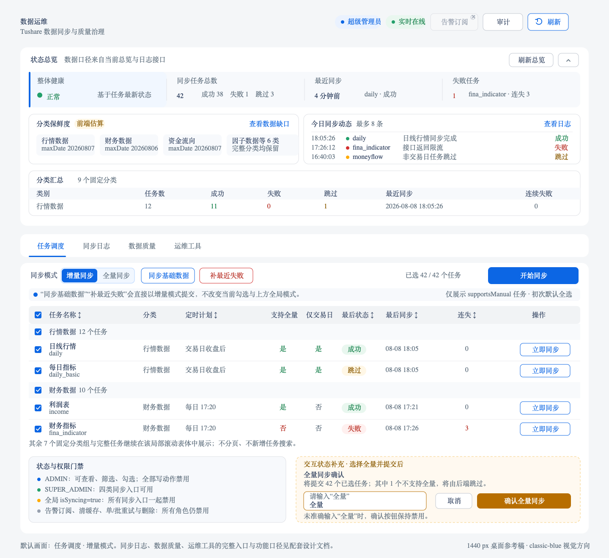

# 数据运维 — 重构 v3 前端设计

> 状态：🟡 Round 2 自动化与默认 PC 浏览器回归通过；全局浏览器矩阵仍由主任务汇总<br>
> 验收日期：2026-08-08；4 主 Tab、运维工具 2 子 Tab、同步入口、`FULL` 确认、权限与 WebSocket 门禁已由定向测试覆盖；默认 PC 会话已完成可达性与确认流回归<br>
> 创建日期：2026-08-08<br>
> 适用仓库：`client-code`；联调仓库：`server-code`<br>
> 页面入口：`/tushare-sync`（历史 `/admin/tushare-sync` 继续重定向）<br>
> 桌面设计稿：`docs/archive/assets/数据运维-v3-桌面设计稿.png`、`docs/archive/assets/数据运维-v3-桌面设计稿.svg`<br>
> 设计视角：资深金融产品经理 + 数据运维从业者 + UI/UE 设计师<br>
> 设计基线：以 2026-08-08 仓库真实实现为准；旧稿中的未实现愿景不视为现有功能

---

## 一、功能提炼

### 1.1 用户原始诉求

> 1. 数据运维

> 记住，功能不变是硬性门禁，除非你发现确认是BUG

本轮只重构信息层级、视觉密度、状态表达和操作路径，不改变任务、数据范围、权限意图、请求时机之外的业务规则。任何新增接口、删除入口、改变默认选中或改变同步语义，均不属于本设计的默认授权范围。

### 1.2 页面核心任务

数据运维不是普通报表，而是高风险的后台控制台。用户进入页面后，应依次回答四个问题：

1. **系统现在是否健康**：数据缺口、失败任务、实时连接、最近更新时间是否异常。
2. **哪里需要处理**：具体任务、数据集、重试记录或校验异常是什么。
3. **可以采取什么动作**：增量/全量同步、质量检查、补数、耗尽重置等操作是否可执行。
4. **操作是否生效**：异步任务是否被接受、WebSocket 是否返回结果、日志和质量状态是否更新。

### 1.3 功能不变硬门禁

| 门禁对象 | 必须保留的现有行为 | v3 允许的变化 | 禁止变化 |
| --- | --- | --- | --- |
| 路由 | `/tushare-sync` 可达；旧后台路由继续重定向 | 页面标题统一为“数据运维” | 改路由、删除重定向 |
| 权限意图 | `ADMIN` 可只读，`SUPER_ADMIN` 可执行写操作 | 修复后端守卫与该意图不一致 | 扩大普通用户权限；让 ADMIN 执行同步/补数 |
| 主工作区 | 任务调度、同步日志、数据质量、运维工具四个主 Tab | Tab 提前进入首屏、可吸顶 | 合并或删除任一主 Tab |
| 运维工具 | `缓存`、`重试队列`两个子 Tab | 卡片去重、表格重排 | 改名、合并或把未开放的清缓存/单条重试伪装成可用 |
| 同步任务 | 仅展示并默认全选接口返回的 `supportsManual` 任务；保留全局增量/全量模式、`同步基础数据`、`补最近失败`、`开始同步`、行内`立即同步` | 真正实现有意义列的稳定排序、改善长表操作 | 把两个捷径改成“快捷选择”；增加任务搜索/行模式；改变任务集合、默认模式或全量确认文案 |
| 全量同步 | 保留输入“全量”的二次确认 | 风险说明更清楚 | 降级确认强度或自动触发 |
| 异步反馈 | 202 接受后依赖 WebSocket 的完成/失败通知 | 加入离线/重连/超时状态 | 将“已提交”误报为“已完成” |
| 日志 | 今日/失败/近 7 天快捷筛选；任务、状态、日期；分页；payload 抽屉 | 筛选布局、错误/加载状态、深链跳转 | 删除筛选、字段或 payload |
| 数据质量 | 健康、摘要、7/14/30 天报告、质量检查、跨表对账、缺口、校验日志、自动补数 | 保留三组 Accordion，优化内部密度和默认展开 | 改检查、补数或范围语义 |
| 缓存与重试 | 缓存命中统计、命名空间搜索；重试状态/任务筛选、选择、耗尽重置 | 修复服务端筛选和返回契约 | 在后端未实现前启用清缓存、批量重试/删除 |
| 占位入口 | 页头保留禁用的`告警订阅`和可打开占位 Drawer 的`审计` | 调整间距和视觉层级 | 隐藏入口或伪造成已联通功能 |

任何功能门禁失败时，UI 美化不予验收。已确认 BUG 走独立修复轨，修复后仍须保持其余行为回归通过。

### 1.4 本次设计目标

| 目标 | 衡量方式 |
| --- | --- |
| 首屏概览与操作并存 | 1440×900 下可看到标题、总览、今日动态、主 Tab 与任务工具栏；无需滚过完整分类表才能开始操作 |
| 降低重复信息 | 同一指标只保留一个主要承载面；卡片负责结论，表格负责证据 |
| 高风险操作可控 | 权限、影响范围、确认、异步状态和操作结果在同一条链路可追溯 |
| 长表可工作 | 固定表头/工具栏、真实排序、局部滚动；1280px 无页面级横向滚动 |
| 状态不说谎 | 失败、陈旧、只读、断线、加载、空结果和局部错误均有独立表达 |
| 符合项目风格 | 沿用 MUI、`DashboardContent`、Iconify、项目间距和 theme tokens；浅色/深色均可读 |

### 1.5 非目标

- 不新增数据源、任务类型、调度配置编辑、告警规则或审计后端。
- 不把前端已预埋但服务端不存在的 v2 API 当作当前能力。
- 不改 WebSocket 事件协议，不改数据质量算法，不改任务执行顺序。
- 不把自然日估算的新鲜度包装成交易日级 SLA；真实保鲜度接口另行立项才可替换。
- 不在阶段一写 `src/` 或后端代码。

## 二、现状盘点

### 2.1 当前信息架构与真实能力

| 区域 | 当前能力 | 关键实现 |
| --- | --- | --- |
| 页面壳 | ADMIN 门禁、只读标识、WebSocket `实时在线/重连中/实时断线`、断线重连、页头刷新、禁用的告警订阅、审计占位 Drawer | `src/sections/tushare-sync/view/tushare-sync-view.tsx` |
| 状态总览 | 整体健康、同步任务总数、最近同步、失败任务 4 个摘要；前端估算分类新鲜度；今日最近 8 条时间线；分类汇总表 | `src/sections/tushare-sync/sync-status-overview.tsx` |
| 任务调度 | 只展示 `supportsManual` 计划并默认全选；全局增量/全量模式；两条直接同步捷径；单项/所选同步；全量确认 | `src/sections/tushare-sync/sync-plan-tab.tsx` |
| 同步日志 | 最新任务状态的 4 个摘要、快捷条件、任务/状态/日期、20 条分页、payload Drawer | `src/sections/tushare-sync/sync-log-tab.tsx` |
| 数据质量 | 健康条、摘要、报告、缺口、跨表对账、校验异常、自动补数/队列 | `src/sections/tushare-sync/data-quality-tab.tsx` 及同目录质量组件 |
| 缓存（子 Tab） | 命中指标、命名空间搜索、明细表；清理操作禁用 | `src/sections/tushare-sync/cache-stats-tab.tsx`、`cache-stats-table.tsx` |
| 重试队列（子 Tab） | 状态/任务筛选、分页、选择、重置耗尽；单项/批量能力占位 | `src/sections/tushare-sync/retry-queue-tab.tsx`、`retry-queue-table.tsx` |
| API | 计划、同步、缓存、质量、日志、重试、总览等请求类型与封装 | `src/api/tushare-sync.ts` |
| 异步通知 | 连接状态、重连、同步完成/失败消息 | `src/contexts/sync-notification-context.tsx` |

当前主页面把状态总览完整铺在四个主 Tab 之前。总览本身又同时包含摘要、分类新鲜度、今日时间线和分类明细，导致核心任务区常落到首屏下方。对运维用户而言，“进入具体工作区”比“先看完所有概览”更重要。

### 2.2 当前有效接口契约

前端请求统一经 `apiClient.post()`，参数走 Body。下表只列服务端当前真实存在的接口：

| 能力 | 方法与路径 | 主要请求/响应 | 当前权限 |
| --- | --- | --- | --- |
| 同步计划 | `POST /api/tushare/admin/plans` | `TushareSyncPlan[]` | 服务端当前仅 SUPER_ADMIN |
| 缓存统计 | `POST /api/tushare/admin/cache/stats` | `CacheMetricsData` | 同上 |
| 手动同步 | `POST /api/tushare/admin/sync` | `{ mode, tasks? }`；202 + message | 同上 |
| 质量检查 | `POST /api/tushare/admin/quality/check` | 202 + message | 同上 |
| 质量报告/缺口 | `POST .../quality/report`、`.../quality/gaps` | `{days?}` / `{dataSet}` | 同上 |
| 跨表/补数/队列/健康/摘要 | `POST .../quality/cross-check`、`repair`、`repair-status`、`health`、`summary` | 见 `src/api/tushare-sync.ts:375-395` | 同上 |
| 校验异常 | `POST /api/tushare/admin/validation-logs` | `{task?, limit?}` | 同上 |
| 同步日志/摘要 | `POST .../sync-logs`、`.../sync-logs/summary` | 分页结果 / 汇总数组 | 同上 |
| 重试队列/重置 | `POST .../retry-queue`、`.../retry-queue/reset` | 分页结果 / message | 同上 |
| 状态总览 | `POST .../sync-status-overview` | `{refresh?}` → `SyncStatusOverview` | 同上 |

以下六个前端封装只有预埋类型，当前控制器不存在对应端点：`data-freshness`、`cache/clear`、`retry-queue/items/retry`、`retry-queue/items/delete`、`sync/cancel`、`sync/performance`（`src/api/tushare-sync.ts:346-355,432-453`）。v3 不得启用它们；占位入口只能保留明确禁用状态。

### 2.3 体验与视觉问题

| 优先级 | 现状问题 | 用户影响 | v3 处理 |
| --- | --- | --- | --- |
| P1 | 概览过长，主 Tab 位于首屏下方 | 用户进入后先滚动，常用工作区曝光不足 | 压缩成摘要带 + 双栏动态，主 Tab 吸顶并提前 |
| P1 | 65 条左右计划一次性展开，表格 `minWidth: 1180` | 浏览、比较、批量操作成本高 | 固定工作区高度、表头与工具栏；保留全量行，不改变数据 |
| P1 | 表头使用排序视觉但没有行为 | 误导用户，破坏可预测性 | 已确认 BUG 轨：实现真实排序或移除排序承诺；推荐实现本地稳定排序 |
| P1 | 缓存指标在卡片和表格重复 | 视觉密度高但信息增量低 | 卡片只留全局 3 指标，命名空间证据只在表格 |
| P1 | 日志筛选变更即请求，同时保留“查询”按钮 | 请求时机含混、键入时易抖动 | 推荐表单草稿 + 查询提交；快捷筛选仍立即执行 |
| P1 | 多处请求错误被吞掉 | 用户把失败误判为空数据 | 每个数据块独立错误/重试，保留上次快照 |
| P2 | emoji 被用于结果状态 | 与项目 Iconify 和金融控制台气质不一致 | 使用 Iconify + theme semantic tokens |
| P2 | 禁用/占位动作与刷新同处页头，状态说明不够明确 | 用户可能把禁用误判为加载失败 | 保留原位置和入口，禁用态直接标明后端未开放，审计打开占位 Drawer |
| P2 | 页面标题“数据同步”与导航“数据运维”不一致 | 模块认知不统一 | 标题统一“数据运维”，副标题说明 Tushare 同步 |

### 2.4 已确认 BUG：独立修复轨

这些问题均有当前代码/契约证据，不属于借重构改功能；阶段二应先写失败用例，再修复，最后并入 UI 回归。

| 编号 | 级别 | 已确认问题与证据 | 推荐修复口径 |
| --- | --- | --- | --- |
| OPS-B01 | P0 | 前端把 `ADMIN` 设为只读可访问（`tushare-sync-view.tsx:46-49,57-83`），后端控制器类级 `@Roles(SUPER_ADMIN)` 拦截全部读取（`server-code/src/apps/tushare/tushare-admin.controller.ts:19-24`） | 控制器读接口允许 ADMIN；写接口逐个限定 SUPER_ADMIN。前端门禁意图不变 |
| OPS-B02 | P1 | 页面“刷新”最终仍调用 `getSyncStatusOverview()` 的空 Body（`src/api/tushare-sync.ts:455-457`），服务端明确缓存 5 分钟且支持 `{refresh:true}`（控制器 `266-276`） | 全局显式刷新传 `refresh:true`；首次/常规读取仍可命中缓存 |
| OPS-B03 | P1 | 重试任务搜索只过滤当前页，API 调用未把任务送给后端，分页总数变成当前页过滤数（`retry-queue-tab.tsx:51-66,92-95,225-236`）；服务端查询 DTO 也不接 task（控制器 `218-241`） | 服务端增加 `task` 条件并返回真实 total；前端查询回到第 1 页，不再本页过滤 |
| OPS-B04 | P1 | 前端期待重置响应 `{message,count}` 并显示 `count`（`src/api/tushare-sync.ts:426-430`；`retry-queue-tab.tsx:82-84`），服务端只返回 message（控制器 `244-263`） | 服务端返回 `{message,count}`，兼容保留 message |
| OPS-B05 | P1 | 任务表每列表头都有 `TableSortLabel`，没有排序处理（`sync-plan-tab.tsx:79-89,434-438`） | 计划已全量载入，前端做稳定排序；默认顺序保持服务端原顺序 |
| OPS-B06 | P1 | 质量摘要只在 `warn===0` 时显示“全部通过”，忽略 `fail>0`（`quality-summary-cards.tsx:90-99`） | 判定优先级 `fail > warn > pass`；失败不得显示健康色/文案 |
| OPS-B07 | P1 | 日志、质量、缓存、重试、缺口多处捕获后只结束 loading，不展示错误 | 统一局部错误态、保留上次成功数据、提供重试；不把请求失败呈现为空 |
| OPS-B08 | P1 | 今日时间线提示“点击跳转并筛选日志”，回调只切到日志 Tab（`sync-status-overview.tsx:404-410,427-430`；主页面 `161-165`） | 回调携带 task/status/date 写入日志筛选；若不实现则必须改掉筛选承诺，推荐前者 |

### 2.5 既有文档与测试漂移

- `docs/archive/数据同步-重构-前端设计.md` 标注已实现，但其中验收项仍未勾选，且 ADMIN 只读能力与真实后端守卫冲突。旧稿保留作历史，不覆盖。
- 当前仅见任务表尺寸相关组件测试与 API 页大小约束测试，缺少角色契约、总览刷新、重试筛选、质量失败状态和跨 Tab 深链测试。
- 新稿以 `数据运维-重构v3-前端设计.md` 独立存在；后续若实现完成，再由阶段三更新汇总文档。

## 三、功能细化

### 3.1 v3 信息架构

```text
数据运维 /tushare-sync
├─ 页头
│  ├─ 页面身份：数据运维 / Tushare 数据同步与质量治理
│  ├─ 权限：管理员只读 / 超级管理员
│  ├─ 实时连接：实时在线 / 重连中 / 实时断线 + 重连
│  ├─ 告警订阅（禁用，后端未开放）
│  ├─ 审计（打开“操作审计流水”占位 Drawer）
│  └─ 刷新（总览 + 今日时间线 + 当前 Tab）
├─ 只读提示（仅 ADMIN）
├─ 状态总览（可独立刷新、收起/展开）
│  ├─ 整体健康 / 同步任务总数 / 最近同步 / 失败任务
│  ├─ 分类保鲜度（前端估算）+ 查看数据缺口
│  ├─ 今日同步动态（最多 8 条）+ 查看日志
│  └─ 分类汇总表
├─ 主工作区（吸顶 Tab）
│  ├─ 任务调度
│  ├─ 同步日志
│  ├─ 数据质量
│  └─ 运维工具
│     ├─ 缓存
│     └─ 重试队列
└─ Drawer / Dialog
   ├─ 日志 payload
   ├─ 全量同步确认
   └─ 操作审计流水（占位）
```

### 3.2 页面进入与刷新

1. 进入页面后读取总览、今日时间线和默认“任务调度”数据；切换主 Tab 后只加载/刷新当前工作区。
2. 页头“刷新”递增统一 `refreshKey`：重取总览、今日时间线和当前 Tab；不承诺刷新未激活 Tab。
3. 总览卡自己的刷新只重取总览；缓存页刷新只重取缓存；质量页“补数队列”刷新只重取补数状态；重置耗尽后只重取重试队列。
4. OPS-B02 修复后，首次/背景读取总览可命中服务端缓存；用户显式点击页头或总览刷新时传 `{refresh:true}`。
5. WebSocket 只提供连接状态与全局 `isSyncing`/完成失败通知；当前代码没有按事件自动重取各区，也没有逐任务 job 状态，本次不虚构。
6. 刷新期间保留上次成功快照并显示局部进度；错误不得被表现为“0”或空结果。

### 3.3 运维摘要与关注区

- 总览第一行严格保留 4 个现有结论：**整体健康**、**同步任务总数**（成功/失败/跳过计数）、**最近同步**（不限定成功状态）、**失败任务**。不得增加“交易日”“正在运行数”“依赖阻断”“今日恢复”等当前不存在的指标。
- “分类保鲜度”继续标注“前端估算”，覆盖当前全部分类；卡片点击和“查看数据缺口”进入数据质量。不得包装成交易日 SLA。
- “今日同步动态”读取当天日志、最多展示 8 条，保留“查看日志”和整行进入日志的入口。OPS-B08 修复后才可承诺带入任务/状态/日期；修复前只能承诺切换 Tab。
- 分类汇总表保留字段：类别、任务数、成功、失败、跳过、最近同步、连续失败。设计稿可截取示例行，但实现必须保留完整表。
- 不新增“待处理/处置”侧栏、依赖链、未来运行节点或工单语义；异常的处理入口仍在日志、质量和重试队列各自工作区。

### 3.4 任务调度

| 能力 | 交互规则 |
| --- | --- |
| 展示集合 | `getPlans()` 后仅展示接口返回中 `supportsManual=true` 的计划；初次默认全选这批可手动任务，不显示不可手动计划占位行 |
| 全局选择 | 保留顶部全选、分类组勾选、行勾选和点击行切换；显示“已选 N / 总数 个任务”；选择键始终为 task，不按行索引 |
| 全局模式 | 默认“增量同步”；“增量同步/全量同步”是全局模式，不在每行增加模式。切换本身不请求 |
| 同步基础数据 | 直接以 `incremental` 提交基础数据任务，独立于全局模式和当前选择；不是快捷选中 |
| 补最近失败 | 从汇总中取 `lastStatus=FAILED` 任务，直接以 `incremental` 提交，独立于全局模式和当前选择；无失败项时禁用 |
| 开始同步 | 使用当前全局模式提交当前选中任务；无选择、ADMIN 只读或全局 `isSyncing` 时禁用 |
| 立即同步 | 行内提交该单个任务，使用当前全局模式；ADMIN 只读或全局 `isSyncing` 时禁用 |
| 全量确认 | 切换全量并提交时显示风险提示，必须准确输入“全量”才能确认；取消不发请求 |
| 不支持全量 | 全量模式下仍提交全部所选任务，同时显示其中不支持全量的数量；由后端跳过，不在前端静默过滤 |
| 状态反馈 | 202 只显示“已提交”；WebSocket 完成/失败后再显示终态；当前 `isSyncing` 是全局锁，任一同步期间所有同步入口禁用 |
| 排序 | 默认保持服务端顺序与固定分类组；只在任务名称、定时计划、最后状态、最后同步、连失等有意义数据列实现组内稳定排序，其他列不用排序图标 |
| 长表 | 工具栏和表头吸顶，表体局部滚动；不分页、不新增任务搜索，不改变一次加载全部手动计划的功能 |

计划表字段与顺序固定为：选择、任务名称（label + task code）、分类、定时计划（`schedule.description` 或“仅手动触发”）、支持全量、仅交易日、最后状态、最后同步、连失、操作。分类组固定顺序为基础数据、行情数据、财务数据、资金流向、因子数据、另类数据、基金数据、宏观数据、期权数据。

### 3.5 同步日志

- 顶部 4 个只读摘要严格为：成功任务数、失败任务数、跳过任务数、连续失败告警；口径是每个任务最新汇总，不新增“运行中”。
- 保留快捷 Chip：今天、失败、近 7 天、清空。普通字段为任务类型、状态（全部/成功/失败/跳过）、开始日期、结束日期、查询。
- 现有筛选字段变化会自动请求，同时仍有“查询”；v3 推荐改为“草稿筛选 → 查询提交”，快捷 Chip 仍立即提交，结果语义和接口不变。
- 请求日期使用 `YYYY-MM-DD`；响应中的 `tradeDate` 保持 `YYYYMMDD`。不要把日志 DatePicker 的请求格式写成 `trade_date` 规则。
- 表格保留任务、状态、交易日、消息、payload、开始时间、结束时间；payload 仍以“查看（长度）”打开 Drawer，不新增复制按钮。
- 固定每页 20 条并保留分页。请求失败显示局部错误和重试（OPS-B07），不得吞错后呈现空表。
- OPS-B08 完成后，总览时间线可把 task/status/date 写入日志条件；否则必须移除“并筛选”的承诺。

### 3.6 数据质量

保留当前 3 个 Accordion 入口及名称，并继续用 `sessionStorage` 记住展开状态；默认仅展开一个：

| 入口 | 必须保留的读取与动作 |
| --- | --- |
| 健康总览 | 健康状态、质量摘要、7/14/30 天报告；`触发质量检查`（SUPER_ADMIN） |
| 主动检查工具 | 跨表对账范围 `recent/full` + `立即执行对账`（SUPER_ADMIN）；数据集 Autocomplete + `查询缺失日期` |
| 检查结果与异常 | 校验异常最近 100 条、补数队列 4 个状态卡和最近补数任务；`手动触发补数`（SUPER_ADMIN，保留确认）；补数状态独立刷新 |

- 当前校验日志固定读取最近 100 条，界面没有 task/limit 控件；本次不得新增。
- 质量摘要“全部通过”必须同时满足 `warn=0` 且 `fail=0`；`fail` 优先级最高（OPS-B06）。
- 写动作仍只对 SUPER_ADMIN 开放；ADMIN 可读取、切换范围和查询缺口，但不可触发检查、对账或补数。

### 3.7 运维工具

主 Tab 内保留精确子 Tab 名称：**缓存**、**重试队列**。

**缓存**：保留独立刷新、命名空间搜索、命名空间卡片和明细表。表格字段为命名空间、keys、命中率、hits、misses、writes、invalidations、最近命中、操作。为减少重复，可把卡片压成由现有返回值派生的只读汇总，但表格字段不得丢失。页头“清除全部缓存”和行内“清除”对所有角色继续禁用，并明确后端未开放。

**重试队列**：保留任务名称搜索、状态筛选（全部/PENDING/RETRYING/EXHAUSTED/SUCCEEDED）、选择、已选数量、每页 20 条分页。OPS-B03 修复后任务条件由服务端筛选并返回真实 total；条件变化回第 1 页。`重置耗尽`只对 SUPER_ADMIN 开放，确认文案必须说明将**全部 EXHAUSTED** 重置为 PENDING，不能误写成仅当前筛选/选中项。批量重试、批量删除和行内重试对所有角色继续禁用；OPS-B04 修复后用服务端 `count` 显示真实重置数量。

### 3.8 权限与危险操作

| 角色 | 读取 | 写操作 | 页面表现 |
| --- | --- | --- | --- |
| 普通用户 | 不允许 | 不允许 | 现有权限不足空态 |
| ADMIN | 允许 plans、overview、logs、quality report、cache stats、retry queue 等读取 | 不允许四条同步入口、质量检查/对账/补数、重置耗尽 | 全页可读；顶部只读提示；写按钮禁用并有原因 |
| SUPER_ADMIN | 允许 | 允许四条同步入口、质量检查/对账/补数、重置耗尽 | 危险动作保留确认和异步反馈 |

无论角色，告警订阅、清除全部/单个缓存、批量重试、批量删除、行内重试都继续禁用。`审计`只打开占位 Drawer。后端推荐把控制器基础权限调整为 ADMIN，再对写方法显式标记 SUPER_ADMIN；必须通过集成测试证明写接口没有因元数据覆盖规则而降权。

#### 3.8.1 源码入口—动作—权限矩阵

| 区域 | 可见入口 | 当前语义与作用范围 | 权限/状态 |
| --- | --- | --- | --- |
| 页头 | 重连 | 仅实时断线时出现，调用现有 reconnect | ADMIN、SUPER_ADMIN；连接正常时不出现 |
| 页头 | 刷新 | 重取总览、今日时间线、当前主 Tab | ADMIN、SUPER_ADMIN |
| 页头 | 告警订阅 | 后端未启用 | 所有角色禁用 |
| 页头 | 审计 | 打开“操作审计流水”占位 Drawer | ADMIN、SUPER_ADMIN；不发审计请求 |
| 总览 | 刷新总览 / 收起展开 | 只刷新总览；或切换总览可见高度 | ADMIN、SUPER_ADMIN |
| 总览 | 分类保鲜度卡 / 查看数据缺口 | 切到数据质量 | ADMIN、SUPER_ADMIN |
| 总览 | 今日行 / 查看日志 | 切到同步日志；OPS-B08 后可带条件 | ADMIN、SUPER_ADMIN |
| 任务 | 全选 / 分类勾选 / 行勾选 | 只修改本地选中集合 | ADMIN、SUPER_ADMIN；只读用户也可预选但不能提交 |
| 任务 | 同步基础数据 | 直接增量提交基础任务集合 | 仅 SUPER_ADMIN；`isSyncing` 时禁用 |
| 任务 | 补最近失败 | 直接增量提交最近失败任务集合 | 仅 SUPER_ADMIN；无失败或 `isSyncing` 时禁用 |
| 任务 | 开始同步 | 用全局模式提交当前选中集合 | 仅 SUPER_ADMIN；无选择或 `isSyncing` 时禁用 |
| 任务 | 立即同步 | 用全局模式提交当前行任务 | 仅 SUPER_ADMIN；`isSyncing` 时禁用 |
| 日志 | 今天 / 失败 / 近 7 天 / 清空、查询、分页 | 更新筛选并读取每页 20 条日志 | ADMIN、SUPER_ADMIN |
| 日志 | 查看 payload | 打开只读 Drawer | ADMIN、SUPER_ADMIN |
| 质量 | 7/14/30 天、缺失数据集查询、补数状态刷新 | 只读查询 | ADMIN、SUPER_ADMIN |
| 质量 | 触发质量检查、recent/full 对账、手动补数 | 当前真实写接口；补数保留确认 | 仅 SUPER_ADMIN |
| 缓存 | 刷新、命名空间搜索 | 刷新缓存数据或本地过滤命名空间 | ADMIN、SUPER_ADMIN |
| 缓存 | 清除全部缓存 / 行内清除 | 后端未启用 | 所有角色禁用 |
| 重试 | 任务搜索、状态筛选、选择、分页 | 查询/浏览重试队列；每页 20 条 | ADMIN、SUPER_ADMIN |
| 重试 | 重置耗尽 | 全部 EXHAUSTED → PENDING，确认后执行 | 仅 SUPER_ADMIN |
| 重试 | 批量重试 / 批量删除 / 行内重试 | 后端未启用 | 所有角色禁用 |

### 3.9 状态模型

| 状态 | 页面规则 |
| --- | --- |
| 首次加载 | 摘要和当前工作区分别使用结构化 Skeleton；不显示假数字 |
| 局部刷新 | 保留上次内容，显示低干扰进度和“更新中” |
| 局部错误 | 对应块显示错误摘要、重试和最近成功时间；其他块继续可用 |
| 全局鉴权失败 | 401 走登录态；403 区分普通用户无权与 ADMIN/后端契约异常 |
| 无数据 | 说明当前筛选无记录，提供清除筛选；不与请求错误混用 |
| 数据陈旧 | 显示“最后快照”及时间；不自动判定为同步失败 |
| WebSocket 断线 | 红/警告语义 + 重连；已提交任务提示去日志确认 |
| 只读 | 可导航、筛选、查看详情；写按钮禁用且 Tooltip/辅助文案解释角色要求 |
| 异步任务进行中 | 使用现有全局 `isSyncing`；所有同步入口一起禁用，不宣称逐任务并发可用 |
| 长 payload | Drawer 内等宽换行、最大高度滚动；关闭后不丢列表筛选；不新增复制入口 |

### 3.10 待确认问题与推荐默认

下列问题不阻塞阶段二；若产品未另行确认，按推荐默认实施：

| 问题 | 推荐默认 | 理由 |
| --- | --- | --- |
| 页面名称用“数据同步”还是“数据运维” | 主标题“数据运维”，副标题“Tushare 数据同步与质量治理” | 与导航和用户用语统一，同时保留数据源认知 |
| ADMIN 是否应只读 | 是；修复后端为 ADMIN 读、SUPER_ADMIN 写 | 与现有前端明确文案一致，最小权限原则清晰 |
| 日志输入时是否即时查询 | 普通字段点击“查询”；快捷条件即时 | 降低请求抖动，又保留高频一步筛选 |
| 计划表排序初始规则 | 保持后端原顺序 | 不改变用户已有任务序列记忆 |
| 占位入口是否删除 | 不删除；页头直接保留“告警订阅”和“审计” | 与当前入口一一对应，避免隐藏功能 |
| 新鲜度是否显示红黄绿 SLA | 只显示“估算”与日期，不承诺 SLA | 当前没有交易日级 freshness 接口 |

## 四、UI/UE 设计

### 4.1 桌面设计稿



可缩放矢量版本：[数据运维 v3 桌面设计稿 SVG](assets/数据运维-v3-桌面设计稿.svg)。

设计稿中的 **classic-blue 只用于表达信息层级和金融控制台气质，不是实现色值规范**。阶段二不得从 PNG/SVG 抄取固定色值；所有前景、背景、边框、状态和图表颜色必须使用现有 `theme.palette.*`、`theme.vars.palette.*`、`varAlpha(...)` 与项目语义 token，确保浅色/深色主题一致。

### 4.2 桌面布局线框

```text
┌──────────────────────────────────────────────────────────────────────────────┐
│ 数据运维  Tushare 数据同步与质量治理                                      │
│ [超级管理员] [实时在线] [告警订阅·禁用] [审计] [刷新]                      │
├──────────────────────────────────────────────────────────────────────────────┤
│ 只读提示（仅 ADMIN）                                                        │ 40
├──────────────────────────────────────────────────────────────────────────────┤
│ 状态总览                                    [刷新总览] [收起/展开]           │
│ 整体健康 │ 同步任务总数(成功/失败/跳过) │ 最近同步 │ 失败任务              │
│ 分类保鲜度（估算） + 查看数据缺口  │ 今日同步动态（最多 8 条）+ 查看日志    │
│ 分类汇总：类别/任务数/成功/失败/跳过/最近同步/连续失败                      │
├──────────────────────────────────────────────┬───────────────────────────────┤
│ [任务调度] [同步日志] [数据质量] [运维工具]                     sticky 48 │
├──────────────────────────────────────────────────────────────────────────────┤
│ 模式 [增量同步][全量同步] [同步基础数据] [补最近失败] 已选 N/N [开始同步]   │
│ □ 任务名称 / 分类 / 定时计划 / 支持全量 / 仅交易日 / 最后状态 / … / 操作 │
│ □ 行情数据（12）                                                            │
│ ☑ 日线行情 daily / 行情 / 交易日收盘后 / 是 / 是 / 成功 / … / [立即同步] │
│ 全量交互说明：风险提示 → 输入“全量” → 取消 / 确认全量同步                  │
└──────────────────────────────────────────────────────────────────────────────┘
```

- `DashboardContent maxWidth="xl"`，桌面 12 栏，栏间距 24px。
- 页头单行 56px；只读提示只在需要时出现，不为 SUPER_ADMIN 预留空位。
- 总览保留现有四种信息块和收起/展开；通过紧凑分段、两栏排布和分类表局部展开缩短首屏，而不是删除内容。
- 主 Tab 紧随总览并吸顶；滚动长表时始终能切换工作区。
- 当前工作区内部使用局部滚动，页面本身不横向滚动。

### 4.3 视觉语言

| 元素 | 规范 |
| --- | --- |
| 页面背景 | 沿用 dashboard 背景；工作容器使用 `background.paper` / `background.neutral` |
| 层级 | 通过边框、留白、轻量 surface 区分；避免每块都强阴影和大圆角 |
| 主色 | 主操作、选中 Tab、链接使用主题 primary；不新增模块专属蓝色常量 |
| 成功/警告/失败 | `success` / `warning` / `error` 语义，必须同时带图标/文字，不单靠颜色 |
| 数字 | 行数、耗时、命中率、缺口右对齐，`fontVariantNumeric: 'tabular-nums'` |
| 图标 | 统一 Iconify；不使用 emoji 作为业务状态 |
| 密度 | Toolbar 44–48px，表格行 48–52px；危险确认区适度放宽到 56px |
| 文案 | “已提交”与“已完成”严格区分；时间附时区/相对时间时保留精确 Tooltip |

### 4.4 关键组件规格

**状态总览**

- 四段最小宽度 180px，支持自动换行；标签 12–13px，主数值 22–24px。
- 第一段为整体健康；第二段同时呈现成功/失败/跳过小计；第三段文案固定“最近同步”，不改成“最近成功同步”。
- 数值不可点击时不使用 hover/cursor；可导航段使用按钮语义并有 focus ring。

**今日动态**

- 单行高度 40–44px：时间、任务名、状态、简短结果；最多 8 行。
- 点击整行跳日志；同时保留显式“查看日志”可访问名称。
- 长消息省略，Tooltip 展示全量；不在卡片内再嵌套横向表格。

**任务表**

- 顶部工具栏依次为全局模式、两个直接执行捷径、选择摘要、`开始同步`。两个捷径不能使用“选择/筛选”视觉或文案。
- Checkbox 列、任务名列建议吸左；操作列`立即同步`吸右。仅表体允许横向滚动作为 1024px 以下兜底。
- 分类组行有组级 Checkbox；表格不放任务搜索、行级模式、未来运行时间、依赖/阻断或“处理”菜单。
- 排序激活时显示方向；未实现排序的列必须是普通 `TableCell`。

**日志/重试表**

- 筛选器与表格共用一个 workbench Card，筛选结果总数置于表头上方。
- 空态、错误态位于表体区域，分页留在底部且不因错误跳动。
- 批量操作条仅在有选中项时出现；未开放动作保持禁用并说明，不显示假成功。

### 4.5 响应式

| 断点 | 规则 |
| --- | --- |
| ≥1440 | 12 栏；总览摘要单行、保鲜度/今日动态双栏；页头动作完整显示 |
| 1280–1439 | 总览摘要允许 2×2；页头仍保留告警订阅、审计、刷新文字入口 |
| 900–1279 | 保鲜度/今日动态上下堆叠；主 Tab 横向滚动；工作区表格局部滚动，页面不横滚 |
| 600–899 | 摘要 2 列；筛选分两行；表格固定首列、隐藏低优先级描述列但可在行详情查看 |
| <600 | 页头保留状态、刷新，并以具名菜单承载告警订阅/审计；主 Tab 横向滚动；计划表可用行卡兜底；高风险主操作放底部固定操作区 |

隐藏列只改变呈现，不能丢失字段；行详情必须能查看完整信息。目标验收宽度：375、768、1280、1440、1920px。

### 4.6 可访问性与键盘

- 主 Tab、质量 Accordion、行操作、刷新、重连和页头动作均有可见 focus 状态与明确 `aria-label`。
- 所有可点击整行都必须使用 `button`/`ButtonBase` 语义，支持 Enter/Space；不可只在 `Box onClick` 上挂行为。
- 表格表头声明排序状态；Checkbox 有全选/半选说明；危险确认初始焦点不落在确认按钮。
- 状态不可只靠红绿；图标、文本和辅助描述同时存在。
- Drawer 打开后焦点陷阱、Esc 关闭、关闭后回到触发点；错误提示使用适度的 live region。

## 五、实现步骤

### 5.1 仓库与文件边界

| 范围 | 绝对根目录 | 主要相对文件 |
| --- | --- | --- |
| 前端 | `/Users/chenpengxiang/Desktop/quant-code/client-code` | `src/sections/tushare-sync/**`、`src/api/tushare-sync.ts`、`src/contexts/sync-notification-context.tsx` |
| 后端 | `/Users/chenpengxiang/Desktop/quant-code/server-code` | `src/apps/tushare/tushare-admin.controller.ts`、`src/apps/tushare/dto/**`、`src/tushare/sync/**` |
| 路由/导航 | 前端根目录 | 现有 `/tushare-sync` 页面薄壳与导航配置；只核验，不改业务路径 |
| 设计资产 | 前端归档目录 | `docs/archive/assets/数据运维-v3-桌面设计稿.{png,svg}` |

`pages/` 继续只做薄壳；业务组件位于 `src/sections/tushare-sync/`。所有 MUI 组件使用子路径导入，所有颜色走主题 token，所有请求仍使用 `apiClient.post()`。

### 5.2 实施顺序

**阶段 A：冻结契约与回归基线**

1. 为四主 Tab、两运维子 Tab、权限、默认任务选择、同步模式、日志筛选和质量动作建立功能清单。
2. 补 API 契约测试，记录现有接口响应和 WebSocket 事件。
3. 将 OPS-B01—B08 逐条建立失败测试，避免以 UI 重排掩盖契约问题。

**阶段 B：先修确认 BUG**

1. 后端拆分 ADMIN 读 / SUPER_ADMIN 写守卫并做集成测试。
2. 总览 API 前端增加 `refresh` 参数；显式刷新传 true。
3. 重试查询 DTO/where 支持 task；重置响应增加 count；前端移除当前页过滤。
4. 修复质量摘要优先级、真实排序、错误态、总览到日志的条件传递。
5. 每修一项运行对应回归；BUG 修复分支可独立回退，不与视觉组件强耦合。

**阶段 C：页面骨架与总览重排**

1. 在 `view/tushare-sync-view.tsx` 重排页头、只读提示、紧凑总览和吸顶 Tab。
2. 调整总览内四摘要、分类保鲜度、今日时间线和分类汇总的密度；不改变数据源或入口。
3. 页头继续直接保留告警订阅、审计、刷新，并明确禁用/占位语义。

**阶段 D：四个工作区改造**

1. 任务：sticky toolbar/header、稳定排序、选择摘要、危险确认。
2. 日志：筛选草稿/提交、深链条件、保持旧数据刷新、payload Drawer。
3. 质量：保留三个 Accordion 名称/展开记忆，重组内部密度、健康判定和块级错误。
4. 运维：缓存卡片去重；重试服务端筛选、真实分页和选中状态协调。

**阶段 E：响应式、主题与可访问性**

1. 按 375/768/1280/1440/1920 逐级验证；修复页面级横滚。
2. 浅色、深色、高对比/系统缩放 200% 检查；禁止硬编码颜色。
3. 完成键盘全链路、焦点恢复、读屏名称和状态非颜色表达。

**阶段 F：构建与联调**

1. 前端按项目规定依次 ESLint fix、ESLint 无输出、`yarn build`。
2. 后端运行 controller/service/integration 测试，重点验证角色和 DTO 白名单。
3. 使用真实 ADMIN、SUPER_ADMIN 账号和 WebSocket 联调；禁止只用 mock 宣布完成。

### 5.3 建议组件切分

```text
src/sections/tushare-sync/
├─ view/tushare-sync-view.tsx           # 页面编排
├─ components/ops-page-header.tsx       # 标题、权限、连接、动作
├─ components/ops-summary-strip.tsx     # 四项现有摘要的紧凑容器
├─ components/section-state.tsx         # loading/error/stale/empty
├─ sync-status-overview.tsx             # 保留数据组装，减少视觉职责
├─ sync-plan-tab.tsx
├─ sync-log-tab.tsx
├─ data-quality-tab.tsx
├─ ops-tab.tsx
├─ cache-stats-tab.tsx
└─ retry-queue-tab.tsx
```

组件名可在实现时按现有目录惯例调整；不建议为追求“设计系统”抽到全局组件库，除非至少有三个真实复用点。

### 5.4 风险与回退

| 风险 | 控制 | 回退策略 |
| --- | --- | --- |
| 权限守卫拆分导致写接口降权 | 每个写端点做 ADMIN=403、SUPER_ADMIN=2xx 集成测试 | 恢复类级 SUPER_ADMIN，临时关闭 ADMIN 入口，不放开写权限 |
| 并行请求和 WebSocket 造成旧数据覆盖 | Abort/request id + 事件去重 + generatedAt 比较 | 关闭事件触发刷新，保留手动刷新和日志确认 |
| 吸顶/局部滚动在小屏冲突 | 单一滚动容器、逐断点视觉测试 | 小屏取消表头吸顶，保留页面纵向滚动 |
| 本地计划排序改变选择映射 | selection 永远按 task key，不按 index | 关闭排序，恢复服务端顺序；不丢选择 |
| 质量区重排后展开状态丢失 | 保留原 Accordion key 与 sessionStorage 约定 | 回退视觉容器，组件逻辑不回退 |
| 新错误态造成大面积红色噪音 | 块级 severity 与可恢复操作 | 仅降级为 inline Alert，绝不吞错 |

## 六、验收

### 6.1 功能不变门禁

- [ ] `/tushare-sync` 与历史重定向均可用，浏览器刷新/直接进入正常。
- [ ] 四个主 Tab、两个运维子 Tab、全部现有 Drawer/Dialog 入口仍可达。
- [ ] 任务初次只展示并默认全选 `supportsManual` 计划；增量仍为全局默认模式；全选/分类/行选择一致。
- [ ] `同步基础数据`、`补最近失败`均直接以增量提交各自任务集合，不改变当前选择，也不跟随全局全量模式。
- [ ] `开始同步`提交当前选择，行内`立即同步`提交该任务，两者均使用全局模式；全局 `isSyncing` 时四类同步入口一起禁用。
- [ ] 全量同步仍必须准确输入“全量”；提交全部所选任务，不支持全量者由后端跳过且前端事先显示数量。
- [ ] 计划表保留 9 个固定分类组及任务名称、分类、定时计划、支持全量、仅交易日、最后状态、最后同步、连失、操作全部字段。
- [ ] 202 响应只显示“已提交”，WebSocket 完成/失败后才显示终态。
- [ ] 日志的 4 个摘要、4 个快捷 Chip、任务/状态/日期、7 列结果、20 条分页和 payload Drawer 全部保留；请求日期为 `YYYY-MM-DD`，返回交易日为 `YYYYMMDD`。
- [ ] 数据质量仍有“健康总览/主动检查工具/检查结果与异常”3 个 Accordion 和展开记忆；7/14/30 天、检查、recent/full 对账、缺口、最近 100 条异常、补数/队列均保留。
- [ ] 运维工具仍有“缓存/重试队列”2 个子 Tab；缓存搜索与全字段表、重试 4 状态/任务/选择/20 条分页/全局耗尽重置保留；未实现接口没有被启用。
- [ ] 页头的告警订阅和审计仍可直接发现；告警订阅保持禁用，审计打开“操作审计流水”占位 Drawer。

### 6.2 已确认 BUG 验收

- [ ] OPS-B01：ADMIN 对所有只读端点返回 2xx、所有写端点返回 403；SUPER_ADMIN 读写正常；普通用户页面不可访问。
- [ ] OPS-B02：普通进入总览 Body 不强刷；点击页头刷新发出 `{refresh:true}`，并得到新的 `generatedAt`。
- [ ] OPS-B03：任务搜索命中第 2 页以后的重试记录；total、页数、列表一致；清除条件恢复真实总数。
- [ ] OPS-B04：重置 3 条记录时响应 `count=3`，Snackbar/反馈显示 3，不出现 undefined。
- [ ] OPS-B05：每个带排序图标的有意义数据列都可在固定分类组内稳定升/降序；无行为列不显示排序图标；默认仍是服务端顺序；选择不随排序错位。
- [ ] OPS-B06：`fail>0,warn=0` 时显示失败/不健康，不显示“全部通过”。
- [ ] OPS-B07：逐个模拟总览、日志、质量、缓存、重试失败，均显示局部错误且不伪装为空/0，其他区可用。
- [ ] OPS-B08：点击今日动态后进入同步日志，并正确带入任务、状态、日期；刷新后条件仍明确可见。

### 6.3 视觉与响应式

- [ ] 1440×900 首屏能看到页头、摘要、关注区和主 Tab；无须滚过完整分类明细。
- [ ] 1280px 无页面级横向滚动；长表只在自身容器滚动。
- [ ] 375、768、1280、1440、1920px 下无重叠、截断关键操作或不可恢复的隐藏字段。
- [ ] 浅色/深色主题下文字、边框、状态均清晰；实现代码无新增硬编码色值。
- [ ] 缓存卡片与表格不再逐字段重复；页面仍能查看原全部字段。
- [ ] 主 Tab、长表工具栏/表头的吸顶不互相遮挡，浏览器 200% 缩放仍可操作。

### 6.4 状态、权限与安全

- [ ] 首次加载、局部刷新、局部错误、空结果、数据陈旧、只读、WS 断线、异步进行中均有独立状态。
- [ ] 权限不足、接口失败或 WS 断线时，不出现“成功/已完成”误导。
- [ ] 重复点击同步/质量检查不会产生同一请求的并发重复提交。
- [ ] 全量同步、自动补数、耗尽重置均保留作用范围、确认和结果数量。
- [ ] payload 中长对象不会撑破 Drawer；敏感字段遵循现有后端脱敏策略，不在前端额外持久化。

### 6.5 可访问性

- [ ] 仅键盘可完成 Tab 切换、筛选、打开/关闭 Drawer、选择任务和提交/取消确认。
- [ ] 所有 icon-only 按钮、状态 Chip、可点击行有可访问名称；焦点可见且关闭浮层后正确恢复。
- [ ] 成功/警告/失败不只靠颜色；排序、全选/半选、loading 和错误可被读屏理解。
- [ ] 触控目标原则上不小于 40×40px；小屏固定操作区不遮挡表格最后一行。

### 6.6 测试与交付证据

- [ ] 前端单测覆盖权限渲染、默认选择/模式、排序、筛选提交、错误保留、深链、质量状态与重试分页。
- [ ] 后端集成测试覆盖角色矩阵、`refresh`、task 筛选和 reset count。
- [ ] WebSocket 用完成、失败、断线、重连四条真实链路联调。
- [ ] `node_modules/.bin/eslint --fix "src/**/*.{ts,tsx}"` 完成。
- [ ] `node_modules/.bin/eslint "src/**/*.{ts,tsx}"` 退出码 0 且无输出。
- [ ] `yarn build` 明确出现 `✓ built in ...`。
- [ ] 提交 375/768/1280/1440/1920 的浅色与深色截图，以及 ADMIN/SUPER_ADMIN 关键流程录屏或截图证据。

只有功能门禁、OPS-B01—B08、视觉响应式和真实联调同时通过，数据运维 v3 才可由“📐设计中”进入“✅已实现”。
