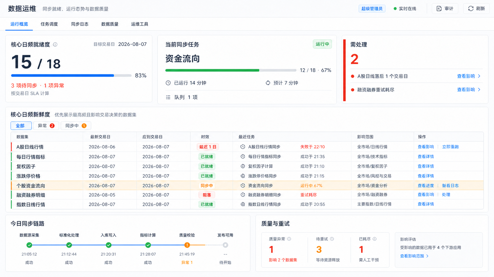
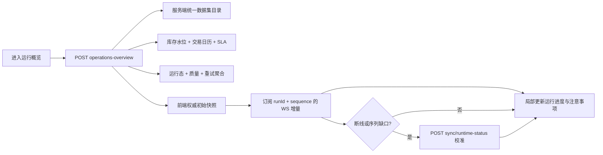

# 数据运维 — 重构 v5 前后端联合设计

> 状态：📐 设计中（阶段一）
>
> 创建日期：2026-08-08
>
> 前端主入口：`src/sections/tushare-sync/view/tushare-sync-view.tsx`
>
> 后端主入口：`../server-code/src/apps/tushare/tushare-admin.controller.ts`
>
> 页面路由：`/tushare-sync`（`/admin/tushare-sync` 保留兼容重定向）
>
> 设计视角：资深金融产品经理 + 资深量化/二级市场从业者 + 资深 UI/UE 设计师
>
> 本轮边界：联合调整概览信息架构、数据新鲜度口径和同步运行态契约；保留任务调度、同步日志、数据质量、运维工具四个工作区，不在概览直接增加取消、暂停、删除等危险动作。



> 设计稿中的日期、数量、进度和影响范围均为布局样例；实施时只展示后端权威返回值。图中“今日同步链路”的阶段标签表达目标信息层级，阶段二只能落地已有事件或本设计新增契约能够证明的阶段，禁止用前端计时器伪造执行进度。

---

## 一、功能要点提炼与补充（PM 视角）

### 1.1 用户原始诉求复述

> 前后端都优化一下吧，我觉得这个概览没有展示到重点，比如我认为应该要优先展示同步频率最高的日频接口的新鲜度，还有当前是否有同步任务以及我截图这个样式不太好看。当然你也不要局限于我说的这几点，你自己思考一下作为数据运维的概览，用户应该会关注哪些重点信息。前后端同步设计修改，前端需要设计图

### 1.2 模块定位与价值主张

- 10 秒内回答：目标交易日的核心日频数据是否已经可用，而不是只看“最近执行过任务”。
- 30 秒内回答：当前是否正在同步、跑到哪个任务、完成多少、预计还要多久、是否有排队任务。
- 3 分钟内完成：识别延迟、失败、阻塞或质量异常，判断影响范围，并进入日志、质量、重试或调度工作区处置。
- 边界：概览负责判定、解释和导航；危险写操作继续归属任务调度、数据质量和运维工具，并沿用 `SUPER_ADMIN` 权限与确认机制。

### 1.3 功能要点提炼

| # | 功能点 | 用户决策场景 | 前后端数据来源 |
| --- | --- | --- | --- |
| 1 | 首要展示“核心日频就绪度” | 判断市场、选股、因子、回测等下游是否可用 | 服务端统一数据集目录 + 交易日历 + 实际库存水位 |
| 2 | 展示目标交易日与 SLA 口径 | 区分“尚未到应同步时间”和“已经延迟” | 服务端按交易日、计划时间、宽限期计算 |
| 3 | 展示当前同步轮次 | 判断系统空闲、运行、阻塞还是状态未知 | 新增权威运行态快照；WebSocket 只做增量更新 |
| 4 | 展示当前任务、总体进度与 ETA | 判断是否需要等待或介入 | 已有单任务/总体进度事件 + 新增 `runId/sequence` |
| 5 | 展示排队轮次与触发来源 | 判断计划任务是否被手动任务挤压 | 服务端跨进程运行态注册表 |
| 6 | 异常优先展示“需处理” | 先处理阻塞、失败、核心日频延迟 | 服务端聚合 freshness、quality、retry，不由前端猜测 |
| 7 | 展示异常影响范围 | 判断是否影响市场概览、股票详情、因子、选股或回测 | 统一数据集目录中的 `consumerModules/recommendedAction` |
| 8 | 全量展示核心日频新鲜度证据 | 对比最新交易日、应到交易日、最近任务与质量状态 | `dataThrough/expectedTradeDate/lagTradingDays/lastAttempt` |
| 9 | 展示今日同步链路与质量/重试摘要 | 判断“同步成功但质量未通过”或“失败后正在重试” | 同步日志、质量摘要、重试队列聚合 |
| 10 | 支持可恢复的实时状态 | 刷新、晚进入或断线重连后仍看到真实运行态 | 首屏 REST 快照 → WS 增量 → 轻量 REST 兜底 |
| 11 | 保留专业处置路径 | 从异常一键带筛选进入日志、质量缺口、重试队列 | 服务端返回结构化 action，前端执行 Tab 跳转 |
| 12 | 收敛概览视觉层级 | 避免四张等权卡掩盖最重要的日频就绪与运行态 | 5/4/3 非对称决策区 + 全宽证据表 + 底部链路 |

### 1.4 资深量化/二级市场从业者补充

- 区分“任务执行成功”与“数据已经就绪”：任务刚成功但 `trade_date` 未推进，仍然不可用；任务今天没跑但库存已覆盖目标交易日，仍然应判为就绪。
- 区分自然日与交易日：周末、节假日、盘前和不同接口的可用时点不能触发虚假延迟告警。
- 按频率和关键度排序：概览默认只突出 `DAILY + CORE`，周频、月频、财务披露型和参考数据进入次级筛选，不能与 A 股日线等权。
- 把影响面放到异常旁边：运维人员真正要判断的是“会影响哪些决策与下游”，而不只是看到一个红色数字。
- 把未知状态当风险而非空闲：Redis/WS/运行态恢复失败时显示“运行态不可判定”，禁止回退成“当前无任务”。
- 把同步、质量、重试分开表达：同步完成不代表质量通过；重试队列为空也不代表数据新鲜或系统健康。
- 保留证据链：每个状态必须能追溯到目标交易日、库存水位、最近任务、质量检查与重试记录，避免“健康分”成为不可解释黑盒。
- 将上游可用性、配额和限流列为后续增强项：它们会影响恢复能力，但当前项目没有可靠的权威契约，本轮不在前端伪造。

### 1.5 待确认清单（推荐默认值已写入施工图）

- [ ] Q1：推荐由后端统一数据集目录定义 `frequency/criticality/SLA/consumerModules`，前端不维护日频白名单；是否确认？
- [ ] Q2：推荐日频 SLA 使用“任务计划时间 + 30 分钟宽限期”，盘前显示“待同步”而非异常；不同数据集允许单独覆盖；是否确认？
- [ ] Q3：推荐概览不提供“暂停/取消”按钮，只提供查看进度、日志、影响和已有的安全重跑入口；是否确认？
- [ ] Q4：推荐整体状态只由核心日频就绪、阻塞/失败和关键质量异常驱动；普通任务总量与历史累计缺口不再决定首屏状态；是否确认？

---

## 二、现状盘点与不足（重构场景）

### 2.1 现有功能清单

| 模块 | 入口文件 | 规模 | 当前数据/行为 |
| --- | --- | ---: | --- |
| 页面壳 | `src/pages/tushare-sync.tsx` | 7 行 | 只渲染 `TushareSyncView`，符合薄壳约束 |
| 页面与 5 Tab | `src/sections/tushare-sync/view/tushare-sync-view.tsx` | 343 行 | 运行概览、任务调度、同步日志、数据质量、运维工具；维护角色、WS、刷新与跨 Tab 跳转 |
| 运行概览 | `src/sections/tushare-sync/sync-status-overview.tsx` | 699 行 | 四等分 KPI、分类同步时效、今日动态、分类汇总 |
| 任务调度 | `src/sections/tushare-sync/sync-plan-tab.tsx` | 837 行 | 计划、选择、增量/全量、快捷同步、结果反馈 |
| 同步日志 | `src/sections/tushare-sync/sync-log-tab.tsx` | 525 行 | 摘要、筛选、分页、payload Drawer |
| 数据质量 | `src/sections/tushare-sync/data-quality-tab.tsx` | 550 行 | 质量健康、检查、缺口、对账、补数 |
| 运维工具 | `src/sections/tushare-sync/ops-tab.tsx` | 44 行 | 缓存与重试队列二级 Tab |
| 前端 API | `src/api/tushare-sync.ts` | 461 行 | 17 个现有端点；另预埋 6 个后端不存在且未调用的端点 |
| WS 上下文 | `src/contexts/sync-notification-context.tsx` | 345 行 | 只消费 started/completed/failed，维护易丢失的 `isSyncing` |
| 后端 Controller | `../server-code/src/apps/tushare/tushare-admin.controller.ts` | 322 行 | 计划、同步、质量、日志、重试与旧总览；无 freshness/current-run API |
| 旧总览服务 | `../server-code/src/tushare/sync/sync-status-overview.service.ts` | 700 行 | 手工维护约 57 张表，返回真实 `maxDate/minDate/missingDays`，重查询内部缓存 5 分钟 |
| 同步编排 | `../server-code/src/tushare/sync/sync.service.ts` | 922 行 | 进程内 FIFO、`running`、排队数、分布式租约、任务/总体进度 WS |
| 可用性目录 | `../server-code/src/apps/data-availability/data-availability.catalog.ts` | 约 140 行 | 16 个数据集，已有真实交易日 lag、质量状态、来源任务和推荐工具 |
| 运行断点 | `../server-code/prisma/tushare/_infra/tushare_sync_infra.prisma` | — | 每任务 `totalKeys/completedKeys/status/updatedAt`，没有“同步轮次”或跨进程 current-run |

当前关键调用：

| POST 端点 / 事件 | 当前能力 | 概览使用情况 |
| --- | --- | --- |
| `/api/tushare/admin/sync-status-overview` | 表水位、行数、缺失天数、最后日志；5 分钟缓存/强刷 | 前端只用 `generatedAt/categories`，item 约 5/13 字段；忽略 `maxDate/missingDays` |
| `/api/tushare/admin/sync-logs` | 日志与任务 payload | 用于今日最多 8 条动态 |
| `/api/tushare/admin/plans` | cron、时区、交易日限制、任务能力 | 概览不使用 |
| `tushare_sync_started/completed/failed` | 轮次开始/结束通知 | Context 消费，但页面概览不读取 `isSyncing` |
| `tushare_sync_progress/overall_progress` | 单任务与总体进度、ETA | 后端已发送，前端完全未订阅 |
| 前端预埋 `/data-freshness` 等 6 个端点 | 后端没有对应路由 | 全部未调用，属于契约幽灵 |

### 2.2 不足之处（按严重性排序）

| 严重性 | 问题 | 直接证据 | 用户影响 |
| --- | --- | --- | --- |
| P0 | “新鲜度”使用 `lastSyncAt` 自然日差，而不是实际 `maxDate/dataThrough` | `sync-status-overview.tsx:104-135`；后端真实水位在 `sync-status-overview.service.ts:606-655` | 补跑旧数据会被显示为新鲜；已覆盖目标日但今天未跑会被显示为陈旧 |
| P0 | 分类取任一 item 最大同步时间 | `sync-status-overview.tsx:109-112` | 同分类一项刚执行会掩盖其他核心日频接口陈旧 |
| P0 | 运行态只靠错过即丢的 WS started 事件 | Context `isSyncing` 只由 started/completed/failed 维护；无 current-run REST | 刷新、晚进入、断线重连后误显示空闲 |
| P0 | 后端已发进度但前端未订阅 | `events.gateway.ts:263-293` 对比 Context `218-220` | 无法展示当前任务、百分比、ETA |
| P0 | 数据质量时效计算把日期比较结果 `-1/0/1` 当 lagDays | `data-quality.service.ts:288-319`、`sync-helper.service.ts:485-491` | 3/7 天 warn/fail 基本无法按真实滞后触发 |
| P1 | 前后端“健康”口径冲突 | 后端按累计 `totalMissingDays`；前端按最新失败/连败重算 | 同一快照可能后端异常、前端正常，且都未直接回答日频是否可用 |
| P1 | 四张等权卡优先级错误 | `sync-status-overview.tsx:295-407` | 任务总数、最近任意同步抢占首屏，核心日频与运行态不可见 |
| P1 | 三套以上数据集目录漂移 | 65 个计划、旧总览约 52 个任务、可用性目录 16 个数据集、质量清单 29 个 | 新任务容易漏出概览，SLA/名称/映射难以长期一致 |
| P1 | 手动同步没有 `jobId`，无轮次实体 | Controller `/sync` 只回 message | 无法在 REST、WS、日志之间关联同一轮同步 |
| P1 | 无 stalled/blocked 权威判定 | `TushareSyncProgress.RUNNING` 没有心跳过期；重试耗尽未进概览 | 进程崩溃可能长期显示运行，或完全看不到阻塞 |
| P1 | 质量与概览契约存在漂移 | quality summary、cross-check 等前后端字段不一致 | 概览若直接复用会继续产生错误数字或运行时空值 |
| P1 | 日志 `endDate` 只到当天 00:00 | `sync-log.service.ts:33-37`；概览发送同日 start/end | 从今日动态跳日志可能查不到白天记录 |
| P2 | 运行概览单文件 699 行且数据推导/布局耦合 | `sync-status-overview.tsx` | 继续扩展运行态、证据 Drawer 和筛选会提高回归风险 |
| P2 | 缺少上游限流/配额与恢复能力 | 当前仅有 Prometheus 服务端指标，无 UI 契约 | 发生批量延迟时无法判断是源站、配额还是本地任务问题 |

### 2.3 重设计应对策略

| 对应问题 | 应对策略 | 取舍说明 |
| --- | --- | --- |
| 新鲜度口径错误 | 扩展现有 `data-availability` 为统一数据集目录，服务端计算目标交易日与真实交易日 lag | 不再从 `lastSyncAt` 推导 freshness；`lastSyncAt` 只作为执行证据 |
| 目录漂移 | 统一计划、库存模型、质量数据集、频率、关键度、SLA、下游影响映射 | 阶段二先覆盖所有 `DAILY`，其余频率可渐进补齐；未登记项显示“未纳管”而非静默消失 |
| 运行态易丢失 | 新增跨进程 `SyncRuntimeStateService` 与轻量 REST；WS 事件补 `runId/sequence` | Redis 用于实时权威状态；现有 per-task 日志继续承担历史证据，不强行新增大型运行历史表 |
| 进度未消费 | Context 订阅已有 progress/overall 事件，并在挂载/重连时用 REST 校准 | WebSocket 只应用 sequence 更新，避免旧事件覆盖新快照 |
| 健康口径冲突 | 首屏改为“核心日频就绪度”，服务端返回可解释 counts 和 statusReason | 旧 `healthStatus/syncStats` 为兼容保留，不再驱动 v5 UI |
| 信息层级错误 | 首屏改为 5/4/3 决策区：日频就绪、当前同步、需处理 | 任务总数和最近任意同步降级到证据区或任务调度 |
| 质量/重试割裂 | 新概览服务聚合稳定的质量、重试摘要并返回统一 attention | 先修契约再接入；查询失败局部降级，不拖垮新鲜度主链路 |
| 无影响面 | 在统一目录维护 `consumerModules/recommendedAction` | 先使用版本化静态映射；未来再接入真实受影响任务/订阅数量 |
| 单文件过大 | 将概览拆为 `overview/` 目录下的 hook、决策组件、表格、链路和 Drawer | `sync-status-overview.tsx` 保留为薄组合/兼容导出，降低调用面变化 |
| 日志日期漏数 | 后端将 `endDate` 规范化为上海时区当日结束，或改为半开区间 `< nextDay` | 与 v5 异常跳转一起修复，避免“点击后无证据” |

---

## 三、功能细化拆分（PM 视角）

### 3.1 模块结构树

```text
数据运维 /tushare-sync
├─ 页头
│  ├─ 数据运维 / 同步就绪、运行态势与数据质量
│  ├─ 权限、实时连接、审计、刷新
│  └─ 5 个既有顶层 Tab
├─ 运行概览（v5）
│  ├─ 决策区（5 / 4 / 3）
│  │  ├─ 核心日频就绪度
│  │  ├─ 当前同步任务 / 队列
│  │  └─ 需处理事项
│  ├─ 核心日频新鲜度
│  │  ├─ 状态/关键度筛选
│  │  ├─ 数据集证据表
│  │  └─ 数据集证据 Drawer
│  └─ 次级证据区（7 / 5）
│     ├─ 今日同步链路
│     └─ 质量与重试
├─ 任务调度（保留）
├─ 同步日志（保留，接收结构化筛选）
├─ 数据质量（保留，接收 dataSet/focus）
└─ 运维工具（保留，接收 retry task/status）
```

### 3.2 子模块逐个细化

#### 3.2.1 核心日频就绪度 `DailyReadinessHero`

- **职责**：只回答“目标交易日的核心日频数据能否供下游使用”。
- **数据**：`asOfTradeDate`、`ready/total/syncing/waiting/late/failed/blocked/unknown`、`readinessPercent`、`statusReason`、`slaEvaluatedAt`。
- **交互**：点击 `异常 N` 将下方表格筛为 `LATE/FAILED/BLOCKED`；点击 `同步中 N` 筛为 `SYNCING`。
- **状态**：`READY` 绿、`SYNCING` 蓝、`AT_RISK` 黄、`DEGRADED` 红、`UNKNOWN` 灰；盘前未到 SLA 的数据只计入 `WAITING`，不显示异常。
- **边界**：不展示全量任务数，不使用累计历史缺口，不以最近任意任务成功作为就绪依据。

#### 3.2.2 当前同步任务 `SyncRuntimeCard`

- **职责**：展示当前轮次是否运行、触发来源、模式、总体进度、当前任务、耗时、ETA 与排队数量。
- **数据**：`runId/status/trigger/mode/startedAt/updatedAt/sequence`、`completedTasks/totalTasks/percentage`、`activeTasks[]`、`queue.depth/items[]`。
- **交互**：点击当前任务进入同步日志并带 `runId/task`；点击队列进入任务调度；空闲时显示下一计划时间，不用大面积空态。
- **状态**：
  - `RUNNING`：展示真实进度和最近心跳；
  - `QUEUED`：展示等待原因；
  - `IDLE`：展示“当前无同步任务”与下一计划；
  - `STALE/UNKNOWN`：展示“运行态不可判定”，提供重新获取状态；
  - WS 断线但 REST 正常：状态仍可展示，标记“实时更新暂停”。
- **边界**：ETA 仅在后端返回时展示；不在前端按百分比线性外推。概览不提供暂停或取消。

#### 3.2.3 需处理 `AttentionPanel`

- **职责**：最多展示 3 个最高优先级、可执行的运维问题。
- **数据**：服务端 `attention[]`，包含 `severity/type/title/reason/affectedDatasets/consumerModules/action`。
- **排序**：`BLOCKED > FAILED > 核心日频 LATE > 关键质量 FAIL > EXHAUSTED > 普通 WARN`；同级按影响模块数与发生时间排序。
- **交互**：执行结构化 action：`LOGS`、`QUALITY_GAPS`、`RETRY_QUEUE`、`PLAN`、`EVIDENCE_DRAWER`。前端不能根据文案解析目标。
- **状态**：无事项显示紧凑“无需处理”，不使用一张与异常态同高的大空卡；聚合失败只影响本面板，并注明快照时间。

#### 3.2.4 核心日频新鲜度 `DailyFreshnessTable`

- **职责**：提供首屏状态的逐项证据，并优先展示最高频、最影响交易决策的数据集。
- **默认范围**：`frequency=DAILY`；默认排序为状态严重性 → `criticality` → `lagTradingDays` → 计划顺序。
- **列**：数据集、最新交易日、应到交易日、时效、最近任务、影响范围、操作。
- **状态规则（只在后端计算）**：
  1. `dataThrough >= expectedTradeDate` → `READY`；
  2. 未就绪且任务包含在 active run → `SYNCING`；
  3. 尚未到 `slaDueAt` → `WAITING`；
  4. 重试已耗尽或进度心跳过期 → `BLOCKED`；
  5. 最近尝试失败 → `FAILED`；
  6. 超过 SLA 且无明确失败 → `LATE`；
  7. 无库存、交易日历或目录契约 → `EMPTY/UNKNOWN`。
- **交互**：状态 chip 可筛选；行点击打开证据 Drawer；`查看日志/查看影响/立即重跑` 按权限和实际能力显示。`立即重跑` 复用现有按 task 手动增量同步并沿用冲突保护，禁止自动执行。
- **边界**：`trade_date` 契约固定 `YYYYMMDD`，UI 统一格式化为 `YYYY-MM-DD`；前端不自己数自然日或交易日。

#### 3.2.5 数据集证据 Drawer `DatasetEvidenceDrawer`

- **职责**：解释某个状态为什么成立。
- **内容**：目标交易日、实际水位、交易日 lag、SLA 计划/宽限、最近成功、最近失败、质量状态、重试状态、来源模型、下游模块、建议动作。
- **交互**：跳日志、质量缺口、重试队列或任务调度；返回保持表格筛选和滚动位置。
- **状态**：字段缺失明确显示“未纳管/不可判定”，不显示 `0`；敏感 payload 不在概览直接展开。

#### 3.2.6 今日同步链路 `TodaySyncChain`

- **职责**：按同一 `runId` 展示当前/最近一轮的真实阶段与关键任务，而不是罗列任意 8 条日志。
- **首期阶段**：轮次排队 → 任务执行 → 数据入库 → 质量检查 → 可用性复核；某阶段没有权威事件时显示“未接入”，禁止默认成功。
- **交互**：点击阶段进入同一 `runId` 的日志或质量证据；当前阶段使用 200ms 状态过渡，不做循环动画。
- **边界**：设计稿中的“采集/标准化/指标”等名称仅作视觉示意，实际标签以阶段二后端事件为准。

#### 3.2.7 质量与重试 `QualityRetrySummary`

- **职责**：补充 freshness 不能回答的内容：质量失败、待重试、重试中、已耗尽与最近检查时间。
- **数据**：修正后的 quality summary、health 与 retry 聚合；数据集维度需能与统一目录关联。
- **交互**：点击指标进入对应 Tab 并带筛选；显示受影响数据集与下游模块数量。
- **边界**：队列为空只表达“无待处理重试”，不文案化为“所有同步任务运行正常”。

#### 3.2.8 原四个工作 Tab

- **职责**：保留现有业务能力和权限，不因概览重构删减。
- **联动**：日志增加 `runId` 条件；质量接收 `dataSet/focus`；运维工具接收 `task/status`；任务调度接收 `task` 并高亮。
- **状态**：继续使用 visited Tabs 保留挂载；概览刷新只刷新概览，不能触发所有隐藏工作区请求。

### 3.3 数据流与状态管理



- 首屏只发一次 `operations-overview`，其响应内部可组合缓存的水位/目录结果与不缓存的运行态，保证同一 `generatedAt` 口径。
- 运行中每 10 秒、WS 断线每 15 秒调用轻量 `sync/runtime-status`；空闲时停止轮询，仅在重连、显式刷新或页面重新获得焦点时校准。
- Context 以 `runId + sequence` 拒绝乱序事件；收到 completed/failed 后刷新 overview 的 readiness/attention，不只把 `isSyncing` 改为 false。
- 服务端时间统一以 `Asia/Shanghai` 计算 SLA，响应时间戳用 ISO；`tradeDate` 固定 `YYYYMMDD`。
- 任一子聚合失败返回 `partialErrors[]` 并局部降级；核心 freshness 无法计算时整体为 `UNKNOWN`，禁止把旧快照静默显示为健康。

### 3.4 后端 API 契约

#### 3.4.1 新增聚合端点

`POST /api/tushare/admin/operations-overview`

请求 Body：

```ts
type DataOperationsOverviewQuery = {
  frequency?: 'DAILY' | 'WEEKLY' | 'MONTHLY' | 'EVENT' | 'REFERENCE'; // 默认 DAILY
  criticality?: Array<'CORE' | 'IMPORTANT' | 'STANDARD'>;
  refresh?: boolean;
};
```

核心响应：

```ts
type DataOperationsOverview = {
  generatedAt: string;
  asOfTradeDate: string | null; // YYYYMMDD
  marketPhase: 'PRE_SLA' | 'SYNC_WINDOW' | 'POST_SLA' | 'NON_TRADING_DAY' | 'UNKNOWN';
  readiness: {
    status: 'READY' | 'SYNCING' | 'AT_RISK' | 'DEGRADED' | 'UNKNOWN';
    ready: number;
    total: number;
    syncing: number;
    waiting: number;
    late: number;
    failed: number;
    blocked: number;
    unknown: number;
    percent: number | null;
    reason: string;
  };
  runtime: SyncRuntimeSnapshot;
  attention: DataOpsAttentionItem[];
  dailyFreshness: DailyFreshnessItem[];
  quality: {
    status: 'PASS' | 'WARN' | 'FAIL' | 'UNKNOWN';
    failedChecks: number | null;
    pendingRetries: number | null;
    retrying: number | null;
    exhaustedRetries: number | null;
    lastCheckAt: string | null;
  };
  recentRun: SyncRunSummary | null;
  partialErrors: Array<{ source: 'FRESHNESS' | 'RUNTIME' | 'QUALITY' | 'RETRY'; message: string }>;
};
```

`DailyFreshnessItem` 必须包含：

```ts
type DailyFreshnessItem = {
  dataset: string;
  displayName: string;
  sourceTask: string;
  sourceModels: string[];
  frequency: 'DAILY';
  criticality: 'CORE' | 'IMPORTANT' | 'STANDARD';
  expectedTradeDate: string | null; // YYYYMMDD
  dataThrough: string | null; // YYYYMMDD
  lagTradingDays: number | null;
  status: 'READY' | 'SYNCING' | 'WAITING' | 'LATE' | 'FAILED' | 'BLOCKED' | 'EMPTY' | 'UNKNOWN';
  statusReason: string;
  scheduledAt: string | null;
  slaDueAt: string | null;
  lastSuccessfulSyncAt: string | null;
  lastAttempt: {
    status: 'SUCCESS' | 'FAILED' | 'SKIPPED' | 'RUNNING' | 'UNKNOWN';
    startedAt: string | null;
    finishedAt: string | null;
    message: string | null;
  };
  qualityStatus: 'PASS' | 'WARN' | 'FAIL' | 'UNKNOWN';
  retryStatus: 'NONE' | 'PENDING' | 'RETRYING' | 'EXHAUSTED';
  consumerModules: string[];
  action: DataOpsAction;
};
```

#### 3.4.2 新增轻量运行态端点

`POST /api/tushare/admin/sync/runtime-status`

```ts
type SyncRuntimeSnapshot = {
  status: 'IDLE' | 'QUEUED' | 'RUNNING' | 'STALE' | 'UNKNOWN';
  runId: string | null;
  sequence: number;
  trigger: 'manual' | 'schedule' | 'catch_up' | null;
  mode: 'incremental' | 'full' | null;
  startedAt: string | null;
  updatedAt: string;
  heartbeatExpiresAt: string | null;
  completedTasks: number;
  totalTasks: number;
  percentage: number | null;
  elapsedMs: number | null;
  estimatedRemainingMs: number | null;
  activeTasks: Array<{
    task: string;
    label: string;
    category: string;
    completedItems: number | null;
    totalItems: number | null;
    percentage: number | null;
    currentKey: string | null;
  }>;
  queue: {
    depth: number;
    items: Array<{ runId: string; trigger: string; mode: string; taskCount: number; queuedAt: string }>;
  };
};
```

运行态实现要求：

- 在 `runPlans()` 入队前生成 `runId`，手动 `/sync` 返回 `{ message, runId, status: 'QUEUED' | 'RUNNING' }`。
- 新增 `SyncRuntimeStateService`，将 active snapshot 与 queue registry 写入 Redis；progress 或定时心跳刷新 TTL，建议 90 秒。
- Redis 不可用、TTL 过期但任务进度仍为 RUNNING、或 sequence 不连续时返回 `STALE/UNKNOWN`，不能返回 `IDLE`。
- 现有 WS payload 增加 `runId/sequence/occurredAt`；保留原字段，兼容旧消费者。
- `tushare_sync_progress` 与 `tushare_sync_overall_progress` 必须可恢复到同一 runtime snapshot；completed/failed 负责原子清除 active 并移除 queue item。

#### 3.4.3 统一数据集目录

以 `DATA_AVAILABILITY_CATALOG` 为唯一基础，扩展字段：

```ts
type DataAvailabilityCatalogEntry = {
  // 保留现有 dataset/sourceModel/dateField/syncTask/qualityDataSet...
  displayName: string;
  frequency: 'DAILY' | 'WEEKLY' | 'MONTHLY' | 'EVENT' | 'REFERENCE';
  criticality: 'CORE' | 'IMPORTANT' | 'STANDARD';
  slaGraceMinutes: number;
  consumerModules: string[];
  recommendedAction: DataOpsAction;
};
```

- 先补齐所有日频同步任务，必须覆盖当前旧总览遗漏的 `STK_FACTOR/DAILY_INFO/CYQ_PERF/CYQ_CHIPS/THS_DAILY/GGT_DAILY` 等已注册日频任务。
- 计划时间来自 `SyncRegistryService`，库存模型/日期字段来自目录，质量 dataSet 不再由前后端重复列表维护。
- 交易日 lag 复用 `DataAvailabilityRepository.loadRecentOpenDates()` 的真实交易日算法；修复质量服务把 `compareDateString()` 当天数的错误。
- 旧 `TABLE_OVERVIEW_CONFIG` 在兼容期只服务旧端点；v5 不从该手工表生成目录。待覆盖一致后再移除重复源。

---

## 四、UI/UE 设计（设计师视角）

### 4.1 设计概念关键词

1. **Operational Control Room**：像控制台一样先呈现可用性、运行进度和证据。
2. **Exception-First Scan**：异常与影响优先，正常数据退后但保持可验证。

### 4.2 必须遵守的项目 UI 规范

- 颜色只使用 `theme.palette.*`、`theme.vars.palette.*Channel` 与 `varAlpha(...)`，禁止硬编码色值。
- 涨红跌绿只用于行情数据；本页状态统一使用 `success/info/warning/error` 语义，不借用涨跌色含义。
- 字号最小 12px；数字使用 `fontVariantNumeric: 'tabular-nums'`，任务进度和日期列右对齐或等宽对齐。
- MUI 全部子路径导入；`sx` 优先；间距使用 8px 节奏，卡片圆角不超过现有主题的 `borderRadius: 1`。
- 动效只在进度或状态真实更新时使用 200ms fade/width transition；禁止无限脉冲、渐变光效和装饰动画。
- Skeleton 复刻最终布局；局部失败保留其余成功区域，不用整页 Spinner。

### 4.3 页面布局

```text
┌ 数据运维  同步就绪、运行态势与数据质量            超级管理员 · 实时在线  审计  刷新 ┐
├ 运行概览 | 任务调度 | 同步日志 | 数据质量 | 运维工具                              ┤
│ ┌──────────── 5/12 ───────────┐ ┌──────── 4/12 ────────┐ ┌── 3/12 ────┐ │
│ │ 核心日频就绪度              │ │ 当前同步任务           │ │ 需处理 2    │ │
│ │ 15 / 18 · 83%              │ │ 资金流向 · 12/18 · 67%│ │ 延迟 / 阻塞 │ │
│ │ 目标交易日 / SLA / 状态构成 │ │ 耗时 / ETA / 队列      │ │ 查看影响     │ │
│ └─────────────────────────────┘ └────────────────────────┘ └─────────────┘ │
│ ┌────────────────────── 核心日频新鲜度 ─────────────────────────────────┐ │
│ │ 全部 | 异常 2 | 同步中 1                                               │ │
│ │ 数据集 | 最新交易日 | 应到交易日 | 时效 | 最近任务 | 影响范围 | 操作    │ │
│ └─────────────────────────────────────────────────────────────────────────┘ │
│ ┌──────────────── 7/12 ────────────────┐ ┌──────────── 5/12 ─────────────┐ │
│ │ 今日同步链路                         │ │ 质量异常 / 待重试 / 已耗尽      │ │
│ └──────────────────────────────────────┘ └────────────────────────────────┘ │
└─────────────────────────────────────────────────────────────────────────────┘
```

- 1440px 以上保持 5/4/3；1024–1439px 就绪度与运行态同排、需处理下移全宽；小于 `md` 全部单列。
- 首屏不再使用四张等宽、等高、等视觉权重的 KPI 卡；日频就绪度的数字和目标交易日成为第一视觉锚点。
- 核心表不使用内嵌固定高度滚动；默认显示异常、同步中和关键日频，正常项可通过筛选查看全部。

### 4.4 关键组件设计要点

- **DailyReadinessHero**：左侧 3px 状态轨；`ready / total` 采用 40–48px 等宽数字；进度条下直接列出 waiting/failed/blocked，避免只给百分比。
- **SyncRuntimeCard**：当前 task 名称为主标题；总体进度与 task 进度分层，只有一个任务时合并；队列用文本行，不再增加迷你 KPI。
- **AttentionPanel**：最多 3 行，每行包含 severity 点、标题、影响范围和动作；没有事项时收紧高度。
- **DailyFreshnessTable**：行高 44px；状态列使用 soft Label；异常行左侧 3px 语义轨，hover 才出现次要动作，避免按钮墙。
- **EvidenceDrawer**：右侧 480px，使用定义列表而非另一张卡片瀑布；日期、SLA、日志、质量、重试形成单条证据链。
- **TodaySyncChain**：展示权威事件节点与时间；进行中节点使用 `info`，异常节点使用 `warning/error`，未知节点使用 `text.disabled`。
- **QualityRetrySummary**：三个紧凑数字共享一个 Paper；右侧显示“影响 N 个数据集 / M 个下游模块”，不重复首屏异常列表。

### 4.5 交互细节

- 点击就绪度状态立即筛选下方表格，并将焦点移动到表格标题；使用 `aria-live="polite"` 宣告筛选结果数。
- 点击异常行动作前往对应工作 Tab，并带结构化筛选；返回概览时保留筛选、Drawer 与滚动位置。
- 显式刷新保留上次快照，顶部显示细 LinearProgress；成功后用 generatedAt 更新“快照于 HH:mm:ss”。
- WS sequence 缺口或断线时，在运行态卡显示“正在校准”，REST 成功前不把任务置为空闲。
- 状态 Tooltip 必须解释：应到交易日、实际水位、SLA 截止、最近尝试和质量结果；禁止只复述 chip 文案。
- `ADMIN` 可看全部证据但不能重跑；`SUPER_ADMIN` 的“立即重跑”仍走现有确认/并发冲突反馈。
- `EMPTY/UNKNOWN` 文案给出操作建议，例如“尚未纳入统一目录，请检查任务映射”，不使用泛化“暂无数据”。

### 4.6 暗色 / 亮色双主题适配检查

- 表面、分隔线、状态底色全部使用主题 channel；阴影使用主题预设，不写死 rgba。
- 暗色下进度轨使用 `action.disabledBackground`，状态文字确保 4.5:1 对比度。
- 异常行不能只靠颜色；同时使用状态文字、图标和左侧轨。
- 表格 hover、focus-visible、选中态三者必须可区分；键盘焦点使用主题 primary outline。
- 亮/暗主题均验证 1440 与 1920；小屏仅作为可读降级，不在本轮设计图中另出移动稿。

---

## 五、实现步骤与要点（阶段二施工图；本阶段不写代码）

### 5.1 实现范围与顺序

#### A. 后端契约与口径（先行）

1. 扩展 `../server-code/src/apps/data-availability/data-availability.catalog.ts`：补齐日频数据集及 displayName、frequency、criticality、SLA、consumerModules、action。
2. 扩展 `data-availability.repository.ts`：批量读取日频库存水位、最近日志、质量与进度，避免每数据集 N+1；复用真实交易日 lag。
3. 新增 `../server-code/src/tushare/sync/sync-runtime-state.service.ts` 与类型：Redis active snapshot、queue registry、TTL、heartbeat、sequence、未知态处理。
4. 修改 `../server-code/src/tushare/sync/sync.service.ts`：入队前生成 runId；开始、进度、任务完成、轮次完成/失败时原子更新 runtime；手动提交返回 runId。
5. 修改 `../server-code/src/websocket/events.gateway.ts`：所有同步事件加入 runId/sequence/occurredAt，保留旧字段。
6. 新增 `../server-code/src/tushare/sync/data-operations-overview.service.ts`：聚合 freshness、runtime、attention、quality、retry；重数据内部缓存、运行态不缓存。
7. 修改 `../server-code/src/apps/tushare/tushare-admin.controller.ts`：新增 `operations-overview` 与 `sync/runtime-status`，补 Swagger DTO；全部使用 POST/Body。
8. 修复直接影响本页可信度的既有问题：质量 lag 计算、quality summary/cross-check 契约、手动质量检查完成广播、日志 endDate 当日范围。
9. 保留旧 `sync-status-overview` 兼容；新增埋点比较旧目录与统一目录覆盖差异，稳定后再决定清理。

#### B. 前端 API 与状态

1. 修改 `src/api/tushare-sync.ts`：新增上述 DTO 与两个 POST 方法；删除或明确标记 6 个幽灵端点，不能继续假装已可用。
2. 修改 `src/contexts/sync-notification-context.tsx`：维护 `runtimeSnapshot`，订阅 progress/overall，按 runId/sequence 合并；挂载与重连调用 runtime-status 校准。
3. 新增 `src/sections/tushare-sync/overview/use-data-operations-overview.ts`：首屏请求、强刷、局部错误、运行态轮询、focus/reconnect 校准。

#### C. 前端组件与页面组合

1. 新增 `src/sections/tushare-sync/overview/daily-readiness-hero.tsx`。
2. 新增 `sync-runtime-card.tsx`、`attention-panel.tsx`。
3. 新增 `daily-freshness-table.tsx`、`dataset-evidence-drawer.tsx`。
4. 新增 `today-sync-chain.tsx`、`quality-retry-summary.tsx`。
5. 将 `sync-status-overview.tsx` 收敛为薄组合视图或兼容导出；业务推导全部删除，状态直接消费服务端枚举。
6. 修改 `view/tushare-sync-view.tsx` 的跨 Tab action，保留 pages、routes、nav 不变。
7. 更新 mock/MSW 数据，设计稿样例不能直接成为测试断言。

#### D. 测试与验证

1. 后端单测：交易日/SLA、盘前、周末、缺数据、失败、阻塞、运行态 TTL、Redis 异常、sequence、聚合 partial error。
2. 后端集成：手动提交返回 runId；刷新可恢复当前轮次；WS 与 REST 同一 runId；完成后 runtime 原子归零；跨进程队列可见。
3. 前端单测：决策区优先级、状态筛选、未知态、断线校准、乱序事件、权限、跨 Tab action。
4. 前端集成：初始 overview → WS 进度 → completed → readiness 刷新；日志日期筛选包含当日白天记录。
5. 阶段二代码完成后按项目顺序执行 ESLint fix → ESLint 零输出 → `yarn build`；服务端同步执行相应 lint/build/test。

### 5.2 关键技术点

- **单一口径**：frequency、criticality、SLA、模型、质量 dataSet、任务和影响映射只在统一目录定义；前端只渲染。
- **批量查询**：可用性仓库为概览新增 batch load，禁止 18 个日频数据集各自并发 6 次 Prisma 查询。
- **缓存分层**：目录常驻内存；库存/质量聚合短缓存 30–60 秒；旧表统计可继续 5 分钟；runtime 永不外层缓存。
- **运行态一致性**：Redis snapshot 使用 runId/sequence CAS 或事务更新；TTL 只负责识别 stale，不作为正常完成路径。
- **多实例语义**：本地 `running/queuedRunCount` 不能直接作为 API；必须读取共享 runtime registry，并与分布式租约状态一致。
- **失败闭合**：Redis 或交易日历不可用时返回 UNKNOWN；partial errors 可见；不沿用上次绿态。
- **日期**：请求/响应 `tradeDate` 固定 `YYYYMMDD`；日志日期区间按上海时区半开区间处理。
- **性能**：仅 runtime 变化不重渲染整张 freshness 表；行组件稳定 key 为 dataset；长 consumerModules 用 Tooltip/Drawer。
- **可访问性**：状态不只靠颜色；进度有 `aria-valuenow`；Tab 跳转后管理焦点；行级动作可键盘触达。

### 5.3 风险与回退

| 风险 | 防护 | 回退 |
| --- | --- | --- |
| 统一目录首次补齐有遗漏 | 启动时对比 registry 全任务并输出 missing/duplicate 指标；未纳管显式 UNKNOWN | v5 feature flag 关闭，继续旧概览 |
| SLA 配置不准确产生误报 | 每条返回 statusReason/slaDueAt；先以观察模式记录一周 | 单数据集把 criticality 降级或增大 grace，不改前端 |
| Redis runtime 与真实任务不一致 | heartbeat、sequence、租约 owner 校验；过期返回 STALE | UI 退化为未知态和日志证据，不退化为空闲 |
| 聚合接口拖慢首屏 | batch query、分层缓存、partial errors、超时预算 | runtime 与 freshness 独立展示，质量/重试延迟加载 |
| WS 重复/乱序 | runId + sequence 丢弃旧事件；重连 REST 校准 | 停用 WS 增量，只用轻量轮询 |
| 新旧契约影响现有任务调度 | 新端点增量添加，旧端点与旧字段保留 | feature flag 切回 v4，不回滚后端兼容字段 |
| 影响面映射被误当真实受影响数量 | 文案区分“影响模块映射”与“实际受影响对象数” | 只展示模块名，隐藏数量 |

---

## 六、验收方式与细节

### 6.1 功能验收清单

- [ ] 首屏第一视觉锚点为“核心日频就绪度”，而非任务总数或最近任意同步。
- [ ] 每个日频状态可追溯到 `expectedTradeDate/dataThrough/lagTradingDays/SLA/lastAttempt`。
- [ ] 盘前、周末、节假日不会因自然日差产生虚假延迟。
- [ ] 同步开始后刷新页面，仍能通过 REST 恢复同一 runId、当前任务、进度与 ETA。
- [ ] 晚进入页面或 WS 断线重连不会把运行中任务显示为空闲。
- [ ] progress/overall 的乱序事件不会覆盖较新的 runtime snapshot。
- [ ] 阻塞、失败、核心日频延迟、质量异常与重试耗尽按约定优先级进入需处理。
- [ ] 每个 attention action 能带结构化筛选进入日志、质量、重试或调度。
- [ ] `ADMIN` 只读；`SUPER_ADMIN` 可执行已有安全重跑；概览无暂停/取消/删除入口。
- [ ] 旧四个工作 Tab、会话状态、旧路由重定向和现有权限不回退。

### 6.2 UI/UE 验收清单

- [ ] 对照本设计稿完成 5/4/3 决策区、全宽日频表和 7/5 次级证据区。
- [ ] 不再出现四张等宽、等高、等权的顶部 KPI 卡。
- [ ] 1440/1920 无页面横向滚动；表格容器在必要时独立横滚。
- [ ] 行高约 44px、字号不低于 12px、数字等宽对齐、状态不只靠颜色。
- [ ] 亮色/暗色下 divider、hover、focus、selected、error 均可区分。
- [ ] Skeleton、partial error、empty、unknown、stale、idle、queued、running、completed 全部有独立视觉状态。
- [ ] 通过阶段二末 `web-design-guidelines` 审查，无硬编码颜色。

### 6.3 后端契约与性能验收

- [ ] registry 中所有日频任务要么纳入统一目录，要么启动失败/告警，不能静默遗漏。
- [ ] `operations-overview` 正常缓存命中 P95 < 300ms；`sync/runtime-status` P95 < 100ms（本地/测试环境基线）。
- [ ] 概览批量查询无按数据集线性增长的 Prisma N+1。
- [ ] Redis 不可用、heartbeat 过期、交易日历缺失时返回 UNKNOWN/STALE 和 partial error。
- [ ] `/sync` 返回 runId；REST、WS、日志能关联同一轮次。
- [ ] 手动质量检查与自动质量检查均广播最终、完整的质量摘要。
- [ ] 同日 startDate/endDate 能查到当天 00:00–24:00 的全部日志。
- [ ] 旧 `sync-status-overview` 契约保持兼容，v4 feature flag 可回退。

### 6.4 验收数据样例

| 场景 | 预期 |
| --- | --- |
| 交易日盘前，昨日库存完整 | 目标日仍为上一交易日；全部 READY，不提示延迟 |
| 交易日盘后但 SLA 未到 | 今日未到数据为 WAITING，整体可显示 SYNCING/AT_RISK，不显示失败 |
| SLA 已过，A 股日线缺今日 | A 股日线 LATE；就绪度下降；需处理展示影响范围 |
| 任务刚成功但 dataThrough 未推进 | 仍为 LATE/FAILED，不因 lastSyncAt 新而变 READY |
| 周末/节假日 | expectedTradeDate 为最近开放日，无自然日误报 |
| 当前运行且页面中途刷新 | REST 恢复 RUNNING、runId、当前任务、进度和队列 |
| WS 断线 | 显示实时更新暂停；runtime REST 校准；不误报空闲 |
| 重试耗尽 | freshness BLOCKED；需处理优先级最高；跳转重试队列 |
| 质量 FAIL 但水位已到 | readiness 可标 AT_RISK/DEGRADED，并明确“水位已到、质量未通过” |
| 统一目录漏登记任务 | 显示 UNKNOWN/未纳管并产生服务端告警，不静默隐藏 |

---

> 如确认设计，请回复“实现数据运维 v5”进入阶段二；阶段二按后端权威契约 → 前端 API/状态 → 概览组件 → 联调测试的顺序执行。
