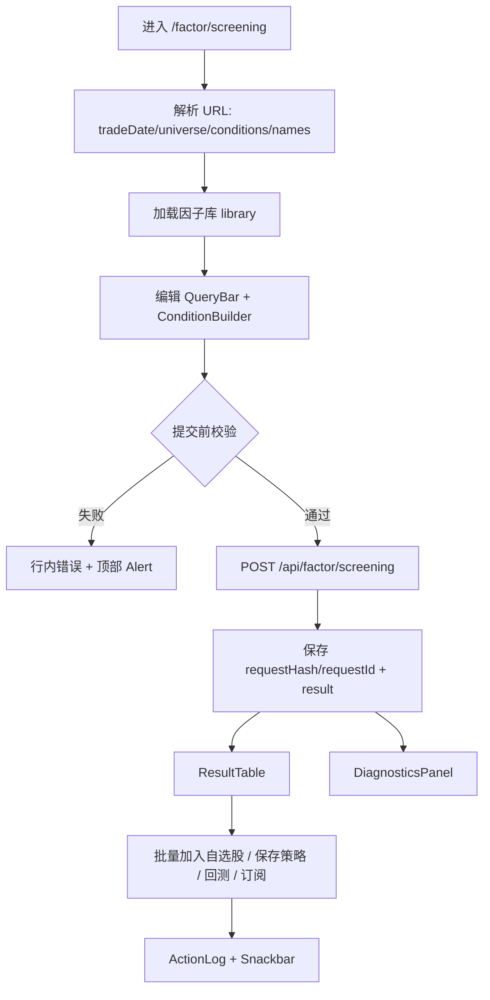

# 因子选股 — 前端设计（v2 重设计）

> 状态：✅ 设计已确认（进入阶段二实现）
> 创建日期：2026-04-30
> 主入口：`src/sections/factor/view/factor-screening-view.tsx`
> 路由：`/factor/screening`
> 关联后端：`/api/factor/library`、`/api/factor/screening`、`/api/factor/backtest/*`、`/api/factor/optimization`、`/api/watchlist/stocks/batch`
> 设计视角：资深金融产品经理 + 资深从业者 + 资深 UI/UE 设计师

---

## 一、功能要点提炼与补充（PM 视角）

### 1.1 用户原始诉求复述

> “重新审视因子选股页面，看看是否有要优化的点，落实到文档，需要后端支持的点也落到文档”

用户没有指定单个按钮或字段，而是要求对现有因子选股页做**完整复盘**：找体验、数据契约、研究闭环、后端支撑上的优化点，并把可执行方案沉淀为阶段一设计文档。

### 1.2 模块定位与价值主张

- **30 秒回答**：在指定交易日、指定股票池里，哪些股票满足这组因子条件？结果是否可信（数据新鲜度 / 缺失率 / 命中率）？
- **3 分钟动作**：搭条件 → 看命中概览 → 解释为什么入选 → 加入自选股 / 保存为策略 / 发起回测 / 建条件订阅。
- **边界声明**：
  - 与 **股票列表/高级选股器** 区别：股票列表看基础行情、财务、概念、资金等宽表字段；因子选股只处理因子库中已定义并可预计算的横截面因子。
  - 与 **因子库** 区别：因子库负责“找因子、看质量”；因子选股负责“组合条件、生成候选池、进入验证与跟踪”。
  - 与 **因子详情** 区别：因子详情解释单因子的 IC / 分层 / 分布；因子选股解释多因子条件如何共同筛出股票。
  - 与 **回测工作台** 区别：因子选股只提供快速验证入口；完整资金曲线、交易明细、归因报告仍归回测模块。
  - 与 **自选股 / 组合管理** 区别：因子选股输出“候选名单”，不是持仓建议；加入自选股是跟踪动作，加入组合需经过仓位与风险约束。

### 1.3 功能要点提炼（结构化）

| #   | 功能点                       | 用户决策场景                                       | 数据来源 / 依赖                            |
| --- | ---------------------------- | -------------------------------------------------- | ------------------------------------------ |
| 1   | 构建多因子条件               | 用估值、质量、动量、资金等多维度组合筛股票         | `factorApi.library`、`factorApi.screening` |
| 2   | 明确日期与股票池口径         | 确认“用哪天的横截面数据、覆盖哪些股票”             | `/api/factor/screening`、后端交易日解析    |
| 3   | 展示数据新鲜度与缺失率       | 区分“没有股票命中”和“因子数据缺失 / 日期无快照”    | 后端需补 `summary / dataFreshness`         |
| 4   | 预览条件命中漏斗             | 判断是哪一个条件把候选池压得过窄                   | 后端需补 `conditionPassCounts`             |
| 5   | 支持组合排序 / 因子得分      | 用多因子加权而不是单一排序因子决定 TopN            | 后端需补 `score` 计算口径                  |
| 6   | 解释单只股票入选原因         | 复盘“这只股票为什么进来了、每个条件值是多少”       | 后端需补阈值、排名、分位字段               |
| 7   | 结果诊断面板                 | 看行业集中度、因子分布、相关性、极端值             | 后端可补聚合统计；前端可轻量聚合           |
| 8   | 条件预设 / 历史记录          | 保存常用策略雏形，避免每次重建                     | 后端需补预设 CRUD，或先本地存储            |
| 10  | 加入自选股 / 保存策略 / 回测 | 从候选池进入跟踪和验证                             | `watchlist`、`factor/backtest/*`           |
| 11  | 条件订阅                     | 每日/每周自动运行同一组选股条件，追踪新增/退出股票 | 需扩展条件订阅支持因子选股                 |
| 12  | URL 持久化与分享             | 把筛选条件分享给同事，刷新不丢状态                 | 前端 URL search params                     |

### 1.4 资深从业者补充（行业最佳实践）

| 补充项                               | 为什么补充                                                                                             |
| ------------------------------------ | ------------------------------------------------------------------------------------------------------ |
| **避免未来函数**                     | 因子选股必须严格基于 `tradeDate` 当日或之前已可得数据；需要标出财报类因子的公告日/可用日口径。         |
| **区分“横截面分位”与“原始阈值”**     | `top_pct` / `bottom_pct` 比 `pe_ttm < 20` 更稳定，但必须说明是在全股票池排名还是在当前候选集迭代排名。 |
| **暴露缺失率与覆盖度**               | 多因子交集很容易因为某个因子缺失导致候选池骤降；没有缺失率会误判策略无效。                             |
| **显示条件命中漏斗**                 | 研究员调参时最常问“是哪条条件杀掉了大多数股票”，不能只给最终 `total`。                                 |
| **控制行业/市值暴露**                | 多因子筛选可能无意中过度集中在银行、煤炭、小市值；应给行业与市值分布提示。                             |
| **支持去极值 / 标准化 / 中性化**     | 多因子打分如果直接加权原始值，会被量纲和极端值污染；至少要规划 z-score、winsorize、行业中性化。        |
| **把筛选结果接到回测**               | 静态候选名单只能说明“今天长这样”；是否有交易价值要看调仓、成本、滑点后的回测。                         |
| **把筛选结果接到跟踪**               | 实盘研究需要“今天入选，后续表现如何”；加入自选股和条件订阅是自然闭环。                                 |
| **标记 ST / 停牌 / 新股 / 退市风险** | 因子值漂亮但无法交易或交易约束过强的股票要显性提示。                                                   |
| **记录策略版本**                     | 条件组合一旦保存为策略，应保留条件快照、回测参数、创建人和变更记录。                                   |

### 1.5 待确认清单（已确认 ✅，2026-05-01）

> 用户决策：**全部按推荐方案执行**。

- [x] **Q1**：第一期保持“所有条件 AND”，不引入条件组 / OR / NOT。条件组放入 v2 Backlog。
- [x] **Q2**：本期上线“单因子排序 + 加权综合分”两档；综合分依赖后端 `scoreConfig`，未实现前在 UI 上以 feature flag 灰显并 fallback 单因子排序。
- [x] **Q3**：`top_pct / bottom_pct` 口径固定为“在选定股票池全集内横截面排名”，由后端在 `conditionPassCounts[].threshold` 中返回实际阈值（前端只展示，不本地估算）。
- [x] **Q4**：闭环动作优先级（高→低）：① 加入自选股 → ② 保存策略 → ③ 快速回测 → ④ 创建订阅。加入自选股依赖已有后端能力，其他依赖后端契约修复，阶段二接通已就绪部分，未就绪的按钮置灰并提示“等待后端”。
- [x] **Q5**：接受新增后端端点 `screening/summary`（合并到 `screening` 响应）、`screening/presets`、`export/factor-screening`；前端阶段二按 P0/P1 分批接入，缺失字段时降级渲染。
- [x] **Q6**：支持交易约束过滤——排除 ST、排除停牌、最小上市天数（默认 60）、排除北交所。前端 UI 在 QueryBar 提供开关，参数透传后端；后端未支持时仅前端轻量过滤（基于 `ts_code` 前缀 / `name` 前缀），并在 KPI Strip 标注“前端过滤”。

---

## 二、现状盘点与不足（仅重构场景）

### 2.1 现有功能清单

| 模块/Tab              | 入口文件                                                           | 主要数据/接口                                     | 行为                                                                    |
| --------------------- | ------------------------------------------------------------------ | ------------------------------------------------- | ----------------------------------------------------------------------- |
| 页面薄壳              | `src/pages/factor-screening.tsx`                                   | 无                                                | 设置 title，渲染 `FactorScreeningView`，符合 `pages/` 薄壳规则          |
| 主视图容器            | `src/sections/factor/view/factor-screening-view.tsx`               | `factorApi.library()`、`factorApi.screening()`    | 加载因子库、维护日期/股票池/条件/排序/分页/结果状态，触发筛选           |
| 全局参数卡            | 同主视图                                                           | 本地 `UNIVERSE_OPTIONS`                           | 选择日期、股票池；当已有条件时展示排序因子与排序方向                    |
| 条件构建器            | `src/sections/factor/factor-screening-conditions.tsx`              | `FactorCondition[]`                               | 最多 10 条条件；添加、删除、开始选股                                    |
| 条件行                | `src/sections/factor/factor-screening-condition-row.tsx`           | `FactorDef[]`、`FactorCondition`                  | 选择因子、运算符、阈值；支持 `gt/gte/lt/lte/between/top_pct/bottom_pct` |
| 结果表格              | `src/sections/factor/factor-screening-table.tsx`                   | `FactorScreeningResult`                           | 展示排名、代码、名称、行业、动态因子列；分页                            |
| 因子 API              | `src/api/factor.ts`                                                | `/api/factor/library`、`/api/factor/screening` 等 | 类型与接口封装，全部使用 `apiClient.post()`                             |
| 后端筛选 DTO          | `server-code/src/apps/factor/dto/factor-screening.dto.ts`          | `FactorScreeningDto`                              | 校验 `tradeDate=YYYYMMDD`、分页、排序、条件数组                         |
| 后端筛选服务          | `server-code/src/apps/factor/services/factor-screening.service.ts` | `FactorComputeService.getRawFactorValuesForDate`  | 拉取每个因子截面值 → 条件交集 → 股票基本信息 → 单因子排序 → 分页返回    |
| 回测/策略能力（相邻） | `factor-backtest-panel.tsx`、`factor/backtest/*`                   | `submitFactorBacktest`、`saveFactorAsStrategy`    | 因子详情页已有回测面板；因子选股页未集成闭环动作                        |
| 自选股能力（相邻）    | `src/api/watchlist.ts`                                             | `/api/watchlist/stocks/batch`                     | 后端已有批量加入自选股能力；因子选股结果页未接入                        |
| 条件订阅能力（相邻）  | `src/api/screener-subscription.ts`                                 | `/api/screener-subscription/*`                    | 当前类型面向股票高级选股 `ScreenerFilters`，不支持 `FactorCondition[]`  |

### 2.2 不足之处（按严重性排序）

| #    | 问题                                                                                                                                                                | 影响                                                             | 触发场景                  |
| ---- | ------------------------------------------------------------------------------------------------------------------------------------------------------------------- | ---------------------------------------------------------------- | ------------------------- |
| P0-2 | **结果可信度不足**：只显示 `total`，没有 `universeCount / matchedRate / missingRate / asOfTradeDate / dataFreshness`                                                | “0 只股票”无法判断是条件过严、数据缺失、非交易日还是因子未预计算 | 任意筛选                  |
| P0-3 | **条件校验过弱**：`between` 未阻止 `min > max`；`top_pct` 空值后端默认 20 但前端不提示；`gt/gte/lt/lte` 空值会静默无结果                                            | 用户输入错误时得到空表，误判策略无效                             | 新手调参或快速试错        |
| P0-4 | **后端返回字段与前端类型不严谨**：后端 `name / industry` 可能为 `null`，前端 `ScreeningItem` 标成 `string`；后端返回 `conditionCount`，前端类型未声明               | 类型契约隐藏风险，极端数据下 UI 显示不稳定                       | 股票基本信息缺失          |
| P1-1 | **没有条件命中漏斗**：后端不返回每条条件筛掉多少股票                                                                                                                | 无法定位哪条条件过严，调参效率低                                 | 多条件组合                |
| P1-2 | **缺少结果诊断面板**：无行业分布、因子分位分布、市值分布、极值提示                                                                                                  | 候选池是否过度集中不可见                                         | 结果 > 20 只              |
| P1-3 | **只支持单因子排序**：`sortBy` 只能选择一个已入条件因子                                                                                                             | 无法表达“价值 40% + 质量 30% + 动量 30%”这类常见多因子打分       | 多因子策略雏形            |
| P1-4 | **缺少入选解释**：行内只展示因子值，不展示分位、排名、实际阈值、是否踩线                                                                                            | 用户难以判断股票是强入选还是刚好过线                             | 复盘单只股票              |
| P1-5 | **条件无法保存/加载/分享**：刷新页面丢失，URL 不承载条件                                                                                                            | 常用条件组合要反复重建，团队协作困难                             | 日常研究                  |
| P1-6 | **闭环动作缺失**：结果页不能批量加入自选股、保存为策略、创建订阅或直接发起回测                                                                                      | 从发现到跟踪/验证断裂                                            | 选出候选池后              |
| P1-7 | **回测/策略契约需对齐**：前端 `SaveAsStrategyResponse` 期待 `strategyName/version`，后端返回 `name/strategyConfig/backtestDefaults`；归因接口前后端字段也不完全一致 | 如果把回测面板搬到本页，会先遇到契约不一致                       | 因子选股闭环实现          |
| P1-8 | **后端每次筛选逐因子拉取全量截面再内存过滤**                                                                                                                        | 因子多、股票池大、分页频繁时成本高                               | 5+ 因子、全市场、多人并发 |
| P2-1 | **股票池选项硬编码**：只有全市场、沪深300、中证500、中证1000、上证50                                                                                                | 无法支持中证2000、创业板、科创板、自定义股票池                   | 扩展股票池                |
| P2-2 | **表格信息密度不足**：列不可配置，因子列显示英文名，数值固定 `toFixed(4)`                                                                                           | 不同因子量纲展示不友好，长因子名横向拥挤                         | 选择 5+ 因子              |
| P2-3 | **因子库加载缺少错误态**：`library()` 只有 `finally`，无 `catch` 与重试                                                                                             | 因子库失败时条件构建区域可能空白                                 | 网络失败                  |
| P2-4 | **响应式体验弱**：条件行 flex 换行后控件堆叠，删除按钮位置不稳定                                                                                                    | 小屏或窄窗口不易编辑                                             | 13 寸屏 / Split View      |
| P2-5 | **无请求取消与防抖**：连续点击筛选或快速翻页可能出现结果覆盖                                                                                                        | 后返回的旧请求覆盖新结果                                         | 网络慢、用户连点          |

### 2.3 重设计应对策略（一一对应 2.2）

| 对应问题 | 应对策略                                                                                       | 取舍说明                                               |
| -------- | ---------------------------------------------------------------------------------------------- | ------------------------------------------------------ | ----------------------------------------------- | -------------------- |
| P0-2     | 结果顶部增加 KPI Strip：股票池规模、命中数、命中率、缺失率、数据日期、新鲜度状态               | 后端补 `summary`；缺字段时灰显                         |
| P0-3     | 条件行内做即时校验；提交前汇总错误；后端新增 validate/preview 返回规范化条件与提示             | 前端校验负责体验，后端校验负责权威                     |
| P0-4     | 前端类型改为 `name: string                                                                     | null`、`industry: string                               | null`，补 `conditionCount`；UI 对 null 显示 `—` | 阶段二代码实现时处理 |
| P1-1     | 增加“条件命中漏斗”：每条条件显示输入前/输入后数量、剔除数量、缺失数量                          | 后端一次性返回，避免前端重复请求                       |
| P1-2     | 结果区拆为 Table / Diagnostics / Action Log 三视图，Diagnostics 展示行业、分位、相关性和异常值 | 首期可先用后端 summary，后续补图表                     |
| P1-3     | 增加“排序模式”：单因子排序 / 加权综合分；综合分支持权重、方向、标准化方式                      | 加权综合分依赖后端计算，避免前端与回测口径不一致       |
| P1-4     | 行详情 Drawer 展示“入选证据链”：因子值、分位、排名、阈值、是否刚过线、缺失字段                 | 点击股票或行内“解释”打开                               |
| P1-5     | 条件写入 URL；新增本地最近 10 条历史；后端预设 CRUD 作为 P1                                    | 分享链接不带用户私有名称，只带条件 JSON 编码或短链 ID  |
| P1-6     | 结果表增加批量选择，顶部 Action Bar：加入自选股、保存策略、发起回测、创建订阅                  | 先接已有 `watchlist/stocks/batch`；其他依赖后端修契约  |
| P1-7     | 阶段二先修前后端类型：`save-as-strategy` 响应、`attribution` 入参/响应、回测状态字段           | 不修契约不把回测面板搬进选股页                         |
| P1-8     | 后端增加筛选请求 hash / cache / async job：分页、回测复用同一次筛选快照                        | 大数据量时必要；小数据量仍可同步返回                   |
| P2-1     | 增加 `/api/factor/universes` 或复用市场指数列表；支持自定义股票池 ID                           | 硬编码保底，后端列表优先                               |
| P2-2     | 表格列配置、因子 label 展示、数值格式按因子元数据决定（percent / ratio / raw）                 | 需要因子库补 `format` 元数据                           |
| P2-3     | 因子库加载失败显示 Alert + 重试；使用 Skeleton 保留布局                                        | 阶段二顺手修                                           |
| P2-4     | 条件行改为桌面三段式、移动端卡片式；删除按钮固定右上角                                         | 不为移动端牺牲桌面密度                                 |
| P2-5     | 给筛选请求加 requestSeq / AbortController；翻页禁用旧请求覆盖                                  | 遵循项目 `useState/useCallback/useEffect` 数据获取模式 |

---

## 三、功能细化拆分

> 把第 1 章的功能要点拆到“每一步都能直接进入开发任务”的颗粒度。

### 3.1 模块结构树

```text
FactorScreeningView v2（因子选股研究工作台）
├── ScreeningHeader
│   ├── 标题 / 最近一次运行摘要 / 后端能力提示
│   └── 快捷入口：从因子库导入、加载预设、最近历史
├── QueryBar（粘性）
│   ├── tradeDate / universe / exclude ST / exclude suspended / min list days
│   ├── sort mode：单因子 / 综合分
│   └── Run / Reset / Save Preset
├── ConditionBuilder
│   ├── FactorPicker（搜索、分类、质量指标）
│   ├── ConditionGroup（AND v1；AND/OR v2）
│   ├── ConditionRow（运算符 + 值 + 校验 + 阈值预览）
│   └── ConditionFunnelPreview（命中漏斗）
├── ResultWorkspace
│   ├── KpiStrip（命中数、命中率、缺失率、数据日期、耗时）
│   ├── ResultToolbar（批量动作、列配置）
│   ├── ResultTable（可选列、行选择、解释入口）
│   ├── DiagnosticsPanel（行业/市值/因子分布/相关性）
│   └── ActionLog（加入自选股、回测、策略保存结果）
└── Drawers / Dialogs
    ├── StockEvidenceDrawer（入选证据链）
    ├── SavePresetDialog
    ├── SaveAsStrategyDialog
    ├── QuickBacktestDrawer
    ├── AddToWatchlistDialog
    └── ExportDialog
```

### 3.2 子模块逐个细化

#### 3.2.1 `ScreeningHeader`

- **职责**：把因子选股从“表单页”升级为“研究工作台入口”。
- **数据**：最近一次运行时间、最近交易日、后端能力开关、预设数量。
- **交互**：点击“加载预设”打开预设抽屉；点击“从因子库导入”解析 URL `names` 参数或跳因子库。
- **状态**：无历史时显示“尚未运行因子选股”；后端能力缺失时显示轻量提示条。
- **边界条件**：后端未实现 P1 能力时，不阻断核心筛选。

#### 3.2.2 `QueryBar`

- **职责**：统一管理影响筛选结果的全局口径。
- **数据**：`tradeDate`（内部统一 `YYYYMMDD`）、`universe`、交易约束、排序模式。
- **交互**：切换日期或股票池后标记结果为“待重新运行”；点击 Run 才发请求。
- **状态**：loading 时禁用 Run；非交易日/无快照时展示后端返回原因。
- **边界条件**：`tradeDate` 为空时禁止提交；日期不得晚于今天；股票池列表后端失败时回退硬编码 5 项。

#### 3.2.3 `FactorPicker`

- **职责**：让用户快速找因子，而不是在超长 Select 里滚动。
- **数据**：`factorApi.library({ enabledOnly: true })`，建议后端补 `summary / format / direction / coverage`。
- **交互**：支持搜索、分类、收藏、最近使用；选择后生成条件行。
- **状态**：loading 用 Skeleton；error 用 Alert + 重试。
- **边界条件**：因子禁用、缺快照、覆盖度低时可选但给 Warning。

#### 3.2.4 `ConditionBuilder`

- **职责**：构建可解释、可校验的因子条件。
- **数据**：`FactorCondition[]`；后端 validate/preview 返回规范化条件、实际阈值、命中数量。
- **交互**：添加/删除/复制条件；拖拽排序；点击“预览漏斗”不刷新结果表。
- **状态**：行内错误（缺值、范围反向、percent 非 1~100）即时显示；全局错误聚合到顶部。
- **边界条件**：最多条件数仍可保留 10，但提示“超过 6 条建议拆分为预设”；`between` 必须 `min <= max`。

#### 3.2.5 `ConditionFunnelPreview`

- **职责**：解释每条条件的筛选杀伤力。
- **数据**：后端返回 `conditionPassCounts[]`：`beforeCount / passCount / missingCount / afterCount / threshold`。
- **交互**：点击某条漏斗高亮对应条件行；点击缺失数打开缺失样本列表。
- **状态**：preview 未执行时显示“运行预览后查看每条条件命中”；请求失败时给重试。
- **边界条件**：后端不支持 preview 时隐藏本区块，不假装准确。

#### 3.2.6 `ResultTable`

- **职责**：展示可操作的候选池，而不是只读表。
- **数据**：`items[]`，建议字段：`tsCode / name / industry / market / close / pctChg / amount / score / rank / factorValues / factorRanks / warnings`。
- **交互**：行选择、列配置、排序、点击股票跳详情、点击“解释”打开 Drawer、批量动作。
- **状态**：loading 使用表格骨架；empty 根据原因分文案：条件过严 / 数据缺失 / 非交易日 / 后端错误。
- **边界条件**：`name / industry` 为 null 显示 `—`；因子值按元数据格式化，不统一 `toFixed(4)`。

#### 3.2.7 `DiagnosticsPanel`

- **职责**：快速判断候选池是否“可交易、不过度拥挤、不过度暴露”。
- **数据**：行业分布、市值分布、因子分位分布、Top 相关因子、极端值名单。
- **交互**：点击行业柱子过滤表格；点击异常值定位股票；点击相关因子跳相关性页。
- **状态**：候选数 < 5 时提示样本不足；数据字段缺失时灰显。
- **边界条件**：首期可只做行业分布 + 因子分布，相关性作为 P2。

#### 3.2.8 `ActionCenter`

- **职责**：把“筛出来”接到“跟踪、验证、复用”。
- **数据**：选中 `tsCodes`、当前条件快照、排序口径、结果 requestId。
- **交互**：
  - 加入自选股：调用 `batchAddStocks`，notes 自动写入“来自因子选股：预设名/日期/条件摘要”。
  - 保存策略：调用 `saveFactorAsStrategy`，弹窗补名称、标签、TopN、权重方式。
  - 发起回测：复用 `submitFactorBacktest`，默认 start/end/费用/滑点可编辑。
  - 创建订阅：依赖后端把 `ScreenerSubscription` 扩展到因子条件。
- **状态**：每个动作成功/失败写入 ActionLog。
- **边界条件**：未运行结果时禁用；未选中时可对当前全部结果执行（需二次确认）。

#### 3.2.9 `PresetManager`

- **职责**：保存、加载、分享常用因子条件。
- **数据**：本地最近历史 + 后端预设 CRUD。
- **交互**：保存当前条件；加载预设覆盖当前条件；复制分享链接。
- **状态**：本地历史最多 10 条；后端失败时仍可保存本地草稿。
- **边界条件**：分享链接不包含用户私有备注；如条件过长，改用后端短链 ID。

### 3.3 数据流与状态管理



- **共享上下文**：`tradeDate`、`universe`、`conditions`、`sortMode`、`page`、`selectedRows`、`lastRequestHash`。
- **URL 持久化**：`tradeDate / universe / conditions / sortBy / sortOrder / scoreWeights` 写入 query；`selectedRows` 不写 URL。
- **请求一致性**：分页、回测、保存策略都引用同一个条件快照；如果条件变更，结果区标记“已过期，请重新运行”。
- **跨模块联动**：
  - 因子库 → 因子选股：`/factor/screening?names=pe_ttm,roe_ttm` 预填条件。
  - 因子选股 → 股票详情：点击 `tsCode`。
  - 因子选股 → 自选股：批量添加并附条件摘要。
  - 因子选股 → 回测/策略：保存条件快照与回测默认参数。
  - 因子选股 → 条件订阅：以当前条件创建定时任务。

---

## 四、UI/UE 设计（设计师视角）

### 4.1 设计概念关键词（最多两个）

**Explainable Funnel × Research Flight Deck**

- **Explainable Funnel**：每条因子条件像漏斗一样可见，用户知道股票为什么留下或被剔除。
- **Research Flight Deck**：页面不是单表单，而是研究员从“筛选 → 诊断 → 行动”的驾驶舱。

### 4.2 必须遵守的项目 UI 规范（quant-client）

- 颜色：仅用 `theme.palette.*` / `varAlpha(...)`，禁止硬编码。
- 涨红跌绿仅用于行情字段（`pctChg`），不作为页面主色。
- 字号最小 12px；因子值、排名、百分位使用等宽数字对齐。
- MUI 组件 `sx` prop 优先；间距使用 8 倍数（8 / 16 / 24）。
- 动效只用于运行完成、漏斗条变化、批量动作反馈，200ms fade/width transition 即可。
- 表格行高建议 40；诊断 mini 图不小于 160 高，避免金融指标不可读。

### 4.3 页面布局

```text
┌──────────────────────────── 因子选股研究工作台 ────────────────────────────┐
│ 因子选股  最新交易日 20260429 · 187 个可用因子 · 6 个 stale                 │
│ [加载预设] [从因子库导入] [最近历史]                         [后端能力提示] │
├──────────────────────────────── QueryBar（粘性） ─────────────────────────┤
│ 日期 [2026-04-29] 股票池 [沪深300] 交易约束 [排除ST] [排除停牌] [新股>60日] │
│ 排序 [综合分]  权重 [价值40 质量30 动量30]                  [运行选股] [重置] │
├────────────────────────── 条件构建 + 命中漏斗 ─────────────────────────────┤
│ ┌──────── 条件编辑（左 7 列） ────────┐ ┌──── 命中漏斗（右 5 列） ───────┐ │
│ │ 1  ROE_TTM      >=       12%       │ │ 股票池 300 → ROE 86 → PE 42   │ │
│ │ 2  PE_TTM       bottom  30%        │ │ 缺失：ROE 4、PE 2、MOM 0       │ │
│ │ 3  MOM_20D      top     40%        │ │ 实际阈值：PE≤18.2，MOM≥3.4%    │ │
│ └────────────────────────────────────┘ └────────────────────────────────┘ │
├──────────────────────────── 结果工作区 ───────────────────────────────────┤
│ KPI: 命中 42 / 300 · 命中率 14.0% · 缺失率 2.1% · 耗时 420ms · 日期新鲜 ✓ │
│ Tabs: [结果表] [诊断] [动作日志]                                           │
│ ┌───────────────────────────────────────────────────────────────────────┐ │
│ │ ☐ Rank  Code      Name   Industry  Score  ROE%ile PE%ile MOM%ile  操作 │ │
│ │ ☐ 1     600000.SH  浦发…  银行       91.2   88     12     76      解释 │ │
│ │ ☐ 2     000001.SZ  平安…  银行       88.4   80     18     71      解释 │ │
│ └───────────────────────────────────────────────────────────────────────┘ │
│ Selected 12: [加入自选股] [保存策略] [快速回测] [创建订阅]           │
└───────────────────────────────────────────────────────────────────────────┘
```

### 4.4 关键组件设计要点

- **QueryBar**：粘性顶部；背景使用 `varAlpha(theme.vars.palette.background.paperChannel, 0.86)`；滚动时保留运行按钮。
- **条件行**：左侧 2px 状态条：灰=未完成、绿=有效、黄=有提示、红=错误；不要整行大红大绿。
- **因子选择**：Select 升级为 Autocomplete + 分类 group；选项显示 `label · name · coverage · latestDate`。
- **漏斗条**：横向条形，宽度代表保留比例；Tooltip 展示 before/pass/missing/threshold。
- **KPI Strip**：5 个小卡，数字使用 tabular nums；缺失率 > 20% 标为 warning。
- **结果表**：行 hover 显示快捷动作图标；`解释`按钮固定最后一列；数值列右对齐。
- **StockEvidenceDrawer**：宽 520；顶部股票摘要，中部条件证据链，底部动作按钮。
- **Action Bar**：选中态从表格底部浮出，避免占据首屏；批量动作需要二次确认。
- **Tooltip**：只在图标、指标标签、阈值处触发，禁止整卡/整行触发。

### 4.5 交互细节（micro-interactions）

- 切日期/股票池/条件后，结果区右上角出现“条件已变更，需重新运行”，不自动清空旧结果。
- 添加条件时自动聚焦因子搜索框；复制条件保留因子和运算符但清空阈值。
- `top_pct / bottom_pct` 输入框后缀固定 `%`，提交后在行内显示后端实际阈值。
- 点击漏斗某一段，高亮对应条件行 1.2 秒。
- 运行成功后 KPI Strip 200ms fade in；运行失败保留上次结果但标记过期。
- Empty 文案按原因区分：
  - 条件未完成：“先选择因子并填写阈值。”
  - 无命中：“当前条件无命中，建议放宽 ROE 或 PE 条件。”
  - 数据缺失：“因子 `xxx` 在 20260429 缺少快照，请检查预计算状态。”
  - 后端能力缺失：“后端暂未返回命中漏斗，当前仅展示最终结果。”

### 4.6 暗色 / 亮色双主题适配检查

- 漏斗条背景使用 `varAlpha(theme.vars.palette.primary.mainChannel, 0.12)`；高亮使用 `primary.main`。
- 条件状态条使用 `success/warning/error/text.disabled` 的 theme channel。
- 表格 hover 使用 `varAlpha(theme.vars.palette.primary.mainChannel, 0.04)`。
- 抽屉阴影使用主题预设，不写死 `rgba`。
- 诊断图表颜色从 `theme.palette.chart` 或语义色派生，不写十六进制。

---

## 五、实现步骤与要点（给阶段二的人看的施工图，本阶段不写代码）

### 5.1 实现顺序（按 quant-client 项目铁律）

1. `src/api/factor.ts`：
   - 修正 `ScreeningItem` 的 `name / industry` 为 `string | null`。
   - 补充 `conditionCount / summary / diagnostics / requestId / score` 等 optional 类型。
   - 新增 `validateFactorScreening`、`saveFactorScreeningPreset`、`exportFactorScreening` 等 API（全部 `apiClient.post()`）。
2. `src/sections/factor/screening/`：按子目录拆分新组件：
   - `screening-query-bar.tsx`
   - `screening-condition-builder.tsx`
   - `screening-condition-row.tsx`
   - `screening-funnel-preview.tsx`
   - `screening-result-kpi-strip.tsx`
   - `screening-result-table.tsx`
   - `screening-diagnostics-panel.tsx`
   - `screening-action-bar.tsx`
   - `screening-preset-dialog.tsx`
   - `stock-evidence-drawer.tsx`
3. `src/sections/factor/view/factor-screening-view.tsx`：组合新组件，保留旧视图作为 feature flag 回退。
4. `src/pages/factor-screening.tsx`：保持薄壳，不放逻辑。
5. `src/routes/sections.tsx` + `src/layouts/nav-config-dashboard.tsx`：路由已存在，若导航文案需要从“因子选股”升级为“因子选股工作台”，只改导航配置。
6. 测试文件 `src/sections/factor/screening/__tests__/`：
   - 条件校验（空值、between 反向、percent 边界）
   - URL 持久化
   - 结果表 null 字段渲染
   - Action Bar 批量动作启停

### 5.2 关键技术点

- **状态共享方案**：页面级 `useReducer` 比散落 `useState` 更适合条件、结果、选中态、过期态；仍不引入 Zustand。
- **日期口径**：内部 state 使用 `YYYYMMDD` 字符串；DatePicker 展示时转换为 `YYYY-MM-DD`，提交不传 ISO。
- **条件快照**：每次 Run 生成 `requestHash`，结果、分页、回测、保存策略都绑定这一版快照。
- **请求防串**：使用 request sequence 或 AbortController；旧请求返回时如果 hash 不一致则丢弃。
- **性能敏感处**：
  - 因子库数据缓存到页面生命周期内。
  - 表格超过 200 行时再考虑虚拟化；首期分页 50 足够。
  - Diagnostics 图表按 Tab 懒加载，避免首屏卡顿。
- **容错**：后端未返回 `summary/diagnostics` 时显示降级 UI；不阻断结果表。
- **前后端契约修复优先级**：先修类型 null、save-as-strategy/attribution 字段，再做大组件搬迁。

### 5.3 风险与回退

| 风险                                  | 影响               | 回退策略                                         |
| ------------------------------------- | ------------------ | ------------------------------------------------ |
| 后端 summary / diagnostics 未及时实现 | KPI 与诊断无法展示 | 结果表可先上线；对应区域灰显“等待后端支持”       |
| 综合分口径争议                        | 策略结果不可复现   | 第一版保留单因子排序；综合分放在 feature flag 下 |
| 条件 URL 太长                         | 分享链接不可用     | 超过阈值时保存后端 preset，URL 只带 `presetId`   |
| 回测/策略接口字段不一致               | 闭环动作失败       | 阶段二先补契约测试，再接 UI                      |
| 诊断图过多导致首屏复杂                | 学习成本高         | 默认显示结果表，诊断放 Tab 2                     |

### 5.4 ⚠️ 需要后端支持的清单

#### P0（必须，否则核心流程不可完全可信）

| #    | 字段 / 端点                                                              | 说明                                                                                                   |
| ---- | ------------------------------------------------------------------------ | ------------------------------------------------------------------------------------------------------ | ------------------------------------------- |
| BE-2 | `/api/factor/screening` 响应补 `summary`                                 | `{ universeCount, matchedCount, matchedRate, missingRate, asOfTradeDate, dataFreshness, executionMs }` |
| BE-3 | `/api/factor/screening` 响应补 `conditionPassCounts[]`                   | 每条条件 `{ factorName, operator, beforeCount, passCount, missingCount, afterCount, threshold }`       |
| BE-4 | `/api/factor/screening/validate` 或在 screening 中返回 `warnings/errors` | 校验因子存在、启用、日期覆盖、阈值合理性、percent 口径                                                 |
| BE-5 | `ScreeningItem` 字段契约明确 `name/industry: string                      | null`，并可选补 `market/area/listDate/isSt/isSuspended/latestQuoteDate`                                | 前端要正确显示 null、交易约束与股票基础信息 |
| BE-6 | 返回 `requestId/requestHash`                                             | 分页、回测、保存策略复用同一版条件快照，避免条件变更后串数据                                           |

#### P1（重要，决定研究效率）

| #     | 端点 / 字段                                                                       | 说明                                                                        |
| ----- | --------------------------------------------------------------------------------- | --------------------------------------------------------------------------- |
| BE-7  | `/api/factor/screening/presets/list/create/update/delete`                         | 用户级因子选股预设，保存条件、股票池、排序、权重、标签                      |
| BE-8  | `FactorScreeningDto.scoreConfig` + 响应 `score/rank/factorRanks`                  | 支持多因子加权综合分；需定义标准化、方向、缺失处理、行业中性化口径          |
| BE-9  | `diagnostics` 聚合                                                                | 行业分布、市值分布、因子值分布、极端值、相关性摘要                          |
| BE-10 | `POST /api/factor/universes`                                                      | 返回可用股票池、指数池、自定义股票池元数据，替代前端硬编码                  |
| BE-11 | 扩展 `screener-subscription` 支持 `type='FACTOR_SCREENING'` 与 `factorConditions` | 每日/每周运行因子条件，记录新增/退出股票                                    |
| BE-12 | 对齐 `save-as-strategy` 与 `attribution` 前后端契约                               | `save-as-strategy` 响应字段、归因入参 `backtestId/id`、归因响应字段统一     |
| BE-13 | `POST /api/watchlist/stocks/check`                                                | 批量加入自选股前返回已存在、无效代码、容量限制；已有 `batch` 可继续负责写入 |

#### P2（增值，适合后续迭代）

| #     | 字段 / 端点                                                         | 说明                                               |
| ----- | ------------------------------------------------------------------- | -------------------------------------------------- |
| BE-14 | 异步筛选任务 `POST /api/factor/screening/jobs/*`                    | 大股票池 + 多因子 + 诊断时避免同步接口超时         |
| BE-15 | `FactorDef.format / direction / defaultOperator / defaultThreshold` | 前端按因子元数据渲染数值、默认条件和排序方向       |
| BE-16 | `FactorDef.latestSnapshot / coverageByUniverse`                     | 因子选择时提前提示缺失率与可用日期                 |
| BE-17 | `POST /api/factor/screening/audit/list`                             | 查询用户近期运行条件、保存策略、订阅创建等操作日志 |
| BE-18 | `POST /api/factor/screening/short-link`                             | 长条件生成短链，便于分享与复盘                     |

#### 接口约定补充

- 全部端点必须使用 `POST`，参数走 Body，不使用 query string 或路径 ID。
- 所有日期字段使用 `YYYYMMDD` 字符串，包括 `tradeDate / asOfTradeDate / latestQuoteDate`。
- 新字段全部 optional，前端按缺失降级，避免破坏现有页面。
- `top_pct / bottom_pct` 必须返回后端实际阈值与排名全集口径。
- 数值字段允许 `null`，前端不做非空假设。

---

## 六、验收方式与细节

### 6.1 功能验收清单（可勾选）

- [ ] 第 1 章每个功能点都有对应实现入口。
- [ ] 第 2 章每个 P0/P1 不足都已被第 5 章解决或明确降级。
- [ ] `tradeDate` 请求参数始终为 `YYYYMMDD` 字符串。
- [ ] 条件未填、`between min > max`、`percent` 越界时禁止提交并给行内提示。
- [ ] 结果顶部展示命中数、命中率、缺失率、数据日期与执行耗时。
- [ ] “0 命中”能区分条件过严、数据缺失、非交易日、后端错误。
- [ ] 批量加入自选股可处理已存在/无效代码，并显示 added/skipped。
- [ ] 保存策略 / 快速回测使用当前条件快照，不受后续编辑影响。
- [ ] URL 刷新后可恢复日期、股票池、条件、排序模式。

### 6.2 UI/UE 验收清单

- [ ] 通过 `web-design-guidelines` skill 审查（阶段二末执行）。
- [ ] 暗色 / 亮色双主题截图对比无问题。
- [ ] grep 验证：因子选股新目录下无硬编码十六进制颜色。
- [ ] 字号 ≥ 12px，表格数字列使用等宽数字。
- [ ] 1440 / 1920 宽度下无横向滚动；13 寸 Split View 条件行仍可编辑。
- [ ] 条件漏斗、KPI、表格三块信息层级清晰，首屏能看到“运行按钮 + 至少 3 条条件 + KPI”。
- [ ] Tooltip 只解释口径，不承载主要操作。

### 6.3 性能与质量验收

- [ ] `node_modules/.bin/eslint --fix "src/**/*.{ts,tsx}"` 无报错。
- [ ] `node_modules/.bin/eslint "src/**/*.{ts,tsx}"` 退出码 0 且无输出。
- [ ] `yarn build` 输出 `✓ built in ...`。
- [ ] 因子库加载失败有 Alert + 重试，不出现空白条件区。
- [ ] 快速连续点击 Run / 翻页不会出现旧请求覆盖新结果。
- [ ] 3000 股票 × 6 因子筛选时，前端渲染不超过 50 行分页，不一次性渲染全量。
- [ ] 条件校验、URL 持久化、null 字段渲染都有单元测试。

### 6.4 验收数据样例

| 场景           | 数据                                            | 预期                                                |
| -------------- | ----------------------------------------------- | --------------------------------------------------- |
| 正常交易日     | `20260429`，沪深300，3 条有效条件，命中 42      | KPI、表格、漏斗、批量动作均正常                     |
| 条件过严       | PE 后 5% + ROE 前 5% + 动量前 5%，命中 0        | Empty 文案建议放宽具体条件，并显示漏斗              |
| 因子缺失       | 某因子覆盖率 60%，缺失 120 只                   | KPI warning，漏斗显示 missingCount                  |
| 非交易日       | 周末日期，无快照                                | 显示“该日期无因子快照”，建议使用最近交易日          |
| null 股票信息  | 后端返回 `name=null` 或 `industry=null`         | 表格显示 `—`，不报错                                |
| 自选股批量添加 | 选中 20 只，其中 5 只已存在                     | 显示 added=15/skipped=5，并写入 ActionLog           |
| 保存策略契约   | 后端返回 `name/strategyConfig/backtestDefaults` | 前端按新类型显示成功，不读取不存在的 `strategyName` |

---

## 附：与现有 archive 文档的关系

- `docs/archive/因子市场-前端设计.md` 为 v1 因子市场整体实现规划，包含因子选股初版。
- `docs/archive/因子库-重构-前端设计.md` 聚焦因子目录与质量指标。
- 本文档聚焦 `/factor/screening` 的**选股研究工作台重设计**，旧文档保留作对照，不覆盖。
