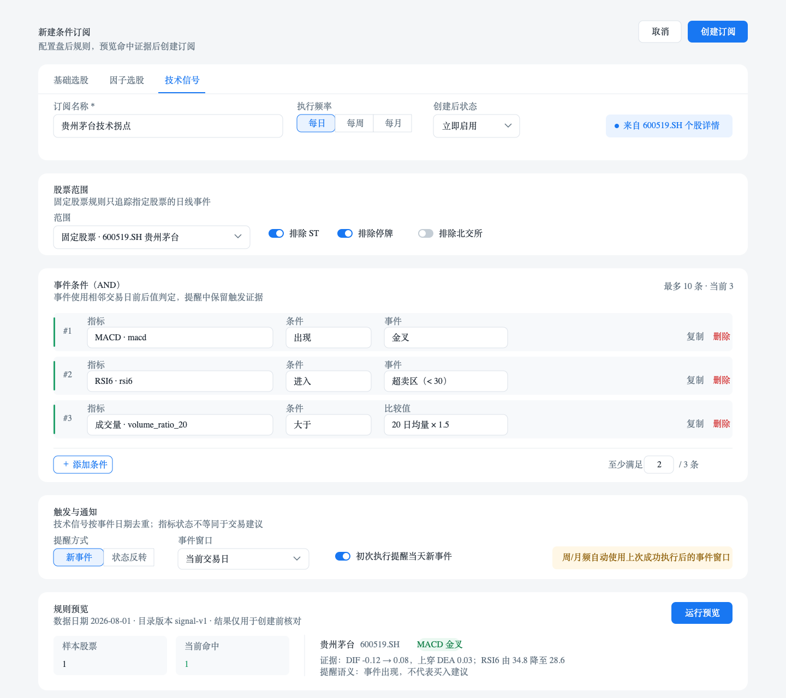

# 条件订阅 — 前端设计（v3 指标规则工作台）

> 状态：🔧 待联调（前端 v3 工作台已完成；等待后端 B0—B4 API 实现）
> 创建日期：2026-08-02
> 决策确认日期：2026-08-03
> 适用仓库：`client-code`
> 关联后端设计：`../../../server-code/docs/design/条件订阅规则引擎-后端设计.md`
> 主入口：`/stock/subscription`、`/stock/subscription/new`、`/stock/subscription/:id`、`/stock/subscription/:id/edit`
> 桌面设计稿：`docs/design/assets/条件订阅规则工作台-桌面设计稿.png`
> 设计视角：金融产品经理 + 量化研究从业者 + UI/UE 设计师

---

## 一、功能要点提炼与补充（PM 视角）

### 1.1 结论先行

条件订阅可以、也应该扩展更多指标，但不应继续向现有 600px 小弹窗堆输入框。推荐把它升级为统一的桌面端“指标规则工作台”，让用户订阅三类结果：

1. **基础选股**：估值、财务、规模、行情、资金、技术过滤条件命中集合的进入/退出。
2. **因子选股**：内置因子和自定义因子的阈值、排名、Top/Bottom 分位命中集合变化。
3. **技术信号**：个股详情已有的 MACD、KDJ、RSI、BOLL、MA、SAR、成交量等事件出现。

产品统一、执行分层：用户面对同一个创建入口，前后端内部按规则类型分派。P0—P2 每条订阅只选择一种数据源；跨源组合仅在数据口径、预计算和证据链稳定后进入 P3。

本模块当前没有移动端产品范围。本设计只定义桌面端，目标验收宽度为 1440px、1920px，最低工作宽度为 1280px。

### 1.2 用户任务与价值

| 用户任务 | 当前成本 | v3 目标 |
| ------------------------------ | ------------------------ | -------------------------------------------- |
| 每天找新进入某组选股条件的股票 | 重复打开选股器并手工比较 | 订阅集合变化，只提醒新进入/退出 |
| 追踪因子筛选结果 | 因子选股结果无法直接订阅 | 从因子页面一键带入规则并定时执行 |
| 等待个股技术信号 | 反复打开个股详情查看 | 在指标产生事件时提醒，并附触发证据 |
| 判断提醒是否可信 | 只有股票代码和新增/退出 | 显示数据日期、指标当前值、前值、阈值和原因 |
| 复盘规则质量 | 日志只有数量和耗时 | 可追溯规则版本、命中明细、数据版本与失败原因 |

### 1.3 指标扩展范围与优先级

| 阶段 | 规则来源 | 范围 | 推荐优先级 | 理由 |
| ---- | -------- | -------------------------------------------------------------- | ---------- | -------------------------------------------------- |
| P0 | 基础选股 | 完整暴露后端现有 50+ 条件；补 `minBuySignalCount` 契约 | 必做 | 能力已存在，主要工作是口径修正和 UI 统一 |
| P1 | 因子选股 | 33 个内置因子 + 启用的自定义因子；比较、Top/Bottom 分位 | 必做 | 研究闭环缺失最明显，已有因子快照可复用 |
| P2 | 技术信号 | MACD/KDJ/RSI/BOLL/MA/SAR/VOLUME 等“出现事件”；可选指标评分阈值 | 推荐 | 用户价值高，但需后端批量快照，不能逐股调用详情接口 |
| P3 | 复合规则 | 多子规则 AND；同源 OR；跨源组合 | 增强 | 先解决可解释性、数据就绪和算力成本，再开放组合 |
| 暂缓 | 盘中信号 | 分钟级行情、盘口、实时跨越事件 | 暂缓 | 当前数据、调度与通知均以盘后为主，语义完全不同 |

### 1.4 规则类型与默认触发语义

| 规则类型 | 默认触发 | 可选触发 | 初次执行 |
| ------------------ | ----------------------- | ------------------------ | ---------------------------- |
| `STOCK_SCREENING` | 新进入集合 `ENTER` | 退出 `EXIT`、两者 `BOTH` | 只建基线，不发送全量命中通知 |
| `FACTOR_SCREENING` | 新进入集合 `ENTER` | `EXIT`、`BOTH` | 只建基线，不发送全量命中通知 |
| `SIGNAL_EVENT` | 新事件 `EVENT` | 评分上穿/下穿、状态反转 | 可通知当天首次出现的事件 |
| `COMPOSITE` | 子规则整体由 false→true | true→false、两者 | P3 再开放 |

“命中条件”不等于交易建议。全站统一使用“新进入、退出、事件出现”，不使用“买入、卖出”，除非原始指标本身明确输出买卖事件。

### 1.5 产品边界

- 条件订阅负责**规则周期执行、状态变化检测、证据留存和通知**。
- 股票列表/因子选股负责**一次性探索和研究**，可把当前条件复制到订阅草稿。
- 个股详情负责**单股分析**，可把某个信号定义复制成固定股票订阅。
- 价格预警负责**价格点位/涨跌幅**；条件订阅不重复构造高频价格预警。
- 策略管理负责可回测、可交易的完整策略；条件订阅不是订单生成器。

### 1.6 已确认产品决策

以下六项按推荐方案冻结，不再作为阶段二待确认项。若后续变更，必须新增决策记录并同步修改前后端契约，不能在实现中临时改口径。

| 决策编号 | 已确认结论 | 一期执行口径 | 后续开放条件 |
| -------- | -------------------------------- | ------------------------------------------------------------------------------------------- | --------------------------------------------------------------------- |
| D-01 | P0—P2 每条订阅只允许一种规则来源 | `STOCK_SCREENING/FACTOR_SCREENING/SIGNAL_EVENT` 三选一；来源切换时确认清空不兼容条件 | P3 完成 point-in-time、成本评估、证据合并和专项压测后开放 `COMPOSITE` |
| D-02 | 集合类规则首次执行只建立基线 | `notifyOnInitialMatch=false`；首次执行展示“基线已建立”，不发送历史存量 | 只允许用户在未来版本显式开启，且创建页必须展示预计通知量 |
| D-03 | 周/月技术事件使用交易日窗口 | `previousSuccessfulTradeDate < eventTradeDate <= tradeDate`；首次无成功记录时只看当前交易日 | 不提供自然日窗口，避免节假日和数据延迟产生歧义 |
| D-04 | 复杂创建器使用独立页面 | 新建、编辑分别走 `/new`、`/:id/edit`；弹窗仅保留迁移期跳转，不承载规则编辑 | 无；该信息架构作为 v3 固定基线 |
| D-05 | 首期保留每用户 10 条订阅配额 | `ACTIVE/PAUSED/ERROR` 均计入配额，删除后释放；暂停不能规避配额 | 连续两个完整交易周获得执行成本数据后，再按规则权重评估分级配额 |
| D-06 | P2 只开放盘后日线信号 | 技术事件基于日线快照，在数据 READY 后执行；不展示分钟、盘口或“实时”文案 | 盘中能力独立立项，具备实时行情、流式计算、去抖和通知 SLO 后再开放 |

### 1.7 一期默认值与保存规则

| 项目 | 已确认默认值 | 前端行为 |
| ------------ | -------------------------------------------- | ------------------------------------------------------------------ |
| 默认规则来源 | `STOCK_SCREENING` | 首次进入展示基础选股；从因子/个股详情带草稿进入时按来源覆盖 |
| 默认股票范围 | 全 A 股；排除 ST、排除停牌、默认不排除北交所 | 展示所有开关的实际值，不用隐式默认值提交 |
| 默认频率 | `DAILY` | 周/月由用户主动选择；页面明确实际按交易日调度 |
| 默认触发 | 集合类 `ENTER`；技术事件 `EVENT` | 集合类可改 `EXIT/BOTH`；事件类不混用集合触发语义 |
| 初次通知 | 集合类关闭；技术事件仅允许当天首次事件 | 摘要区在提交前明确展示，不藏在 Tooltip 中 |
| 条件数量 | 每条规则 1—10 个条件；固定股票 1—100 只 | 达到上限后禁用添加并解释上限，不静默截断 |
| 预览展示 | 前 20 条；`matchedCount` 始终显示完整数量 | “20”只限制列表展示，不影响执行和持久化 |
| 通知摘要 | 默认 20 条，允许 1—100 | 超出部分显示“另有 N 条”，详情仍可分页查看全部 hit |
| 创建状态 | 默认 `ACTIVE` | 只有当前规则 fingerprint 预览成功且数据 READY 才可创建 ACTIVE |
| 数据未就绪 | 允许保存为 `PAUSED`，不允许 ACTIVE | 保留已通过结构校验的规则，显示缺失数据集和最近可用日期；不建立基线 |
| 草稿有效期 | 30 分钟、一次性消费 | 超时丢弃并提示；成功读取后清理 `sessionStorage`，防止重复带入 |
| 失败策略 | 连续 3 次真实执行失败转 `ERROR` | `DATA_NOT_READY` 显示为跳过，不累计失败，也不误显示为 0 命中 |

---

## 二、现状盘点与不足

### 2.1 当前实现盘点（以 2026-08-02 代码为准）

| 模块 | 当前能力 | 关键文件 | 结论 |
| ------------ | --------------------------------------------------------------- | ------------------------------------------------------------------- | -------------------------------------------------------- |
| 条件订阅创建 | 从策略或 7 个常用自定义字段创建 | `src/sections/screener-subscription/subscription-create-dialog.tsx` | UI 覆盖仍低于后端能力；F0 已补偏多信号数量 |
| 条件订阅编辑 | 名称、频率、7 个常用字段 | `subscription-edit-dialog.tsx` | F0 已纠正过期文案，并提交/保留 legacy filters |
| 列表/详情 | 状态、频率、最近结果、日志、手动执行 | `view/screener-subscription-*-view.tsx` | 运行台骨架可保留 |
| API | list/detail/create/update/delete/pause/resume/run/logs/validate | `src/api/screener-subscription.ts` | F0 已直连接入 `detail`；legacy `validate` 仍待接入主流程 |
| 股票筛选类型 | 已声明大量基础、行情、资金与技术字段 | `src/api/screener.ts` | F0 已补 `minBuySignalCount` 与命中信号结果字段 |
| 因子选股 | 多条件 AND、排序、分位、结果列表 | `src/sections/factor/view/factor-screening-view.tsx` | “创建订阅”入口被禁用 |
| 个股信号 | 多空打分明细和技术指标原因 | `src/sections/stock-detail/**` | 是展示结果，不是可订阅的规则定义/批量市场快照 |

### 2.2 可直接复用的后端能力

| 能力 | 已有状态 | 前端动作 |
| -------------------- | ------------------------------------------------- | ----------------------------------------------- |
| 完整基础选股器 | 已有，含估值、成长、行情、资金、技术等 50+ 条件 | 用指标目录动态生成，而非手写 50 个输入框 |
| 技术综合买入信号数量 | 后端已有 `minBuySignalCount` | 补齐 API 类型、表单定义和预览展示 |
| 因子目录与因子筛选 | 已有 33 个内置因子及自定义因子 | 复用元数据、条件行和格式化逻辑 |
| 单股多空打分 | 已有 MA/MACD/KDJ/RSI/BOLL/WR/CCI/DMI/SAR/VOL 展示 | 只复用指标语义与视觉；P2 改接市场级批量信号 API |
| 订阅状态机和调度 | ACTIVE/PAUSED/ERROR，日/周/月，手动执行、冷却 | 保留列表与详情操作，扩展规则类型和任务证据 |
| WebSocket 通知 | 已有新增命中事件 | 扩为统一触发事件，并在页面内做去重刷新 |

### 2.3 核心不足与风险

| 等级 | 问题 | 影响 | v3 对策 |
| ---- | ---------------------------------- | -------------------------------------- | ------------------------------------------------------- |
| P0 | 创建弹窗仅 6 项，实际筛选器 50+ 项 | 用户无法订阅已经能筛选的条件 | 独立规则工作台 + 指标目录 |
| P0 | 执行器分页取前 500 条作为全量结果 | 大集合会误判退出，通知错误 | 后端新增无分页 `screenCodes`，前端展示命中总数/截断状态 |
| P0 | 查询未统一锁定调度交易日 | 日志日期与实际数据时点可能不一致 | 所有预览/执行返回 `asOfTradeDate`、`dataVersions` |
| P0 | 前端 `detail` 仍 list+filter | 多一次全量数据且错误语义模糊 | 直接调用现有 detail 端点 |
| P0 | 规则只存 filters，缺规则类型和版本 | 无法扩到因子/事件，历史不可复现 | 使用可辨识联合 `ruleSpec` + `ruleVersion` |
| P1 | 因子订阅入口被禁用 | 因子研究无法形成持续监控闭环 | 保存当前因子条件为订阅草稿 |
| P1 | 个股详情信号是即时计算 | 全市场订阅若逐股调用将形成 N+1 | P2 只消费后端日级信号快照/事件表 |
| P1 | MA、BOLL 等模块间语义不完全一致 | 同一名称在筛选器和详情里可能给不同结论 | 指标目录由后端统一 ID、版本、描述和计算口径 |
| P1 | 通知只有代码，缺证据 | 用户无法判断为何命中 | 命中证据含前值、现值、运算符、阈值、原因 |
| P1 | 周/月定时只看执行当日 | 周中/月中短暂事件可能永久漏报 | 技术事件按上次成功执行后的交易日窗口聚合 |
| P2 | 当前条件摘要靠前端手工 labelMap | 扩指标会持续漏标签/单位 | 指标目录返回 label、unit、valueType、operators |

### 2.4 不采用的方案

1. **继续扩大弹窗**：条件数量和联动复杂度已超过 `Dialog maxWidth="sm"` 的适用范围，无法同时容纳条件目录、校验和预览证据。
2. **直接序列化任意表达式**：安全、校验、回放和兼容成本过高；先用后端白名单规则 DTO。
3. **前端拼接因子与技术计算**：会造成数据时点不一致，且无法保证定时任务与页面结果一致。
4. **把所有信号统称“买入信号”**：会误导用户；应保留指标事件与集合变化的原始语义。

---

## 三、功能细化

### 3.1 信息架构

```text
条件订阅
├─ 订阅列表 /stock/subscription
│  ├─ 健康与配额 KPI
│  ├─ 搜索 / 状态 / 规则类型 / 频率 / 数据日期筛选
│  └─ 列表卡：规则摘要、最近数据日、最新变化、运行操作
├─ 新建规则 /stock/subscription/new
│  ├─ 基础信息
│  ├─ 数据范围
│  ├─ 规则来源：基础选股 / 因子选股 / 技术信号
│  ├─ 条件构建
│  ├─ 触发方式与频率
│  └─ 校验、预览、创建
├─ 编辑规则 /stock/subscription/:id/edit
│  └─ 以上内容 + 规则版本变化提示
└─ 订阅详情 /stock/subscription/:id
   ├─ 当前规则快照
   ├─ 最近运行与命中变化
   ├─ 逐股票触发证据
   └─ 执行历史 / 失败诊断
```

### 3.2 前端领域模型

```ts
export type SubscriptionRuleType =
  | 'STOCK_SCREENING'
  | 'FACTOR_SCREENING'
  | 'SIGNAL_EVENT'
  | 'COMPOSITE';

export type ComparisonOperator =
  | 'GT'
  | 'GTE'
  | 'LT'
  | 'LTE'
  | 'EQ'
  | 'BETWEEN'
  | 'IN'
  | 'CROSS_UP'
  | 'CROSS_DOWN'
  | 'APPEARS';

export interface MetricDefinition {
  id: string;
  version: number;
  source: 'STOCK' | 'FACTOR' | 'SIGNAL';
  category: string;
  label: string;
  description: string;
  valueType: 'NUMBER' | 'PERCENT' | 'ENUM' | 'BOOLEAN' | 'EVENT';
  unit?: string;
  operators: ComparisonOperator[];
  enumOptions?: Array<{ label: string; value: string }>;
  range?: { min?: number; max?: number; precision?: number };
  requiredDataSets: string[];
  availability: 'ENABLED' | 'DISABLED' | 'DATA_NOT_READY';
}

export interface StockScreeningRuleSpec {
  type: 'STOCK_SCREENING';
  universe: UniverseSpec;
  filters: ScreenerFilters;
}

export interface FactorCondition {
  factorId: string;
  operator: ComparisonOperator | 'TOP_PERCENT' | 'BOTTOM_PERCENT';
  value: number;
}

export interface FactorScreeningRuleSpec {
  type: 'FACTOR_SCREENING';
  universe: UniverseSpec;
  conditions: FactorCondition[];
  sortBy?: string;
  sortOrder?: 'ASC' | 'DESC';
}

export interface SignalCondition {
  metricId: string;
  event:
    | 'GOLDEN_CROSS'
    | 'DEATH_CROSS'
    | 'OVERBOUGHT'
    | 'OVERSOLD'
    | 'BREAK_UP'
    | 'BREAK_DOWN'
    | 'STATE_CHANGE'
    | 'SCORE_CROSS';
  threshold?: number;
  strengthAtLeast?: number;
}

export interface SignalEventRuleSpec {
  type: 'SIGNAL_EVENT';
  universe: UniverseSpec;
  conditions: SignalCondition[];
  minSatisfied?: number;
}

export type SubscriptionRuleSpec =
  | StockScreeningRuleSpec
  | FactorScreeningRuleSpec
  | SignalEventRuleSpec;

export interface SubscriptionTriggerSpec {
  mode: 'ENTER' | 'EXIT' | 'BOTH' | 'EVENT';
  notifyOnInitialMatch: boolean;
  eventWindow: 'CURRENT_TRADE_DATE' | 'SINCE_LAST_SUCCESS';
  cooldownTradingDays: number;
  maxHitsPerNotification: number;
}
```

`UniverseSpec` 首期支持全 A 股、当前股票池、某自选分组、固定股票；可用范围由规则类型和后端权限返回。前端不得自行扩展后端未声明的 universe。

### 3.3 创建流程

1. 进入页面，读取 `source` 查询参数和 `sessionStorage` 草稿。
2. 输入名称；选择数据范围和规则来源。
3. 从可搜索指标目录添加条件。选择指标后，操作符、输入控件、单位和合法范围随元数据变化。
4. 设置集合变化/事件触发方式、日/周/月频率和通知摘要上限。
5. 300ms 防抖调用 `validate`；用户点击“预览”后调用 `preview`。
6. 纵向预览 Card 展示实际数据日期、样本范围、命中数、前 20 只股票、警告和部分证据。
7. 创建成功后跳转详情页；首次集合类执行显示“基线已建立，本次不通知”。

### 3.4 各来源条件构建规则

#### 3.4.1 基础选股

- 按“基础信息、估值、规模、质量、成长、行情、资金流、技术面”分组。
- 枚举/布尔条件使用 Select 或 Switch；区间使用双输入；百分比 UI 展示 `%`，提交按 API 约定转换。
- 同一指标只允许一行；BETWEEN 作为单行区间，不生成两条冲突条件。
- P0 只支持字段间 AND，和现有选股器一致。
- 综合技术条件使用“至少出现 N 个偏多信号”，详情显示后端返回的实际命中信号列表。

#### 3.4.2 因子选股

- 因子下拉按 `VALUATION/SIZE/MOMENTUM/VOLATILITY/LIQUIDITY/QUALITY/GROWTH/CAPITAL_FLOW/LEVERAGE/CUSTOM` 分组。
- 支持普通比较和 Top/Bottom 百分位。百分位仅接受 `(0, 100]`。
- 因子不可用或指定交易日无快照时禁止预览/保存，并解释“数据尚未预计算”，不得显示为 0 命中。
- 从因子选股页面进入时保留当前条件、股票池、排序因子和方向。

#### 3.4.3 技术信号

- 首批事件：MACD 金叉/死叉、KDJ 金叉/死叉、RSI 超买/超卖进入、BOLL 突破上/下轨、MA 多头/空头状态形成、SAR 翻多/翻空、量能放大/萎缩。
- 可设置“至少满足 N 条”；默认所有条件 AND，P2 不开放任意表达式。
- 固定股票从个股详情进入时不可误切为全市场，切换范围需要二次确认。
- 事件证据必须包含前一交易日与当前交易日数值；只有当前值不能证明“金叉/上穿”。

### 3.5 跨模块创建入口

| 来源 | 入口 | 草稿内容 | 页面反馈 |
| ---------------- | -------------------- | -------------------------------- | ----------------------------------------- |
| 因子选股 | 结果操作区“创建订阅” | universe、conditions、sort | 跳转新建页，来源锁定为因子选股，可修改 |
| 个股详情多空明细 | 指标行“订阅此信号” | 固定股票、metricId、当前事件模板 | 跳转新建页，显示“来自 600519.SH 个股详情” |
| 股票列表/选股器 | 条件栏“保存为订阅” | 当前 filters 和股票池 | 跳转新建页，来源为基础选股 |

草稿用 `sessionStorage['screener-subscription:draft:v1']` 保存，结构含 `createdAt`；超过 30 分钟自动丢弃。URL 仅保留 `?source=factor|stock|signal`，避免把大型 JSON 和敏感研究条件放进地址栏。

### 3.6 预览、证据与错误状态

```ts
export interface SubscriptionPreviewResult {
  asOfTradeDate: string; // YYYYMMDD
  universeCount: number;
  matchedCount: number;
  truncated: boolean;
  matchedStocks: Array<{ tsCode: string; name: string; industry?: string }>;
  evidence: SubscriptionHitEvidence[];
  warnings: Array<{ code: string; message: string }>;
  dataVersions: Record<string, string>;
}

export interface SubscriptionHitEvidence {
  tsCode: string;
  metricId: string;
  metricLabel: string;
  operator: ComparisonOperator;
  previousValue?: number | string | null;
  currentValue?: number | string | null;
  compareValue?: number | string | [number, number];
  reason: string;
}
```

- loading：预览 Card 保留布局，用 Skeleton，不清空上一次成功预览。
- validation error：定位到条件行，顶部汇总错误数；不发 preview。
- `DATA_NOT_READY`：黄色数据就绪提示，提供实际可用日期，不渲染“0 命中”。
- preview timeout：保留规则，展示重试；不允许以前一次预览结果替代本次创建校验。
- 大结果集：只展示前 20 条且明确“预览已截断”，最终执行不得截断。

### 3.7 列表与详情增强

- 列表卡新增规则类型 Chip、最近数据日期、条件摘要、触发语义、最近新增/退出/事件数。
- 列表支持按规则类型筛选；不在一期增加批量操作。
- 详情页规则快照按元数据渲染，显示规则版本和“创建后是否修改过”。
- 最新命中表加入股票名、触发类型、触发时间、证据摘要；展开查看完整指标前值/现值。
- 执行历史区分 `SUCCESS/FAILED/SKIPPED_DATA_NOT_READY`，失败显示稳定错误码和可行动建议。
- 手动执行返回 jobId 后进入“排队/执行中”，轮询状态或接收 WebSocket；冷却结束前禁用按钮并显示剩余时间。

---

## 四、UI/UE 设计

### 4.1 设计概念关键词

**研究工作台 + 规则可解释**。不新增第二套产品壳，不使用营销式大卡、装饰性渐变或自定义深色侧栏。

### 4.2 现有 UI 基线来源

本设计以当前代码和用户提供的三个页面截图为基线，不另造设计系统。

| 设计元素 | 现有基线 | 本模块约束 |
| -------- | -------------------------------------------------------------------------------------------------------- | --------------------------------------------------------------- |
| 页面容器 | `src/layouts/dashboard/content.tsx`：`DashboardContent maxWidth="xl"` | 设计稿只画业务内容；导航和 Header 继续由 `DashboardLayout` 提供 |
| 页面标题 | 条件订阅列表、因子选股均使用 `Typography h4` + `body2/caption`，容器 `mb: 3` | 标题“新建条件订阅”，右侧仅“取消 / 创建订阅” |
| Card | `src/theme/core/components.tsx`：圆角 `theme.shape.borderRadius * 2`，即 16px；使用 `customShadows.card` | 使用裸 `Card + CardContent`，不额外加 1px 边框和自定义阴影 |
| 表单 | `ScreeningQueryBar`：`TextField/FormControl/Select size="small"`，控件宽 120—420px | 表单高度交给 MUI；行内使用 `Stack` 和 8/16px 间距 |
| 来源切换 | 因子结果和股票详情使用 MUI `Tabs/Tab` + `divider` | 三个来源 Tabs 放在首个 Card 顶部 |
| 条件行 | `screening-condition-row.tsx`：`background.neutral` 软底、左侧 3px 状态条、Stack wrap | 直接沿用该视觉和字段宽度，不改成自定义 CSS Grid |
| 技术信号 | `analysis-technical-signal-panel.tsx`：`Card + subtitle1 + outlined small Chip` | 指标事件和证据标签沿用 Chip 语义色 |
| 字体 | 项目主字体 DM Sans；`h4` 为 20/24px，`body2` 14px，`caption` 12px | 字号不低于 12px；数字使用等宽特性 |
| 间距 | 页面/模块常用 24px，表单间 16px，条件行间 12px | 只使用 theme spacing：1 / 1.5 / 2 / 3 |
| 按钮 | small 32px、medium 40px，contained 禁用 elevation | “创建订阅”“运行预览”为 contained；其他动作 outlined/text |

### 4.3 桌面页面结构

```text
DashboardLayout（现有，不在本页重复实现）
└─ DashboardContent maxWidth="xl"
   ├─ 标题区：h4 + body2                         取消 / 创建订阅
   ├─ Card：规则来源 Tabs + 名称 / 频率 / 创建后状态
   ├─ Card：股票范围 + 交易约束
   ├─ Card：条件构建器
   │  ├─ subtitle2 + 最多/当前数量
   │  ├─ ConditionRow × N（中性底 + 3px 状态条）
   │  └─ 添加条件 + 至少满足 N/M
   ├─ Card：触发与通知
   └─ Card：规则预览
      ├─ 数据日期 / 目录版本 / 运行预览
      ├─ 样本数 / 命中数
      └─ 命中股票 + 事件 Chip + 前后值证据
```

采用纵向 Card 流，不做 8/4 右侧 sticky 预览。原因：现有因子选股的查询、条件、结果均是纵向工作流；纵向排列能复用现有组件语言，也避免条件多时左右栏高度失衡。

### 4.4 已落地桌面设计稿

设计稿已作为仓库文档资产保存，并直接嵌入本文。阶段二以该稿的层级、密度、组件语义为基准；生产颜色、阴影、字体必须从 MUI theme 获取，不复制图片色值。



- [矢量设计原稿](assets/条件订阅规则工作台-桌面设计稿.svg)
- 画布：1440 × 1280，仅展示 `DashboardContent` 业务区。
- 当前展示：技术信号来源、有效条件、预览成功状态。
- 基础选股、因子选股只替换 Tabs 内的范围与条件编辑器，不改变页面外壳。

### 4.5 设计元素到代码的执行映射

| 设计区域 | MUI 组件 | 复用/参考文件 | 阶段二实现点 |
| -------- | ------------------------------------------ | ------------------------------------------------------------ | -------------------------------------------------------------------- |
| 页面壳 | `DashboardContent`、`Stack`、`Typography` | `view/screener-subscription-list-view.tsx` | 新建 `screener-subscription-builder-view.tsx`，不创建内层 AppBar/Nav |
| 来源切换 | `Tabs`、`Tab`、`Divider` | `factor-screening-view.tsx`、`stock-detail-analysis-tab.tsx` | 根据 `ruleSpec.type` 切换面板；切换前确认丢弃已有条件 |
| 基础信息 | `TextField`、`ToggleButtonGroup`、`Select` | `subscription-create-dialog.tsx` | 把现有名称/频率逻辑迁入页面 Card |
| 股票范围 | `Select`、`Switch`、`FormControlLabel` | `screening-query-bar.tsx` | 提取订阅专用 `subscription-universe-panel.tsx` |
| 条件行 | `Autocomplete`、`TextField`、`IconButton` | `screening-condition-row.tsx` | 抽取共享外观骨架；不同来源提供字段适配器 |
| 条件状态 | `Box::before` + theme palette | `screening-condition-row.tsx` | error/warning/success 显示 3px 状态条和 helperText |
| 技术事件 | `Chip`、`Tooltip` | `analysis-technical-signal-panel.tsx` | 使用 Metric Catalog label，不复制本地信号字典 |
| 触发设置 | `ToggleButtonGroup`、`Select`、`Switch` | `subscription-create-dialog.tsx`、`screening-query-bar.tsx` | 集合类显示 ENTER/EXIT；事件类显示 EVENT/window |
| 预览 | `Card`、`Alert`、`Skeleton`、`Table` | `factor-screening-view.tsx`、`subscription-log-table.tsx` | 预览保持纵向 Card；结果超过 20 条只截展示，不截 matchedCount |
| 页面动作 | `Button`、`Snackbar`、`ConfirmDialog` | 订阅列表现有组件 | 创建失败保留表单；未保存离开时确认 |

### 4.6 关键尺寸与行为

| 项目 | 规格 |
| --------- | ------------------------------------------------------------------ |
| 页面 | `DashboardContent maxWidth="xl"`；使用布局变量提供的桌面左右内边距 |
| Card 间距 | `mb: 3`，即 24px；CardContent 使用主题默认或 `p: 3` |
| 条件行 | `py: 1.5`、`pl: 2`、字段间 `spacing: 1.5`；左状态条 3px |
| 指标字段 | `Autocomplete minWidth: 240, maxWidth: 360, flexGrow: 1` |
| 操作符 | `TextField minWidth: 150`；数值输入 130—140px |
| 主按钮 | medium 40px；同一操作区只保留一个 contained primary |
| 表格 | 沿用 MUI Table head 中性底；证据文本超长时展开查看，不把主行撑高 |
| 日期 | 页面展示 `YYYY-MM-DD`，API 传输 `YYYYMMDD` |

### 4.7 四种必须实现的页面状态

| 状态 | 页面表现 | 操作 |
| ---------------- | ----------------------------------------------------------- | ------------------------------------------ |
| 默认未完成 | 未完整条件显示 warning 状态条；预览区展示引导文案 | “运行预览”“创建订阅”禁用 |
| 校验错误 | 条件行 error 状态条 + 字段 helperText；Card 顶部 Alert 汇总 | 点击汇总定位首个错误字段 |
| 预览成功 | 展示数据日期、样本数、完整 matchedCount、前 20 条证据 | 当前 fingerprint 未变化时允许创建 |
| `DATA_NOT_READY` | warning Alert 展示缺失数据集和可用日期；不显示 0 命中 | 保留表单，允许重试，不允许创建 ACTIVE 规则 |

### 4.8 桌面范围、主题与可访问性

- 产品范围仅桌面端：验收 1440px、1920px；最低工作宽度 1280px。更窄宽度不属于本次设计和验收。
- 保留项目暗色/亮色主题能力；所有色值通过 `theme.palette.*` 或 `varAlpha(...)`，设计稿 PNG 仅代表亮色视觉参考。
- Tabs、条件增删、错误聚焦、预览结果均支持键盘；图标按钮必须有 `aria-label`。
- 状态不可只依赖颜色，必须同时显示文本、图标或 helperText。
- “0 命中”只用于成功执行且确实无命中；数据缺失、超时、未执行分别显示独立状态。
- 固定风险提示：“指标信号仅用于研究，不构成投资建议”。

---

## 五、实现步骤与要点

### 5.1 实施分期

| 批次 | 前端范围 | 后端依赖 | 完成标志 |
| ------------- | ------------------------------------------------------------------ | ---------------------------------------- | ------------------------------------- |
| F0 契约纠偏 | detail 改直连接口；补 minBuySignalCount/命中信号类型；清理过期文案 | 现有接口 | 不改变 UI 主流程，类型与真实响应一致 |
| F1 工作台骨架 | 新建/编辑路由、基础信息、指标目录、纵向预览 Card | metrics、preview、ruleSpec create/update | 基础选股 50+ 条件可创建、编辑、预览 |
| F2 因子接入 | 因子条件适配器、因子页面草稿跳转 | factor evaluator、快照就绪状态 | 因子规则可订阅且与当日因子选股一致 |
| F3 技术信号 | 事件控件、个股详情入口、证据渲染 | signal snapshot/event evaluator | 单股/市场技术事件可订阅且有前后值证据 |
| F4 运行台增强 | 类型筛选、触发明细、job 状态、结构化错误 | hits、job status、扩展 WS | 可复盘每次提醒及执行状态 |
| F5 复合规则 | 子规则分组与 AND | composite evaluator | 完成 P3 专项评审后再实现 |

> **F0 完成（2026-08-03）**：详情改为 `POST /api/screener-subscription/detail`；筛选器与旧订阅表单补 `minBuySignalCount`；选股结果展示命中偏多信号；旧编辑弹窗改为提交并保留 `filters`。
>
> **前端 v3 完成、待联调（2026-08-04）**：已落地独立新建/编辑路由、冻结 v1 `ruleSpec/triggerSpec` 类型、指标目录驱动的基础/因子/技术规则构建器、预览与结构化错误状态、因子选股/个股技术信号草稿跳转、规则类型筛选与命中证据查看。前端不使用 mock；当前后端 Controller 仍只有 legacy 10 个端点，需上线 B0—B4 的 `metrics/preview/hits/run/status` 及扩展后的 create/update/validate 后进行真实联调。

### 5.2 计划文件结构

```text
src/
├─ api/
│  ├─ screener-subscription.ts              # 扩展 metrics/preview/job-status
│  └─ screener.ts                           # 补齐已有后端字段
├─ pages/
│  ├─ screener-subscription-builder.tsx      # 仅薄壳
│  └─ screener-subscription-edit.tsx         # 仅薄壳或复用 builder page
├─ sections/screener-subscription/
│  ├─ rule-builder/
│  │  ├─ subscription-rule-builder.tsx
│  │  ├─ subscription-rule-reducer.ts
│  │  ├─ metric-selector.tsx
│  │  ├─ condition-row.tsx
│  │  ├─ stock-rule-panel.tsx
│  │  ├─ factor-rule-panel.tsx
│  │  ├─ signal-rule-panel.tsx
│  │  ├─ trigger-schedule-panel.tsx
│  │  ├─ rule-summary.tsx
│  │  ├─ rule-preview.tsx
│  │  └─ draft-handoff.ts
│  ├─ subscription-hit-evidence.tsx
│  └─ view/screener-subscription-builder-view.tsx
└─ routes/sections.tsx
```

`pages/` 只做薄壳。构建器局部状态使用 `useReducer`，不新增全局状态库。服务端状态继续由项目现有请求层管理。

### 5.3 API 映射

所有接口继续使用 `apiClient.post()`，参数放 Body，ID 不进入 URL 路径参数。

| 前端方法 | POST 端点 | 用途 |
| ------------------------------------- | --------------------------------------- | ------------------------------ |
| `getSubscriptionMetrics()` | `/api/screener-subscription/metrics` | 指标、运算符、单位、可用性目录 |
| `validateSubscriptionRule(body)` | `/api/screener-subscription/validate` | 结构与业务校验、重复风险 |
| `previewSubscriptionRule(body)` | `/api/screener-subscription/preview` | 指定交易日预览与证据 |
| `createSubscription(body)` | `/api/screener-subscription/create` | 保存 `ruleSpec/triggerSpec` |
| `updateSubscription(body)` | `/api/screener-subscription/update` | 生成新规则版本 |
| `getSubscriptionById({ id })` | `/api/screener-subscription/detail` | 直接获取详情 |
| `getSubscriptionLogs(body)` | `/api/screener-subscription/logs` | 执行批次 |
| `getSubscriptionHits(body)` | `/api/screener-subscription/hits` | 逐股票触发证据 |
| `runSubscription({ id })` | `/api/screener-subscription/run` | 手动入队 |
| `getSubscriptionRunStatus({ jobId })` | `/api/screener-subscription/run/status` | 队列/执行状态 |

### 5.4 数据与状态要点

- 指标目录按 `catalogVersion` 缓存；页面打开先用缓存渲染，再后台校验版本。
- 编辑旧订阅时，前端将 legacy filters 适配为 `STOCK_SCREENING` 草稿；不在客户端永久保存双格式。
- 表单脏状态基于规范化后的 `ruleSpec` 比较，条件行顺序改变也视为修改，因为摘要和优先级可能变化。
- 预览请求用递增 requestId 或 AbortController 丢弃旧响应，防止快速改条件后回写过期结果。
- 提交前必须对当前 fingerprint 重新 validate；不得用旧规则预览成功状态放行新规则。
- WebSocket 事件只触发详情/列表失效刷新；不直接信任事件负载覆盖完整实体。

### 5.5 与现有组件的迁移

- `subscription-create-dialog.tsx`、`subscription-edit-dialog.tsx` 在 F1 后停止作为主入口；可保留一个版本做路由跳转过渡，随后删除。
- `subscription-filters-summary.tsx` 改为由 Metric Catalog 驱动的 `subscription-rule-summary.tsx`。
- 列表卡、状态标签、日志表、匹配预览尽量增量扩展，不整体重写。
- 因子页面移除“需要 BE-11 扩展，暂未启用”提示，改为生成草稿并跳转。
- 个股详情仅新增低干扰动作入口，不在指标表内嵌完整订阅编辑器。

### 5.6 依赖与回滚

- F1 必须等后端 `ruleSpec + metrics + preview` 上线；以功能开关 `subscriptionRuleBuilderV3` 控制新入口。
- 关闭开关后继续使用旧列表/详情和旧 filters 创建方式；已有 v3 订阅仍应由后端执行，旧 UI 至少能只读展示自然语言摘要。
- 不在同一批次删除 legacy API 类型；待所有存量订阅回填完成后再清理。

---

## 六、验收方式与细节

### 6.1 产品验收

- [ ] 用户能在一个工作台中创建基础选股、因子选股、技术信号三类订阅。
- [ ] 基础选股覆盖后端已支持字段，不再只有 PE/ROE/营收增速/市值 6 项。
- [ ] 因子选股当前条件能无损带入新建页，创建后的预览与原页面同交易日结果一致。
- [ ] 个股详情可对某个技术事件发起固定股票订阅，股票范围不会静默变成全市场。
- [ ] 集合类规则首次执行默认不推送历史存量，第二次才产生进入/退出。
- [ ] 每条提醒可查看“哪只股票、哪个指标、前值、现值、阈值、数据日期”。
- [ ] 数据未就绪与确实 0 命中严格区分。

### 6.2 契约验收

- [ ] 所有日期请求传输为 `YYYYMMDD`；UI 可格式化但不得改传输口径。
- [ ] 所有 API 为 POST + Body；详情、更新、暂停等 ID 均通过 Body。
- [ ] `ruleSpec.type` 与具体 payload 可辨识联合严格匹配，未知字段和未知 metricId 被拒绝。
- [ ] preview/create 使用同一规则 fingerprint 和同一指标目录版本。
- [ ] 预览响应展示 `asOfTradeDate`、`dataVersions`、`truncated` 和 warnings。
- [ ] ERROR/COOLDOWN/DATA_NOT_READY 使用结构化错误码，前端不解析后端自然语言。

### 6.3 一致性验收

| 场景 | 验收方法 | 预期 |
| -------------- | ------------------------------------------------------- | ----------------------------------- |
| 基础筛选一致性 | 同一 tradeDate、同一 filters 分别运行股票筛选和订阅预览 | 命中代码集合一致 |
| 大集合 | 构造 >500 命中，连续执行两次 | 第二次不产生虚假退出 |
| 因子一致性 | 同日因子页面和订阅预览使用相同条件 | 集合一致；无快照时报 DATA_NOT_READY |
| MACD 金叉 | 对已知样本比对个股详情与订阅证据 | 事件日期、DIF/DEA 前后值一致 |
| 周频事件 | 事件周二出现、周末执行周频规则 | 可命中，不因只看执行日而漏报 |
| 重复执行 | 同一规则/交易日连续手动执行 | 只生成一次 hit/通知 |

### 6.4 UI/UE 验收

- [ ] 1440px、1920px 与最低 1280px 桌面宽度无页面级横向滚动。
- [ ] 页面没有重复实现 DashboardLayout 的侧栏、Header 或面包屑顶栏。
- [ ] Card、Tabs、表单、按钮、条件行与第 4.2 节现有 UI 基线一致。
- [ ] 条件构建和预览采用纵向 Card 流，不出现右侧 sticky 预览面板。
- [ ] 仅键盘可完成添加条件、编辑、删除、预览和提交。
- [ ] loading/empty/error/data-not-ready/zero-match 五类状态均有独立视觉和文案。
- [ ] 指标选择器 100+ 项时搜索输入无明显卡顿，打开耗时目标 `<100ms`。
- [ ] 条件行增删后焦点位置正确；错误摘要可跳到具体字段。
- [ ] 深色模式、浅色模式均无硬编码颜色和对比度问题。

### 6.5 自动化测试建议

- reducer：来源切换、指标变更清值、minSatisfied 边界、legacy filters 迁移。
- API：联合类型序列化、错误码映射、detail 直连、preview 竞态丢弃。
- 组件：Metric Selector 分组搜索、条件行输入类型、数据未就绪、预览证据展开。
- 路由：新建/编辑直接访问、未保存离开确认、外部草稿超时与一次性消费。
- E2E：因子选股→创建订阅→预览→详情；个股详情→订阅 MACD 金叉→运行日志。

### 6.6 阶段二启动门槛

产品与设计决策已经确认；以下未勾选项是实施验证门槛，不是待定方案：

- [x] 1.6 六项产品决策按推荐方案冻结。
- [x] `ruleSpec/triggerSpec/MetricDefinition` v1 字段和版本策略以关联后端设计第 3.8 节为准。
- [x] P2 指标语义由同一份 Metric Catalog 驱动，前端不自行解释 MA/BOLL/MACD。
- [x] 使用本文嵌入的桌面设计稿、现有 MUI UI 复用映射和独立页面信息架构。
- [x] 前端已按冻结 v1 协议完成工作台与跨模块入口；缺失 API 明确降级为待联调，不使用 mock 数据。
- [ ] 后端 B0 的全量集合、交易日锁定、point-in-time、幂等与 >500 用例全部通过。
- [ ] `metrics/validate/preview/create/update` 契约测试通过，并生成可被前端消费的类型。
- [ ] 功能开关、存量规则适配和关闭开关后的只读降级完成演练。

阶段二可先实施 F0；F1 只能在 B0、B1 契约与测试完成后启用。F2、F3 分别受后端 B2、B3 READY 能力约束，不允许用前端 mock 假装完成。
