# 模型供应商 — 前端设计（v2 重设计）

> 状态：✅ 核心链路已实现（阶段二 + 三，2026-08-06）  
> 创建日期：2026-08-06  
> 主入口：`src/sections/model-providers/view/model-providers-view.tsx`  
> 关联后端：`../server-code/src/apps/agent/model-gateway/`  
> 设计视角：资深金融产品经理 + 资深量化/二级市场从业者 + 资深 UI/UE 设计师

> 实现说明：本轮已落地连接/模型部署分表、3 类适配器、字段级错误、可扩展推理控制、探测门禁与活动版本快照；Gemini 原生适配器、跨轮 thinking opaque state 续传和真实供应商计费 E2E 留作后续增强。

> 2026-08-07 能力策略更新：标准能力由管理员按实际接入情况自由声明，适配器目录只提供说明和建议，不再作为保存白名单；切换连接不会重置声明。基础结构与安全约束仍在保存期校验，供应商实际不支持的能力在真实调用时返回可操作提示，且不透传原始响应正文。

---

## 一、功能要点提炼与补充（PM 视角）

### 1.1 用户原始诉求复述

> “这是为何？而且这里有一个比较大的问题是只有openai兼容，似乎没有claude等，并且推理强度最好能够加一个自定义输入框，像openai 有xhigh、max等，你这些不一定覆盖得到，当然你有更好的方案也可以推荐，不一定要输入框，总而言之我希望你能对这一块做一个比较全面深入的分析调研，然后看看能不能重构一下”

截图中的直接现象：在“接入新供应商”弹窗填写 `供应商标识=中转站`、`模型名称=gpt-5.6-sol`、OpenAI 兼容 Base URL 与 API key 后，保存只显示“请求参数校验失败”，未指出具体字段或修复方法。

### 1.2 模块定位与价值主张

- **30 秒内回答**：当前有哪些模型接入点、各自采用什么协议、哪些模型真正可用、凭证和连接是否健康、当前路由会优先选谁。
- **3 分钟内完成**：安全接入一个供应商连接，为其配置一个或多个模型，明确推理控制、能力、数据边界与路由优先级，完成连接/能力测试后启用。
- **边界声明**：本模块负责供应商连接、模型部署、能力与路由运维；会话中的模型选择继续由 Agent 工作台负责；API key 永不返回前端；原始思维链不展示、不写前端日志。

### 1.3 功能要点提炼

| # | 功能点 | 用户决策场景 | 数据来源 |
| --- | --- | --- | --- |
| 1 | 解释并修复字段级校验 | 保存失败时立即知道哪个字段、为什么、如何改 | DTO 约束 + 统一错误契约 |
| 2 | 区分“连接”与“模型” | 一个 API key/Base URL 下配置多个模型，不重复录入密钥 | 连接表 + 模型部署表 |
| 3 | 支持多协议适配器 | 直接接 OpenAI、Anthropic Claude、Gemini 或 OpenAI 兼容中转站 | Adapter Registry |
| 4 | 协议感知的表单 | 选定协议后只显示该协议需要的地址、鉴权、版本和高级参数 | Adapter Definition |
| 5 | 模型标识宽松但安全 | 接受 `gpt-5.6-sol`、`gemini-2.5-pro`、`openai/gpt-*` 等真实模型 ID | Model ID 校验器 |
| 6 | 可扩展推理控制 | 支持 `xhigh`、`max`、自适应 thinking、Token 预算及供应商原生值 | Reasoning Control Schema |
| 7 | 默认推理策略真正生效 | 管理员配置默认档位后，未显式覆盖的运行请求会采用它 | Gateway Request + Adapter 翻译 |
| 8 | 能力由管理员声明 | 全部标准能力对所有适配器可选；适配器预设仅作参考，声明与实际支持状态分开记录 | Capability Evidence |
| 9 | 保存前测试 | 验证 DNS/TLS/鉴权/模型/流式/工具调用，减少坏配置进入路由 | Probe API |
| 10 | 健康与路由可观测 | 展示真实健康、最近探测、熔断状态和选路原因，不把“启用”冒充“在线” | Health Snapshot + Route Preview |
| 11 | 安全接入自定义域名 | 继续执行 HTTPS、SSRF 与生产 allowlist 策略，并把不命中原因反馈给管理员 | 服务端 URL Policy |
| 12 | 平滑迁移与回退 | 现有 OpenAI 兼容记录自动迁移，旧接口在过渡期可读可回滚 | 数据迁移 + Feature Flag |

### 1.4 资深从业者补充（行业最佳实践）

1. **把供应商连接和模型部署拆开**。当前一行数据库记录同时保存连接凭证与单个模型；同一中转站配置三个模型就会重复加密、重复维护同一把 key，轮换密钥容易漏改。
2. **不要把“OpenAI 兼容”理解为“能力兼容”**。同为 `/chat/completions`，不同服务对 `reasoning_effort`、结构化输出、流式 usage、工具调用和思维内容续传的支持仍可能不同。
3. **把“声明”与“验证”分开**。管理员可自由声明能力且保存不受适配器预设限制；协议目录、探测和实际调用结果只更新验证状态，实际拒绝时必须给出具体关闭项或调整方式。
4. **推理控制不能只建一个字符串枚举**。OpenAI 是 effort 枚举，Anthropic 同时存在 adaptive thinking、effort 与旧式 `budget_tokens`，Gemini 按模型使用 thinking level 或 thinking budget，DeepSeek 还涉及 `reasoning_content` 的回传规则。
5. **保留供应商的隐式会话状态，但不泄漏原始推理**。Anthropic thinking block/signature、Gemini thought signature、DeepSeek 工具轮次 reasoning content 都可能影响续轮正确性；应仅在后端适配器内部保存和回放，不投影到浏览器或业务日志。
6. **模型配置必须能进入评测闭环**。`high/xhigh/max` 是否值得使用不能凭感觉决定；至少记录首 Token 延迟、总耗时、reasoning tokens、工具成功率、结构化校验成功率与成本估算，后续才能调路由。

### 1.5 待确认清单（请用户回复）

- [ ] **Q1（推荐）**：第一阶段原生协议是否先落地“OpenAI Responses + OpenAI Chat Compatible + Anthropic Messages”，Gemini 先把适配器位和 UI 做好、第二批接入？
- [ ] **Q2（推荐）**：是否允许“保存为未启用草稿”，但强制“连接测试通过后才能启用”？
- [ ] **Q3（推荐）**：推理控制采用“常用预设 + 高级自定义原生值”，自定义值必须经过适配器校验/探测；是否接受不提供任意 JSON 直通？
- [ ] **Q4（推荐）**：现有 `AiModelProvider` 数据自动迁移为“连接 + 模型部署”，冲突记录保持禁用并生成迁移报告，是否接受？
- [ ] **Q5（安全边界）**：生产环境自定义 Base URL 继续由部署侧环境 allowlist 控制；超级管理员可查看命中结果，但不能从页面绕过 SSRF 策略，是否确认？

---

## 二、现状盘点与不足（重构场景）

### 2.1 现有前端与后端清单

| 层级 | 文件 | 行数 | 当前职责 |
| --- | --- | ---: | --- |
| 页面薄壳 | `src/pages/model-providers.tsx` | 18 | 标题、SUPER_ADMIN 权限包裹、渲染 View |
| 主视图 | `src/sections/model-providers/view/model-providers-view.tsx` | 484 | 列表、KPI、编辑弹窗、全部字段/常量/校验/请求状态 |
| 前端 API | `src/api/model-provider.ts` | 63 | 手写类型与 5 个 POST 请求 |
| 后端 Controller | `../server-code/src/apps/agent/api/model-provider-admin.controller.ts` | 88 | list/create/update/delete/reload |
| 请求 DTO | `../server-code/src/apps/agent/api/dto/model/model-provider-request.dto.ts` | 257 | 严格 body、枚举、范围与正则校验 |
| 配置服务 | `../server-code/src/apps/agent/model-gateway/model-provider-config.service.ts` | 400 | DB CRUD、密钥 AES-GCM、URL 安全校验、装载配置 |
| 网关端口 | `../server-code/src/apps/agent/model-gateway/model-gateway.port.ts` | 211 | 统一消息、能力、路由、流事件与错误类型 |
| 唯一真实适配器 | `../server-code/src/apps/agent/model-gateway/providers/openai-compatible.provider.ts` | 424 | 固定 Chat Completions 请求与 SSE 解析 |
| 数据表 | `../server-code/prisma/agent/model-provider.prisma` | 27 | 一个连接凭证 + 一个模型合并为单行 |

当前路由与导航完整：`/admin/model-providers` 已懒加载，页面与导航仅对 `SUPER_ADMIN` 展示。前端暂无模型供应商组件测试，只有 API URL/方法级测试。

### 2.2 现有 API 调用清单

| 端点 | 前端动作 | 主要请求 | 当前问题 |
| --- | --- | --- | --- |
| `POST /api/agent/admin/model-providers/list` | 首屏加载 | `{}` | 只返回已保存配置，不返回真实健康/探测/路由状态 |
| `POST /api/agent/admin/model-providers/create` | 新增并刷新网关 | 整个 FormState | 连接与模型混在一起；严格校验未在前端复刻；先落库后 reload |
| `POST /api/agent/admin/model-providers/update` | 编辑、开关 | `{ id, ...partial }` | 开关失败只有页级错误；不能预览影响 |
| `POST /api/agent/admin/model-providers/delete` | 删除 | `{ id }` | 只保护“至少保留一个启用项”，未显示被哪些会话/路由引用 |
| `POST /api/agent/admin/model-providers/reload` | 重载 | `{}` | 返回模型名列表，无逐项失败、版本或配置快照 |
| `POST /api/agent/models/list` | Agent 会话选模型 | `{}` | `displayName` 实际取供应商名称；同名模型只能按 model 字符串选择 |

### 2.3 截图中“请求参数校验失败”的确定根因

后端 `CreateModelProviderDto` 对 `providerId` 与 `model` 复用了同一正则：`^[A-Za-z0-9_-]{1,128}$`。

| 截图字段 | 截图值 | 后端规则 | 结果 |
| --- | --- | --- | --- |
| 供应商标识 | `中转站` | 仅英文字母、数字、`_`、`-` | **失败**：中文不允许 |
| 模型名称 | `gpt-5.6-sol` | 同上 | **失败**：`.` 不允许 |
| Base URL | `https://api.fishxcode.com/v1` | HTTP(S) URL；生产还需命中 origin allowlist | DTO 通过；生产 allowlist 仍可能在下一层失败 |
| 上下文/最大输出/超时/重试 | `256000 / 54000 / 120000 / 2` | 均在截图所示 DTO 范围内 | 通过 |

错误之所以只有一句泛化提示，是两层契约同时丢失信息：

1. `GlobalExceptionsFilter` 将 class-validator 的数组消息改写为 `message="请求参数校验失败"`，把原始消息放在 `data.details`。
2. `src/api/client.ts` 的 `ApiError` 只读取响应顶层 `details`，未读取 `data.details`；弹窗最终只能显示泛化 `message`。

当前页面也没有设置 `providerId`/`model` 的 pattern、helper text 或字段级 error，因此保存前无法发现问题。

### 2.4 不足之处（按严重性排序）

| # | 严重性 | 问题 | 影响 | 触发场景 |
| --- | --- | --- | --- | --- |
| 1 | P0 | `model` 误用 slug 正则 | 合法模型名含 `.`、`/`、`:`、`@` 时无法保存 | GPT-5.6、Gemini、OpenRouter/Bedrock 风格模型 ID |
| 2 | P0 | 只有 `openai-compatible` kind | 原生 Claude/Gemini 协议完全无法接入 | 需要 Messages/GenerateContent/Interactions API |
| 3 | P0 | 错误详情在 `data.details` 丢失 | 用户只看到泛化错误，无法修正字段 | 任意 DTO 校验失败 |
| 4 | P0 | 推理档位只允许 LOW/MEDIUM/HIGH | OpenAI `none/minimal/xhigh/max` 与其他厂商机制无法表达 | 新推理模型与未来枚举扩展 |
| 5 | P0 | 工作流未传 `reasoningEffort` | 管理页面勾选的推理强度只是能力声明，未形成默认运行策略 | 所有生产 Agent 工作流 |
| 6 | P0 | 统一消息模型丢弃供应商 thinking/signature 状态 | 某些原生推理 + 工具续轮会 400 或语义损坏 | Claude/Gemini/DeepSeek 多轮工具调用 |
| 7 | P1 | 连接凭证与单模型合表 | 同一连接多个模型需重复密钥/Base URL，轮换和审计困难 | 中转站、官方账号多模型部署 |
| 8 | P1 | OpenAI 适配器固定 `/chat/completions`、Bearer、`max_tokens` | 无法使用 Responses API；不同兼容站对参数/SSE 兼容不一 | GPT-5.6、严格工具调用、供应商代理 |
| 9 | P1 | 能力由管理员直接勾选且无证据 | 路由相信错误能力，直到真实调用才失败 | 勾选结构化输出/并行工具但上游不支持 |
| 10 | P1 | KPI 文案与真实状态不符 | “正在服务”仅统计 enabled，“密钥状态正常”仅统计 key 已保存 | 密钥过期、TLS/模型不存在、熔断开启 |
| 11 | P1 | create/update 后 reload 缺少事务/版本切换 | DB 已变更但网关刷新失败时，响应失败与持久状态不一致 | 其他坏记录、解密失败、适配器构造失败 |
| 12 | P1 | 手写 API 类型绕开生成契约 | DTO 漂移不易在编译期暴露；生成类型中 `enabled` 已出现异常类型 | OpenAPI 重新生成或后端字段变化 |
| 13 | P2 | 单文件 484 行包含所有职责 | 难测、难扩展，增加一种协议就会继续堆分支 | 新增 Claude/Gemini 表单与探测状态 |
| 14 | P2 | 视觉存在项目规范违例 | KPI 装饰使用硬编码 hex；能力 Chip 使用 10px 字号 | 暗色主题与可读性审查 |
| 15 | P2 | 缺少组件/契约/E2E 用例 | 校验、编辑密钥、开关、失败回显没有回归保护 | 本轮截图问题即属漏测 |
| 16 | P1 | `VISION` 只有勾选项，没有多模态消息结构 | `NormalizedMessage.content` 仅支持字符串，声明视觉也无法真正发图 | 视觉模型请求 |
| 17 | P1 | `PARALLEL_TOOL_CALLING` 未进入门禁或请求参数 | 路由不会验证，并行工具声明与实际行为脱节 | 多工具 Agent 工作流 |
| 18 | P1 | 默认表单自相矛盾 | 默认 `reasoningEfforts=['MEDIUM']`，但 capabilities 不含 `REASONING_EFFORT` | 新建任意供应商 |
| 19 | P1 | 运行时 provider 身份使用 DB UUID | 页面填写的 providerId 基本只剩管理元数据，目录/审计/健康可读性差 | 排障与跨系统审计 |
| 20 | P1 | 会话只保存 model string | 两个供应商部署同名模型时，MANUAL 选择只会命中 registry 第一项 | 多供应商容灾与 A/B |
| 21 | P2 | `retryBaseMs` 隐藏往返 | FormState 会提交该字段，界面却没有输入与说明 | 重试策略调优 |

### 2.5 官方协议调研结论

| 协议/模型族 | 官方事实 | 对当前实现的影响 |
| --- | --- | --- |
| OpenAI GPT-5.6 | 官方建议推理/工具/多轮使用 Responses API；GPT-5.6 支持 `none/low/medium/high/xhigh/max`，`reasoning.mode` 与 effort 独立 | 需要独立 `openai-responses` 适配器；LOW/MEDIUM/HIGH 不够；不能把“pro”误当 effort |
| Anthropic Claude | 原生入口为 `POST /v1/messages`；SSE 由 `message_start/content_block_*/message_delta/message_stop` 组成，工具和 thinking 都是内容块 | 现有 Chat Completions 请求体、Bearer 头与 choices.delta 解析器不可复用 |
| Anthropic 推理 | 新模型推荐 adaptive thinking + `output_config.effort`；模型支持的 `low/medium/high/xhigh/max` 不完全一致；旧模型仍可能用 `budget_tokens` | 需要“模式 + effort/budget”结构，不能只用一个字符串输入框 |
| Gemini | 不同代际采用 `thinkingLevel` 或 `thinkingBudget`；工具流有独立 step/delta 事件与 thought signature 约束 | 需要模型级推理 schema 与原生事件适配，不能静态映射三个档位 |
| DeepSeek | OpenAI 风格接口会返回 `reasoning_content`；思考模式配合工具调用时，特定轮次要求把 reasoning content 完整带回，否则 400 | 当前只统计 reasoning 字符数、不保存续轮状态，不能据此宣称完整兼容 |

官方资料：

- [OpenAI GPT-5.6 模型与推理配置](https://developers.openai.com/api/docs/guides/latest-model)
- [OpenAI 模型目录与 GPT-5.6 支持档位](https://developers.openai.com/api/docs/models)
- [Anthropic Messages API](https://platform.claude.com/docs/en/api/messages/create)
- [Anthropic 流式事件](https://platform.claude.com/docs/en/build-with-claude/streaming)
- [Anthropic Effort](https://platform.claude.com/docs/en/build-with-claude/effort)
- [Anthropic Extended Thinking](https://platform.claude.com/docs/en/build-with-claude/extended-thinking)
- [Gemini Thinking](https://ai.google.dev/gemini-api/docs/thinking)
- [Gemini Function Calling](https://ai.google.dev/gemini-api/docs/function-calling)
- [DeepSeek Reasoning Model](https://api-docs.deepseek.com/guides/reasoning_model)
- [DeepSeek Thinking Mode + Tool Calls](https://api-docs.deepseek.com/guides/thinking_mode)

项目后端既有设计也已明确：Anthropic 与 Gemini 应各自实现 Adapter，不能通过“伪 OpenAI”字段猜测；当前代码只完成了首期 OpenAI Compatible，见 `../server-code/docs/agent/backend/model-gateway.md:54-61,128-131`。因此本方案属于补齐既定架构，不是另起一套方向。

### 2.6 重设计应对策略（一一对应 2.4）

| 对应问题 | 应对策略 | 取舍说明 |
| --- | --- | --- |
| 1、3 | 分离 `connectionKey` 与 `modelId` 校验；统一返回结构化 field errors；前端提交前使用同源 schema | `connectionKey` 保持 ASCII slug，`displayName` 支持中文；`modelId` 允许安全标点 |
| 2、8 | 引入 Adapter Registry；首批拆出 OpenAI Responses、OpenAI Chat Compatible、Anthropic Messages | 不用一个“万能兼容适配器”堆供应商 if/else |
| 4、5 | 引入模型级 Reasoning Control Schema 与默认运行策略；工作流请求显式继承/覆盖 | 既支持未来枚举，也能控制成本与延迟 |
| 6 | 在后端模型调用/工具循环保存 opaque continuation state；公共事件只投影安全活动和 token 统计 | 保持“不展示原始思维链”的安全边界 |
| 7 | 拆表为 Connection 与 Deployment；密钥只属于 Connection | 需要一次 Prisma migration，但长期模型扩展显著简化 |
| 9 | 能力增加 `source/status/lastVerifiedAt`；启用前执行分层探测 | 深度能力探测可能产生少量调用费用，需明确提示 |
| 10 | KPI 改为“已启用/已验证/熔断中/配置异常”；列表显示最后探测与路由快照 | 不再把配置状态包装成健康状态 |
| 11 | 未启用部署保存为草稿；已启用部署保存时自动发布；采用配置版本与原子 registry swap，并检测 ACTIVE 快照漂移 | 正常编辑无需手动发布；异常漂移由页面明确告警并提供恢复同步入口 |
| 12 | 前端 API wrapper 复用生成类型；增加 OpenAPI drift test | 保留薄封装以遵守全 POST 约束 |
| 13—15 | View 拆组件与 hooks；使用主题 token；补组件、适配器契约和 E2E 测试 | 不改变既有页面路由与 SUPER_ADMIN 权限 |
| 16—18、21 | capability schema 增加输入形态和交叉约束；允许管理员声明 VISION 等标准能力，实际调用前仍校验请求结构；重试策略显式化 | 声明不受适配器预设限制，运行结果形成验证证据 |
| 19—20 | 对外使用可读 connection key，对内路由改用 deployment ID；会话偏好保存 deployment ID | 解决同名模型和 UUID 排障问题 |

---

## 三、功能细化拆分

### 3.1 模块结构树

```text
模型供应商控制台
├── 顶部状态带
│   ├── 活动部署 / 已验证连接 / 熔断 / 配置异常
│   └── 重载活动版本 / 接入供应商
├── 接入点 Tab
│   ├── 连接列表（协议、域名、凭证、健康、模型数）
│   ├── 接入向导 Drawer
│   └── 连接测试结果 Dialog
├── 模型部署 Tab
│   ├── 按连接分组的模型表
│   ├── 模型配置 Drawer
│   └── 能力/推理探测详情 Drawer
└── 自动路由与健康
    └── 系统根据部署状态、能力和健康状态自动处理；管理端不提供独立页签
```

### 3.2 核心领域模型

#### A. `ModelConnection`（供应商接入点）

| 字段 | 说明 |
| --- | --- |
| `id` | 服务端 UUID，不由用户填写 |
| `connectionKey` | 稳定 ASCII slug，如 `fishxcode-relay`；仅用于运维标识 |
| `displayName` | 中文可读名称，如“FishXCode 中转站” |
| `adapterKind` | `openai-responses` / `openai-chat-compatible` / `anthropic-messages` / `gemini-*` |
| `baseUrl` | 协议根地址；服务端做 HTTPS、userinfo/query/hash、DNS/IP、allowlist 校验 |
| `credential` | API key/自定义 secret header 的服务端加密引用；响应只返回 configured + lastFour |
| `nonSecretHeaders` | 适配器允许的有限非敏感头；禁止覆写 Host/Authorization/转发头 |
| `enabled` | 连接级开关；连接禁用时其下部署全部退出路由 |
| `configVersion` | 乐观并发与原子发布版本 |

#### B. `ModelDeployment`（模型部署）

| 字段 | 说明 |
| --- | --- |
| `id` | 服务端 UUID |
| `connectionId` | 所属连接 |
| `modelId` | 上游真实模型 ID，允许 `A-Za-z0-9._:/@-`，长度按协议限制 |
| `displayName` | 面向 Agent 用户的模型名称，不再复用供应商名 |
| `priority` / `costTier` | 路由优先级与费用分层 |
| `contextWindow` / `maxOutputTokens` | 模型上限；注明来源与最后核验时间 |
| `capabilities` | 每项带 supported、source、verificationStatus |
| `reasoningControl` | 模式、可用档位/预算范围、默认策略、供应商原生值 |
| `dataClasses` | 允许处理的数据分类 |
| `timeoutMs` / `retryPolicy` | 部署级运行参数 |
| `enabled` | 模型级开关；启用前必须连接测试通过 |

#### C. `AdapterDefinition`（协议适配器定义）

服务端返回受控的表单与能力定义，不允许前端提交任意执行逻辑：

```ts
type AdapterDefinition = {
  kind: string;
  label: string;
  transport: 'RESPONSES' | 'CHAT_COMPLETIONS' | 'MESSAGES' | 'GEMINI';
  connectionFields: Array<'BASE_URL' | 'API_KEY' | 'API_VERSION' | 'NON_SECRET_HEADERS'>;
  reasoningModes: Array<'AUTO' | 'EFFORT' | 'TOKEN_BUDGET' | 'DISABLED'>;
  builtInEfforts: string[];
  supportsModelDiscovery: boolean;
  probeLevels: Array<'AUTH' | 'STREAM' | 'TOOLS' | 'STRUCTURED_OUTPUT' | 'VISION'>;
};
```

#### D. `CapabilityEvidence` 与 `ProbeRecord`

- `source`：`ADAPTER_DEFAULT` / `MODEL_CATALOG` / `PROBE` / `ADMIN_OVERRIDE`。
- `status`：`UNVERIFIED` / `VERIFIED` / `FAILED` / `STALE`。
- 记录 `checkedAt`、耗时、上游 request ID、公开错误分类；不保存密钥、原始 prompt 或原始思维链。

### 3.3 推理控制设计（核心决策）

#### 3.3.1 不采用“只有一个自由输入框”

单一自由输入框只能表达字符串，无法表达 adaptive、Token 预算、禁用、模型默认等不同语义，也容易把拼写错误直接带入生产请求。本设计采用**组合控件**：

1. 选择控制模式：`跟随模型` / `档位` / `Token 预算` / `关闭`。
2. “档位”默认显示适配器/模型已知选项；公共候选覆盖 `none`、`minimal`、`low`、`medium`、`high`、`xhigh`、`max`。
3. 高级区提供“添加供应商原生档位”输入（freeSolo tag），保留大小写与原值；保存前必须由适配器校验，启用前必须探测通过。
4. “Token 预算”使用数值框，并展示协议/模型给出的 min/max、与最大输出的关系。
5. 单独选择“默认运行策略”；“支持的档位”不再假装是当前生效值。

#### 3.3.2 统一意图与适配器翻译

```ts
type ReasoningIntent =
  | { mode: 'AUTO' }
  | { mode: 'DISABLED' }
  | { mode: 'EFFORT'; effort: string }
  | { mode: 'TOKEN_BUDGET'; budgetTokens: number; effort?: string };
```

| Adapter | 翻译方式 |
| --- | --- |
| OpenAI Responses | `reasoning.effort`；另将 `reasoning.mode` 作为独立高级能力，不混入 effort |
| OpenAI Chat Compatible | 按 adapter profile 发送 `reasoning_effort` 或省略；不得假定所有中转站都支持 |
| Anthropic Messages | 新模型使用 `thinking:{type:'adaptive'}` + `output_config.effort`；旧模型按目录允许 `budget_tokens` |
| Gemini | 按模型目录翻译为 thinking level 或 thinking budget；互斥字段不同时发送 |
| DeepSeek Chat Compatible | 若模型没有可调档位则仅允许 AUTO；适配器负责 reasoning content 的续轮规则 |

运行时优先级：**单次请求显式策略 > 会话策略 > 模型部署默认策略 > 模型/供应商默认值**。每次模型调用把最终解析结果写入审计摘要，便于成本与质量回溯。

### 3.4 子模块逐个细化

#### 3.4.1 顶部状态带

- **职责**：展示真实运行面，不展示无法验证的“正常”。
- **数据**：连接/部署聚合、registry 活动版本、health snapshot。
- **交互**：点击指标切换到相应筛选；重载成功显示新版本与生效数量。
- **状态**：加载 Skeleton；部分失败保留旧快照并标注“数据可能过期”。

#### 3.4.2 接入点列表

- **职责**：管理 Base URL、协议、凭证和连接级健康。
- **数据**：连接列表、部署计数、lastProbe、allowlist 状态。
- **交互**：新增、编辑、测试、轮换密钥、禁用、删除影响预览。
- **边界**：密钥留空表示保持不变；清除密钥必须二次确认；被部署引用时不能直接删除。

#### 3.4.3 接入向导

- **Step 1 协议**：以 4 张紧凑协议卡选择 OpenAI Responses、OpenAI Chat Compatible、Anthropic Messages、Gemini；说明“原生”和“兼容”的能力差异。
- **Step 2 连接**：显示名称、连接 key、Base URL、凭证、协议版本；实时字段级校验。
- **Step 3 测试与保存**：先测 URL policy、TLS、鉴权、模型目录；允许保存未启用草稿；通过后可立即创建首个模型部署。
- **异常反馈**：顶部错误摘要可点击定位字段；字段下显示规则与服务端消息；提供 request ID 复制按钮。

#### 3.4.4 模型部署表与编辑器

- **职责**：管理真实模型 ID、展示名、能力、推理控制、上限与路由策略。
- **数据**：部署列表 + Adapter Definition + 最近 probe evidence。
- **交互**：从供应商模型目录选择或手输 model ID；复制部署；批量调整优先级；测试能力；启停。
- **边界**：同连接下 `modelId` 唯一；跨连接允许同名模型，但 Agent 目录使用稳定 `deploymentId` 选择，避免只靠 model 字符串冲突。

#### 3.4.5 指定模型部署与健康（无独立页签）

- **职责**：用户选择具体模型；系统仅在同一模型 ID 的多个合格部署之间按健康与优先级容灾，不切换到其他模型。
- **可见状态**：顶部状态带与部署列表保留部署和探测状态，供管理员完成接入与启停操作。
- **异常**：Registry reload 失败时保持上一个活动版本，并在部署操作反馈中给出明确原因。

### 3.5 数据流与状态管理

```mermaid
flowchart LR
  UI["管理端表单"] --> Validate["前端 schema 校验"]
  Validate --> Draft["POST 保存部署配置"]
  Draft --> Enabled{"部署已启用？"}
  Enabled -- 否 --> Probe["可选连接/能力测试"]
  Enabled -- 是 --> Publish["自动发布配置版本"]
  Probe --> Enable["管理员启用部署"]
  Enable --> Publish
  Publish --> Registry["Adapter Registry 原子切换"]
  Registry --> Router["模型路由"]
  Router --> Adapter["协议适配器翻译"]
  Adapter --> Upstream["OpenAI / Anthropic / Gemini / Compatible"]
  Upstream --> Opaque["后端保存 opaque continuation state"]
  Opaque --> SafeEvents["仅输出安全活动、结果、usage"]
```



- 页面级查询状态由 `use-model-provider-console.ts` 管理；Drawer 内草稿独立，关闭时提示未保存变更。
- 列表刷新不清空当前选中行；保存成功按返回实体局部更新，再后台 revalidate。
- registry 采用“草稿版本”和“活动版本”分离；发布失败不污染当前活动路由。
- Agent 工作台模型目录改以 `deploymentId` 为选择值，同时展示模型名、连接名和健康；迁移期兼容旧 `preferredModel`。

### 3.6 API 端点规划（全部 POST，参数走 Body）

| 端点 | Body | 返回/用途 |
| --- | --- | --- |
| `/api/agent/admin/model-adapters/list` | `{}` | 协议卡、字段 schema、推理模式、探测能力 |
| `/api/agent/admin/model-connections/list` | `{ status? }` | 连接、凭证状态、部署数、lastProbe |
| `/api/agent/admin/model-connections/create` | 连接草稿 | 创建未发布连接 |
| `/api/agent/admin/model-connections/update` | `{ id, version, ...patch }` | 乐观锁编辑/轮换凭证 |
| `/api/agent/admin/model-connections/test` | `{ id? , draft? , level }` | URL policy、鉴权、流式等分层探测 |
| `/api/agent/admin/model-connections/delete-impact` | `{ id }` | 返回引用部署/活动路由影响 |
| `/api/agent/admin/model-connections/delete` | `{ id, version }` | 无引用或确认后删除 |
| `/api/agent/admin/model-deployments/list` | `{ connectionId?, status? }` | 部署、能力证据、推理 schema、健康 |
| `/api/agent/admin/model-deployments/create` | deployment draft | 创建部署 |
| `/api/agent/admin/model-deployments/update` | `{ id, version, ...patch }` | 编辑/启停/优先级 |
| `/api/agent/admin/model-deployments/probe` | `{ id, capabilities }` | 能力探测并记录 evidence |
| `/api/agent/admin/model-deployments/delete-impact` | `{ id }` | 返回会话偏好/活动路由引用 |
| `/api/agent/admin/model-deployments/delete` | `{ id, version }` | 删除部署 |
| `/api/agent/admin/model-routing/preview` | 规范化请求特征 | 只预览候选与排除原因 |
| `/api/agent/admin/model-routing/publish` | `{ draftVersion }` | 校验并原子切换活动 registry |
| `/api/agent/admin/model-routing/rollback` | `{ targetVersion }` | 回滚最近安全版本 |

兼容策略：现有 `/model-providers/*` 在迁移窗口内保留，内部映射到连接/部署服务；新前端不再调用 create/update 旧端点。

### 3.7 统一校验错误契约

```json
{
  "code": 9001,
  "message": "请求参数校验失败",
  "data": {
    "details": [
      {
        "field": "modelId",
        "code": "MODEL_ID_PATTERN",
        "message": "模型 ID 仅允许字母、数字及 . _ : / @ -"
      }
    ]
  },
  "requestId": "req_xxx"
}
```

- `ApiError` 兼容读取 `details` 与 `data.details`，但新接口统一使用结构化 details。
- 前端根据 `field` 映射 TextField error/helperText；无法映射的错误留在摘要区。
- `connectionKey` 输入时立即提示“仅英文/数字/下划线/连字符”；`displayName` 明确可输入中文。
- `modelId` 不再与 connection slug 共用正则；服务端仍拒绝空白、控制字符、超长和 URL 注入字符。

---

## 四、UI/UE 设计（设计师视角）

### 4.1 设计概念关键词（最多两个）

**Protocol Matrix + Deployment Inspector**

记忆点不是装饰图形，而是：管理员在一屏内能看见“协议 → 连接 → 模型 → 路由”的层级，并且每个能力都带证据状态。

### 4.2 必须遵守的项目 UI 规范（quant-client）

- 颜色仅用 `theme.palette.*` / `theme.vars.palette.*` / `varAlpha(...)`；删除当前 KPI 的 `#4f7cff/#16a085/#e07a35`。
- 字号最小 12px；删除当前能力 Chip 的 `fontSize: 10`。
- MUI 必须使用子路径导入；间距以 8px 节奏为主。
- 数据/状态色与 UI 主色分离；健康用 success，熔断/风险用 warning/error，不以颜色作为唯一信息。
- 数字列使用等宽数字；优先级、耗时、Token 上限右对齐。
- 动效只用于 Drawer 切步、探测进度和活动版本切换，持续 160—220ms。

### 4.3 页面布局

```text
┌ 模型供应商控制台 ─────────────────────────────── [重载活动版本] [接入供应商] ┐
│ 统一管理协议接入、模型部署、推理控制、数据边界与路由健康                   │
├────────────┬────────────┬────────────┬────────────┤
│ 活动部署 8 │ 已验证连接 3│ 熔断中 1   │ 配置异常 2 │
├──────────────────────────────────────────────────────────────────────────┤
│ [接入点 3]  [模型部署 8]                                                 │
├──────────────────────────────────────────────────────────────────────────┤
│ Anthropic Messages   api.anthropic.com        已验证 · 2 个模型   [···] │
│ ├ Claude Sonnet      adaptive · high          工具/视觉/结构化     健康  │
│ └ Claude Opus        adaptive · max/xhigh     工具/视觉/结构化     健康  │
│                                                                          │
│ OpenAI Responses     api.openai.com            已验证 · 3 个模型   [···] │
│ ├ GPT-5.6 Sol        none…max                  工具/视觉/结构化     健康  │
│ └ ...                                                                      │
└──────────────────────────────────────────────────────────────────────────┘
                                                     ┌ 配置 Drawer 640px ──┐
                                                     │ 1 协议  2 连接  3 测试│
                                                     │ 字段 + 就地校验      │
                                                     │ 固定底部操作区        │
                                                     └──────────────────────┘
```

- 1440px：内容区不横向滚动；表格保留关键 7 列，其余进入行详情。
- 1920px：接入点与其模型可展开为树形表，右侧同时显示 Inspector 详情。
- 小于 1200px：顶部 KPI 两列，表格转紧凑卡片；编辑仍用全宽 Drawer，不用超高 Dialog。

### 4.4 关键组件设计要点

#### 协议卡

- 左上显示协议名，右上显示“原生/兼容”标签。
- 展示鉴权方式、流式、工具、推理控制的摘要，不用品牌渐变背景。
- 不可用/计划中协议仍可查看说明，但不允许选中。

#### 能力证据 Chip

- 文案由“STRUCTURED OUTPUT”改为中文业务名。
- 组合图标 + 文案 + 状态：`已验证`、`已声明`、`验证失败`、`已过期`。
- Tooltip 显示来源、最后验证时间、失败原因；整张卡不绑定 Tooltip。

#### 推理控制编辑器

- 第一行选择模式；第二行按模式渲染档位 Chip 组或预算输入。
- `xhigh/max` 与普通档位同级，不藏在自由文本里。
- “添加原生档位”放在 Advanced Accordion，输入后生成待验证虚线 Chip。
- 同屏展示“支持范围”和“默认策略”，避免继续混淆。

#### 测试结果

- 以步骤时间线展示 URL policy → TLS → 鉴权 → 模型 → 流式 → 能力。
- 每步显示耗时与公开错误；失败项提供“返回字段”或“编辑 allowlist”操作建议。
- 深度能力测试前显示“将产生一次最小模型调用，可能计费”。

### 4.5 交互细节（micro-interactions）

- 选择 adapter 后只替换协议相关字段，不清空显示名与 connection key。
- Base URL 失焦时规范化尾斜杠，并即时显示生产 allowlist 命中状态。
- 输入中文 connection key 时立即报错并建议示例 `fishxcode-relay`；不等到提交。
- 输入 `gpt-5.6-sol`、`gemini-2.5-pro` 等模型 ID 时正常通过。
- 测试进行中逐步追加结果，不使用只有旋转图标的黑盒等待。
- Drawer 关闭时若有修改，提示保存草稿/放弃；保存草稿不等于发布。
- 启用连接/部署前若探测缺失或过期，弹出阻断说明与“立即测试”。
- 调整优先级后先展示路由预览，再发布新活动版本。
- Error/Empty 文案必须给出下一动作，例如“尚无接入点，先选择协议并测试连接”。

### 4.6 暗色 / 亮色双主题适配检查

- 背景层级仅使用 `background.default/paper/neutral` 主题 token。
- 状态底色使用 `varAlpha(theme.vars.palette.*Channel, alpha)`。
- 阴影使用主题预设；边框使用 `divider`；不写死 rgba/hex。
- 协议品牌只以小图标/文字识别，不依赖品牌色块，保证暗色模式对比度。
- focus、error、warning、disabled 在双主题下均满足可见性；状态同时提供图标和文字。

---

## 五、实现步骤与要点（阶段二施工图，本阶段不写代码）

### 5.1 实现顺序

#### Phase A — 先止血并建立契约

1. 修正后端 `modelId` 校验；`connectionKey` 保留 slug 规则。
2. 统一结构化 validation details；修正 `ApiError` 对 `data.details` 的读取与测试。
3. 扩充通用 reasoning effort superset，并让模型部署默认策略进入 `ModelRequest`。
4. 增加截图场景回归：中文显示名 + ASCII key + `gpt-5.6-sol` 必须保存成功；中文 key 必须就地提示。

#### Phase B — 后端领域拆分与适配器注册表

1. Prisma 新增 Connection、Deployment、Probe、ConfigVersion；编写幂等迁移。
2. 将 `createProvider` 的二元分支改为显式 Adapter Registry；未知 adapter fail closed。
3. 拆出 `OpenAiResponsesAdapter`、`OpenAiChatCompatibleAdapter`、`AnthropicMessagesAdapter`。
4. 为每个 adapter 实现请求翻译、SSE 解析、工具调用、usage、错误映射、推理状态续传。
5. 用草稿版本 + 原子 registry swap 替代 CRUD 后直接 reload。

#### Phase C — 前端 API 与视图重构

1. `src/api/model-provider.ts`：改为生成契约的薄封装，所有请求继续 `apiClient.post()`。
2. `src/sections/model-providers/`：拆出 console hook、状态带、Tab、表格、连接向导、部署编辑器、推理控件、探测结果。
3. `src/sections/model-providers/view/model-providers-view.tsx`：只组合模块与处理页面级状态。
4. `src/pages/model-providers.tsx`：保持薄壳和 SUPER_ADMIN 权限，不改路由。
5. Agent 模型目录逐步改为 deployment ID，迁移期兼容旧 model string。
6. 构建通过后再执行 `web-design-guidelines` 审查并更新三份汇总文档。

### 5.2 建议文件拆分

```text
src/sections/model-providers/
├── view/model-providers-view.tsx
├── hooks/use-model-provider-console.ts
├── components/provider-status-strip.tsx
├── components/provider-tabs.tsx
├── connections/connection-list.tsx
├── connections/connection-wizard-drawer.tsx
├── connections/connection-test-timeline.tsx
├── deployments/deployment-table.tsx
├── deployments/deployment-editor-drawer.tsx
├── deployments/reasoning-control-field.tsx
├── deployments/capability-evidence-list.tsx
├── routing/routing-health-panel.tsx
├── routing/route-preview-drawer.tsx
├── model-provider.constants.ts
└── __tests__/
```

### 5.3 关键技术点

- **适配器端口**：公共端口只表达业务语义；provider-specific body/header/event 只存在于适配器内部。
- **续轮状态**：为模型调用与工具循环增加后端 opaque state；禁止进入公共 Agent 事件、API 响应和普通日志。
- **模型唯一性**：registry key 从 model string 升级为 deployment ID；descriptor 同时保留 upstream model ID。
- **能力声明与运行校验**：保存期不按 Adapter Definition 阻断标准能力；结构化输出仍区分 `JSON_OBJECT` 与 `JSON_SCHEMA_STRICT`，上游拒绝时映射成可操作错误。
- **安全**：生产 URL 解析后执行 DNS/IP 检查与 allowlist；禁止重定向；自定义 header 使用白名单；secret 单独加密。
- **类型安全**：OpenAPI 生成类型为事实来源；手写只保留领域别名和适配函数；CI 检查生成文件是否漂移。
- **表单**：复用服务端 Adapter Definition 生成字段范围，但渲染组件固定白名单，避免服务端下发任意 UI/脚本。
- **可观测**：记录 adapter kind、deployment ID、配置版本、最终 reasoning policy、TTFT、usage、错误分类；不记录 key 和 CoT。

### 5.4 数据迁移策略

1. 读取旧 `AiModelProvider`，按 `providerId + kind + baseUrl + 凭证指纹` 分组生成 Connection。
2. 每条旧记录生成一个 Deployment；保留 priority、cost tier、data class、timeout/retry。
3. 旧 `reasoningEfforts` 映射为 EFFORT 模式支持列表；若只有 LOW/MEDIUM/HIGH，默认策略保持 AUTO，避免行为突变。
4. 旧记录若 `model` 含当前正则不允许但新规则允许的字符，正常迁移并记录“规则修复”。
5. 同组出现凭证或 Base URL 冲突时不自动合并；生成独立禁用连接并写迁移报告。
6. 迁移完成后双读校验数量与关键字段；新 registry 先 shadow load，通过后切换 feature flag。

### 5.5 风险与回退

| 风险 | 缓解 | 回退 |
| --- | --- | --- |
| 原生适配器流事件处理不全 | 为每个协议建立录制 fixture + contract tests，未知事件忽略并监控 | 单独禁用 adapter，不影响 OpenAI Compatible |
| 迁移导致路由顺序变化 | 迁移前后生成 route preview diff | feature flag 切回旧 registry，旧表只读保留一版 |
| 自定义原生 effort 无法识别 | 保存草稿允许，发布前 adapter validate/probe | 回退 AUTO，不发送未知字段 |
| 推理状态存储泄露风险 | 仅内存/加密短期存储，日志 sanitizer 与字段白名单 | 禁用状态持久化并限制相关模型工具续轮 |
| 深度探测产生费用 | 连接测试不调用模型；深度探测须显式确认，按当前默认推理、输出上限、结构化输出与工具声明执行一至两次最小调用 | 关闭定时深度探测，只保留手动 |
| 自定义端点协议能力不确定 | 由管理员声明能力，不根据官方/中转端点做静态阻断；真实调用不兼容时返回具体调整建议、HTTP 状态和安全请求 ID | 调整能力声明或默认推理策略后重新探测 |

---

## 六、验收方式与细节

### 6.1 功能验收清单

- [ ] 截图原始场景能明确指出 `connectionKey` 中文不合法，并接受 `modelId=gpt-5.6-sol`。
- [ ] 显示名称支持中文，内部 key 与模型 ID 的规则和 helper text 不再混用。
- [ ] 至少可创建 OpenAI Responses、OpenAI Chat Compatible、Anthropic Messages 三种连接。
- [ ] 一个连接可维护多个部署，API key 只录入/轮换一次。
- [ ] 推理控件覆盖 `none/minimal/low/medium/high/xhigh/max`，并可按 adapter 显示 adaptive/budget。
- [ ] 高级自定义原生 effort 未验证时不能发布；验证失败显示字段级原因。
- [x] 深度探测与正式调用共享默认推理、最大输出上限、结构化输出与工具请求形状；失败显示具体阶段。
- [x] 能力声明不受端点品牌或中转属性限制；新运行不兼容时显示安全 HTTP/兼容诊断，刷新后原因不丢失。
- [ ] 模型部署默认推理策略能进入真实 ModelRequest，并在审计摘要看到最终解析值。
- [ ] OpenAI/Anthropic 的文本流、工具调用、结构化输出与 usage 均通过 adapter contract tests。
- [ ] provider-specific thinking/signature 状态仅在后端续轮使用，浏览器/SSE/日志不出现原始内容。
- [ ] “活动部署/已验证/熔断/异常”均来自真实状态，不等同于 enabled/key configured。
- [ ] registry 发布失败时旧活动版本继续服务，页面显示草稿未生效。
- [ ] 删除连接/部署前展示引用影响；至少保留一个活动部署的规则仍有效。

### 6.2 UI/UE 验收清单

- [ ] 连接向导为分步 Drawer，不再使用单屏超高 Dialog。
- [ ] 错误摘要可点击聚焦对应字段；每个字段有就地 error/helperText。
- [ ] 1440 / 1920 宽度无页面横向滚动；关键操作无需滚到 Drawer 顶部/底部来回寻找。
- [ ] 深度测试明确提示可能计费；进度逐步可见；失败提供下一动作。
- [ ] 暗色 / 亮色主题下状态色、焦点环、禁用态和边框对比清晰。
- [ ] `src/sections/model-providers/**` 无硬编码颜色，字号均 ≥ 12px。
- [ ] 阶段二末通过 `web-design-guidelines` skill 审查。

### 6.3 协议与契约测试矩阵

| 场景 | OpenAI Responses | OpenAI Chat Compatible | Anthropic Messages | Gemini（后续） |
| --- | --- | --- | --- | --- |
| 鉴权失败映射 | AUTH | AUTH | AUTH | AUTH |
| 流式文本 | response events | choices.delta | content block delta | step/delta |
| 工具参数分片 | 累积并校验 | 累积并校验 | input_json_delta | arguments delta |
| 结构化输出 | strict schema | json mode/能力降级 | tool/schema 策略 | schema 策略 |
| 推理 effort | none…max（按模型） | profile passthrough | effort + adaptive | level/budget |
| 推理续轮状态 | reasoning items | reasoning_content（若有） | thinking/signature | thought signature |
| 未知 SSE 事件 | 忽略并计数 | 忽略并计数 | 忽略并计数 | 忽略并计数 |

### 6.4 自动化与质量验收

- [ ] DTO/validator 单测覆盖 slug、中文 display name、含 `.` `/` `:` `@` 的模型 ID、控制字符与超长值。
- [ ] `ApiError` 单测覆盖 HTTP 非 2xx 和 2xx 非零业务码下的 `data.details`。
- [ ] 连接向导组件测试覆盖协议切换、字段保留、就地错误、密钥留空保持、未保存提示。
- [ ] 推理控件测试覆盖预设、自定义原生值、budget 范围、互斥字段与默认策略。
- [ ] 适配器 contract tests 使用脱敏录制 fixture，覆盖完成、超时、中断、限流、未知事件和工具 JSON 截断。
- [ ] E2E 覆盖创建草稿 → 测试 → 发布 → Agent 目录可选 → 禁用后不可选。
- [ ] 服务端迁移测试验证分组、冲突、幂等和回滚。
- [ ] 依项目顺序执行 ESLint fix → ESLint 零输出 → `yarn build` 出现 `✓ built in ...`。

### 6.5 验收数据样例

| 样例 | Adapter | Model ID | 推理配置 | 预期 |
| --- | --- | --- | --- | --- |
| OpenAI 官方 | OpenAI Responses | `gpt-5.6-sol` | `EFFORT=max` | 保存、探测、发布通过 |
| OpenAI 中转 | Chat Compatible | `gpt-5.6-sol` | `EFFORT=xhigh` | origin 命中 allowlist 后通过 |
| Claude 原生 | Anthropic Messages | 当前可用 Claude ID | `AUTO + effort=high` | Messages SSE 与工具调用通过 |
| Gemini 原生 | Gemini Adapter | `gemini-2.5-pro` | `TOKEN_BUDGET` | 第二批适配器启用后通过 |
| DeepSeek | Chat Compatible Profile | `deepseek-reasoner` | `AUTO` | reasoning activity 安全投影，工具续轮状态正确 |
| 非法 key | 任意 | 任意 | 任意 | `connectionKey=中转站` 就地报错，不发请求 |
| 合法中文名 | 任意 | 任意 | 任意 | `displayName=中转站` 正常保存 |

---

## 结论

本次问题不是单个输入框缺少选项，而是**字段契约、协议抽象、推理模型与错误回显同时过窄**。当前以“Connection + Deployment + Adapter Registry + Reasoning Control Schema”承载结构性扩展；管理员可以自由声明标准能力和合法的供应商原生推理档位。适配器目录负责协议翻译与建议，不替用户判定中转或模型能力；实际不兼容由运行时安全识别并返回明确修复建议。
