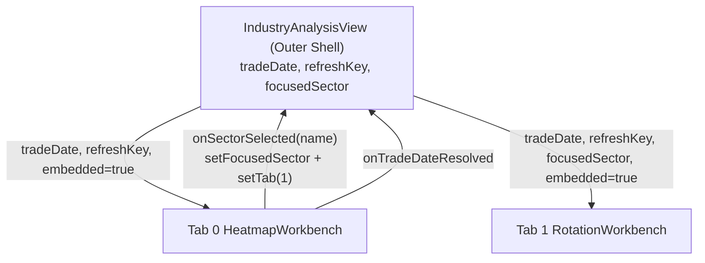

# 行业分析 — 前端设计（v2 重设计）

> 状态：📐 设计中（阶段一）
> 创建日期：2026-04-26
> 主入口：`src/sections/industry-analysis/view/industry-analysis-view.tsx`
> 设计视角：资深金融产品经理 + 资深从业者 + 资深 UI/UE 设计师

---

## 一、功能要点提炼与补充（PM 视角）

### 1.1 用户原始诉求复述

> "对 行业分析这个模块做一次全面的审查，看看是否需要重构，如果需要的话，输出文档"

用户没有列具体痛点，期望先做一次产品视角的体检 → 给出"是否重构 + 重构方案"。

### 1.2 模块定位与价值主张

**30 秒回答**：今天哪些行业（或概念/地域）在涨、在被资金买入、估值还便宜？

**3 分钟动作**：选定一个候选行业 → 看它的轮动特征（动量、近 N 日累计收益、近 N 日资金净流入、估值分位）→ 进入该行业成分股做下一步研究。

**与相邻模块的边界**

| 相邻模块            | 行业分析 不做                                          |
| ------------------- | ------------------------------------------------------ |
| 市场概览            | 不做大盘点位 / 涨跌家数 / 情绪综合                     |
| 资金动态 Tab 3 板块 | 资金动态做"**当日**"板块榜单；行业分析做"**周期**"轮动 |
| 选股器              | 不做多因子筛选；行业分析只到行业层并下钻到成分股 Top   |
| 个股详情            | 行业分析只做入口（点击成分股跳转）                     |

> **关键边界澄清**：现在"行业分析"和"资金动态-板块轮动 Tab"看似重叠（都有行业层榜单），但**时间维度不同**——板块轮动 Tab 是当日截面，行业分析是 1W/1M/3M/6M/1Y 周期。本期重构**保持此边界**，不再合并。

### 1.3 功能要点提炼（结构化）

| #   | 功能点                                     | 用户决策场景                 | 数据来源                                                                              |
| --- | ------------------------------------------ | ---------------------------- | ------------------------------------------------------------------------------------- |
| 1   | 当日行业 / 概念 / 地域涨跌全景             | 30 秒判断今天是哪类板块在动  | `/api/heatmap/data` `/api/market/sector-flow`                                         |
| 2   | 5000 股 TreeMap（按行业 / 指数分组）       | 看个股层异动是否集中在某几只 | `/api/heatmap/data`                                                                   |
| 3   | 行业轮动周期视图（1W/1M/3M/6M/1Y）         | 判断中短期行业强弱排序       | `/api/industry-rotation/heatmap` 等                                                   |
| 4   | 行业 4 维评分（动量 / 收益 / 资金 / 估值） | 综合判断"该不该上车这个行业" | `/api/industry-rotation/{momentum-ranking,return-comparison,flow-analysis,valuation}` |
| 5   | 单行业下钻：N 日趋势 + 成分股 Top          | 选定行业后找具体股票         | `/api/industry-rotation/*` + 个股表                                                   |
| 6   | 管理员：人工触发热力图快照                 | 数据缺日时手动补             | `/api/heatmap/snapshot/*`                                                             |

### 1.4 资深从业者补充（行业最佳实践）

补充以下"用户没说但必备"的项，及补充理由：

1. **统一日期上下文**：当前两个 Tab 各自管理日期（一个 `Dayjs` DatePicker，一个纯文本框 YYYYMMDD），用户切 Tab 后日期归零，违背"我在研究 4/24 这一天"的连贯心智。**必须把日期提到外层共享**。
2. **当日截面 vs 周期视图的桥接**：用户在"全景热力图"里看到某行业当日异动后，希望一键切到"行业轮动"看该行业近 1M 走势。**需要点击行业 → 自动切 Tab + 高亮该行业**。
3. **行业评分综合卡**：行业轮动现在 6 张图各自看，缺一个"4 维综合评分排行榜"（动量 + 收益 + 资金 + 估值打分加权）作为筛选总入口。
4. **不可缺的口径声明**：行业分类来源（申万 / 证监会 / 东财？），轮动收益是否复权，估值分位的滚动窗口长度——任何一项缺失专业用户立刻丧失信任。当前两个视图都没有显式说明。
5. **导出能力对齐**：行业轮动 Tab 有 `ExportButton`，市场热力图 Tab 没有。重构后两者均应能导出当前视图的行业级 CSV。

### 1.5 已确认决策

- [x] **Q1（架构方向）**：✅ 保留两 Tab + 共享日期 + 跨 Tab 联动。当日截面与周期视图认知任务不同，强行合并会让"看周期时被当日工具栏干扰"。
- [x] **Q2（行业分类）**：✅ **后端采用方案 D：申万 L1 主字典 + 东财行业板块映射服务**。
  - 主字典：申万 L1（SW2021），31 个；与东财行业板块 31/31 精确匹配；上市股覆盖 99.65%。
  - 新接口：`POST /api/industry/dict-mapping`（返回 SW → DC 映射表）。
  - `/api/heatmap/data` 增加 `industry_source: 'sw_l1'` + `include_mapping: true`，item 携带 `swCode/swName/dcTsCode/dcBoardCode/dcName`。
  - `/api/industry-rotation/detail` 支持 `tsCode` 优先，`industry` 仅作 fallback / 展示。
  - **跨 Tab 联动策略**：`dcTsCode` 优先（item 自带 → swCode 查字典 → swName 查字典）；全部失败才降级提示。
  - **字典接口失败 / item 无新字段时**：走旧 name 匹配逻辑作为最后兑底；页面不白屏。
  - 详细实现见本文 §八。
- [x] **Q3（综合评分）**：⏸️ **搁置至 AI 介入阶段**。简单加权 25%×4 排行容易"看似客观但缺乏说服力"，AI 接入后可以做自然语言评分理由 + 用户偏好学习。本期降级为"四维并列展示卡"——不加权聚合，让用户肉眼对比四维数据，避免引入弱有据的合成排名。
- [x] **Q4（导出粒度）**：⏸️ 本期不做导出。Tab 1 现有 `ExportButton` 一并移除，避免视觉残留。
- [x] **Q5（管理员快照面板）**：✅ **保留在 Tab 0 底部不迁**。理由：快照触发本质属于"热力图数据维护"，贴近被维护视图能让管理员"看到问题立即修"；散到同步管理反而要回头查问题日期。同步管理那边**不必再做对应入口**。

---

## 二、现状盘点与不足

### 2.1 现有功能清单

| 模块/Tab   | 入口文件                                                                    | 主要数据/接口                                                                                 | 行为                                                                       |
| ---------- | --------------------------------------------------------------------------- | --------------------------------------------------------------------------------------------- | -------------------------------------------------------------------------- |
| 外壳       | `src/sections/industry-analysis/view/industry-analysis-view.tsx`（115 行）  | 无                                                                                            | 包 2 个 Tab，靠 `EMBED_SX` 强行去掉子视图 padding                          |
| Tab 0 全景 | `src/sections/market-heatmap/view/market-heatmap-view.tsx`（~350 行）       | `fetchHeatmapData` / `fetchSectorFlow` / `fetchMainFlowRanking` / `triggerHeatmapSnapshot` 等 | 散点 / TreeMap 切换 + 板块类型 + 分组 + 大小维度 + 行业弹窗                |
| Tab 1 轮动 | `src/sections/industry-rotation/view/industry-rotation-view.tsx`（~170 行） | `fetchRotationOverview` / `fetchRotationHeatmap` / `fetchMomentumRanking` 等 6 个端点         | 周期切换 1W~1Y + 6 个图（总览卡、热力、动量、收益、资金、估值） + 行业抽屉 |
| 子组件总数 | 7（market-heatmap） + 7（industry-rotation） + 1（外壳） = 15               | —                                                                                             | —                                                                          |
| 路由       | `/market/industry`（默认 tab=1）                                            | 兼容重定向：`/market/heatmap` → tab=0；`/market/industry-rotation` → tab=1                    | URL 持久化 tab                                                             |

### 2.2 不足之处（按严重性排序）

| #   | 问题                                                                                                                           | 影响                                                                 | 触发场景                    |
| --- | ------------------------------------------------------------------------------------------------------------------------------ | -------------------------------------------------------------------- | --------------------------- |
| 1   | 两个 Tab 各自管理日期，切 Tab 后用户的日期上下文丢失                                                                           | 心智断裂："我在看 4/24 这一天"被打断                                 | 切 Tab 即触发               |
| 2   | 日期控件不统一：Tab 0 用 `DatePicker`（图形选择），Tab 1 用 `TextField`（要求手敲 YYYYMMDD）                                   | 输入门槛高、容易输错、视觉风格不一致                                 | 在 Tab 1 选日期             |
| 3   | 标题三层重复：外层 H4 "行业分析" + Tab 0 内嵌 H4 "市场热力图" + Tab 1 内嵌 H4 "行业轮动分析"                                   | 信息密度浪费、视觉层级混乱                                           | 始终                        |
| 4   | 包装器用 `EMBED_SX` 强行覆盖子视图 `DashboardContent` 的 padding                                                               | 反向耦合：包装器知道子视图内部 className，子视图独立路由时又恢复正常 | 维护时容易误改              |
| 5   | 跨 Tab 无联动：用户在 Tab 0 看到某行业异动，无法一键带着行业名跳到 Tab 1 周期视图                                              | 决策路径中断                                                         | 完成"当日 → 周期"研究流程时 |
| 6   | "外层壳-空 section 文件夹"反模式：`industry-analysis/` 只有一个 view，违反 quant-client 项目"feature 文件夹包含可复用组件"约定 | 新人不知道真实业务在 `market-heatmap/` + `industry-rotation/`        | 阅读代码时                  |
| 7   | Tab 0 没有"刷新"按钮 / Tab 1 没有数据口径说明（行业字典、复权、估值分位窗口）                                                  | 数据可疑时无法手动复刷；专业用户无法判断口径                         | 数据异常或首次接触模块      |
| 8   | 行业轮动 6 张图各自展示，没有"综合评分"做总入口；用户必须自己脑补加权                                                          | 决策门槛高，模块价值密度未释放                                       | 第一次使用、面对 30+ 行业时 |
| 9   | 概念 / 地域两个维度只在 Tab 0 散点图能看，Tab 1 周期视图缺失                                                                   | 概念股研究链路在周期维度断裂                                         | 研究概念板块的中期表现      |
| 10  | 管理员快照面板挂在 Tab 0 底部，与"同步管理"模块的功能职责重叠                                                                  | 管理员入口分散                                                       | 管理员日常维护              |

### 2.3 重设计应对策略（一一对应 2.2）

| 对应问题 | 应对策略                                                                                                                                                     | 取舍说明                                                                              |
| -------- | ------------------------------------------------------------------------------------------------------------------------------------------------------------ | ------------------------------------------------------------------------------------- |
| #1, #2   | 把 `tradeDate` 提到外壳，统一用 `DatePicker`；切 Tab 不重置                                                                                                  | 与"资金动态"模块对齐，已是项目惯例                                                    |
| #3       | 移除 Tab 0 / Tab 1 内嵌 H4，子视图首屏从工具栏开始                                                                                                           | 只保留外层"行业分析 · 副标题"作为唯一标题                                             |
| #4       | 子视图改造为不再渲染 `DashboardContent`，提供 `embedded?: boolean` prop；在外壳挂载时传 `embedded={true}` 跳过外层容器                                       | 删除 `EMBED_SX` 这种 className 反向耦合；保留旧路由兼容时 `embedded=false`            |
| #5       | 在 `IndustryAnalysisView` 提升 `focusedSector: { dcTsCode, swName, dcName }` 状态；Tab 0 行业弹窗增加"查看 N 日轮动"按钮 → 优先按 `dcTsCode` 跳 Tab 1 + 高亮 | 后端方案 D 保证 31/31 匹配；足够罕见的兑底路径（字典接口 fail）才降级为 name 模糊匹配 |
| #6       | 把 `market-heatmap/`、`industry-rotation/` 收纳到 `industry-analysis/` 下成为子目录；保留各自原名以便 git 历史可追溯                                         | 沿用 sections 一级目录的"feature 必有真实业务组件"约定                                |
| #7       | 外壳新增"刷新"按钮；每个图表卡片右上角加"问号 icon → 口径 Tooltip"；外壳标题旁加"行业字典差异"问号                                                           | Tooltip 仅 icon 触发，不污染卡片其他位置                                              |
| #8       | 新增"四维并列展示卡"——四列分别显示动量 / 收益 / 资金 / 估值各自 Top 10；**不做加权合成排名**                                                                 | 加权综合排名搁置至 AI 介入阶段统一规划，本期避免给出弱有据的合成排行                  |
| #9       | 行业轮动 Tab 增加 `contentType: INDUSTRY \| CONCEPT \| REGION` 切换；后端无对应端点时按维度禁用并显示"该维度数据暂未提供"                                    | 与 Tab 0 控件并行                                                                     |
| #10      | `HeatmapSnapshotPanel` 保留在 Tab 0 底部不迁                                                                                                                 | 快照触发贴近热力图能让管理员"看到问题立即修"；同步管理那边不必再做对应入口            |

---

## 三、功能细化拆分

### 3.1 模块结构树

```text
行业分析 (DashboardContent，外壳唯一)
│
├─ ① 头部条 ────────────────────────────────────────────────────────
│   ├─ 标题：「行业分析」 · 副标题（动态：当前 Tab 摘要）
│   ├─ 共享 DatePicker（YYYYMMDD）+ 「返回最新」+ 「刷新」
│   └─ Tab 切换：[全景热力图] [行业轮动] [概念/地域轮动]（v2 备）
│
├─ ② Tab 0 全景热力图 (HeatmapWorkbench) ──────────────────────────
│   ├─ 工具栏：视图切换 (散点 / TreeMap) | 板块类型 (行业 / 概念 / 地域) | TreeMap 分组 / 大小维度
│   ├─ 主图区（散点 OR TreeMap）
│   └─ 行业弹窗：成分股 Top 涨跌 + Top 资金 + [查看 N 日轮动] 按钮
│
├─ ③ Tab 1 行业轮动 (RotationWorkbench) ──────────────────────────
│   ├─ 工具栏：周期 1W/1M/3M/6M/1Y | 维度 (行业 / 概念 / 地域)
│   ├─ 总览四卡：均涨幅 / 上涨家数 / 平均资金净流 / 资金净流率
│   ├─ 四维并列卡 (新增) — 动量 Top 10 / 收益 Top 10 / 资金 Top 10 / 估值低位 Top 10（仅展示，不合成排名）
│   ├─ 热力 + 动量 + 收益 + 资金 + 估值 五图（沿用现状，加问号口径）
│   └─ 行业抽屉：单行业 N 日趋势 + 成分股 Top
│
└─ ④ 跨 Tab 联动 ─────────────────────────────────────────────────
    Tab 0 行业弹窗点击 → Tab 1 高亮该行业 + 滚动到对应卡片
```

### 3.2 子模块逐个细化

#### 3.2.1 外壳 `IndustryAnalysisView`

- **职责**：拥有共享 `tradeDate`、`refreshKey`、`focusedSector`；切 Tab、跨 Tab 联动均在此处协调。
- **数据**：不直接调 API，仅向下传 props。
- **交互**：
  - DatePicker 改变 → `tradeDate` 改变 → 当前 Tab 子视图内部 `useEffect` 重新拉数。
  - 刷新按钮 → `refreshKey++` → 子视图 `useEffect` 依赖触发。
  - 子视图在 Tab 0 通过 callback `onSectorSelected(sectorName)` 报上来 → 外壳 `setFocusedSector(name)` + `setCurrentTab(1)`。
- **状态**：`tradeDate: Dayjs | null`、`apiFetchDate: string | undefined`、`refreshKey: number`、`focusedSector: string | null`。
- **边界**：URL `?tab=` 持久化；首次挂载允许 `tradeDate=null` 让子视图回填实际最新交易日（沿用资金动态模块 `onTradeDateResolved` 模式）。

#### 3.2.2 Tab 0 `HeatmapWorkbench`（重构 `MarketHeatmapView`）

- **职责**：当日行业 / 概念 / 地域全景 + 个股层 TreeMap。
- **数据**：保持现状 `fetchHeatmapData` / `fetchSectorFlow` / `fetchMainFlowRanking`。
- **交互变更**：
  - 移除内嵌 H4；移除 DatePicker（接受外部 prop）。
  - 行业弹窗增加"查看 N 日轮动"按钮 → 触发 prop callback `onSectorSelected(name)`。
  - 移除 `HeatmapSnapshotPanel`（迁同步管理）。
- **新增**：每个图表卡右上角问号 → 口径 Tooltip（行业字典来源、当日成交额单位、散点 X/Y/Z 含义）。
- **边界**：当 `tradeDate` 为周末或停牌日，后端返回空数组时，主图区显示"该日无市场数据，请选择最近交易日"。

#### 3.2.3 Tab 1 `RotationWorkbench`（重构 `IndustryRotationView`）

- **职责**：周期视角的行业强弱多维呈现（不下结论，不合成排名）。
- **数据**：保持现状 6 个端点。
- **交互变更**：
  - 移除内嵌 H4、TextField 日期、ExportButton；接受外部 `tradeDate` prop。
  - 增加 `contentType` toggle（行业 / 概念 / 地域），后端不支持时按维度禁用并显示"该维度数据暂未提供"。
  - `focusedSector` prop（结构 `{ dcTsCode?, swName?, dcName? }`）：优先按 `dcTsCode` 在轮动数据中高亮；有值时挂载后自动滚动到"动量排行"卡 + 该行高亮 800ms。
  - 调 `/api/industry-rotation/detail` 时：有 `dcTsCode` 必须优先传 `tsCode`；`industry` 同时传入（后端 fallback 与展示用）；无 `dcTsCode` 才退到仅传 `industry` 的旧逻辑。
  - 详细联动伪代码见 §八。
- **新增 `RotationFourFacetCard`（替代综合评分）**：
  - 输入：动量、收益、资金、估值四个排名响应。
  - 输出：四列并列展示，每列内部按本维度排序 Top 10；只展示数值，**不做归一化、不做加权、不输出综合分**。
  - 视觉：四列 `Grid xs=12 sm=6 md=3`；每列内部 8 行精简表（行业名 + 该维度数值 + 颜色编码）；列间用 1px divider 分隔。
  - 价值：肉眼跨列对比哪个行业在多个维度同时强（如同时上动量榜与资金榜），用户自己给结论而不被算法误导。
- **状态**：`period`、`contentType`。

#### 3.2.4 行业详情下钻

- **统一组件**：抽 Tab 0 的 `HeatmapSectorDetailDialog` + Tab 1 的 `RotationDetailDrawer` 的"行业 → 成分股 Top"部分为共用 `<SectorDrillPanel>`，避免双份维护。
- **本期取舍**：弹窗 vs 抽屉的容器形式不强制统一（弹窗适合当日横向对比，抽屉适合周期纵向阅读）；只统一**内容块**。

### 3.3 数据流与状态管理



- **共享上下文**：`tradeDate`、`refreshKey`、`focusedSector` 全部在外壳；不引入 Context Provider（两层就够了）。
- **跨 Tab 联动**：仅在外壳通过 callback 触发，不允许 Tab 0 和 Tab 1 互相 import。
- **本地状态**：每个 Tab 内的 `viewMode` / `period` / `contentType` 留在子视图（切 Tab 不重置 = 父组件中 Tab 共存于 DOM 时使用 `display:none` 切换 vs 完全卸载？取舍：本期保持卸载方案，简单优先）。

---

## 四、UI/UE 设计

### 4.1 设计概念关键词

**Editorial Data Lab（编辑级数据排版）+ Quiet Trading Terminal（克制的交易终端）**

行业分析对应的是"研究而非盯盘"——节奏比资金动态慢，所以视觉密度可比资金动态略低，但保留终端式的等宽数字与左侧色条。

### 4.2 必须遵守的项目 UI 规范（quant-client）

- 颜色：仅用 `theme.palette.*` / `varAlpha(theme.vars.palette.*Channel, ...)`；涨红用 `error`，跌绿用 `success`。
- 字号最小 12px，数字使用等宽字体（`fontVariantNumeric: 'tabular-nums'`）。
- MUI 子路径导入；sx prop 优先；间距 8 倍数（8 / 16 / 24）。
- 动效仅数据更新瞬间使用 200ms fade，禁止位移 / 缩放炫技。
- Tooltip 仅由问号 icon 触发，hover 卡片其他位置不响应。

### 4.3 页面布局

```text
┌──────────────────────────────────────────────────────────────────┐
│ 行业分析                                                          │
│ 副标题：当前 Tab 摘要（动态生成）          [DatePicker] [刷新]    │
├──────────────────────────────────────────────────────────────────┤
│  Tabs:  [全景热力图]  [行业轮动]  ─────────────────────────────  │
├──────────────────────────────────────────────────────────────────┤
│                                                                  │
│   [Tab 内容区，子视图自管理工具栏 + 主图]                        │
│                                                                  │
└──────────────────────────────────────────────────────────────────┘
```

**Tab 0 (HeatmapWorkbench) 布局**：

```text
工具栏：[散点 | TreeMap]  [行业 | 概念 | 地域] | [TreeMap 分组] | [大小维度]
─────────────────────────────────────────────────────────────────
主图（散点 OR TreeMap，全宽，高 540px）
─────────────────────────────────────────────────────────────────
辅助 (xs=12 md=6) 行业涨跌排行 | (xs=12 md=6) 涨跌分布饼
```

**Tab 1 (RotationWorkbench) 布局**：

```text
工具栏：[1W | 1M | 3M | 6M | 1Y]  [行业 | 概念 | 地域]
─────────────────────────────────────────────────────────────────
总览四卡（xs=12 md=3 ×4）：均涨幅 / 上涨家数 / 资金净流 / 净流率
─────────────────────────────────────────────────────────────────
四维并列卡（全宽）：动量 Top10 | 收益 Top10 | 资金 Top10 | 估值 Top10
─────────────────────────────────────────────────────────────────
热力图（全宽）
─────────────────────────────────────────────────────────────────
动量排名（xs=12 md=6）           | 收益对比（xs=12 md=6）
─────────────────────────────────────────────────────────────────
资金流向（全宽）
─────────────────────────────────────────────────────────────────
估值分位（全宽）
```

### 4.4 关键组件设计要点

- **共享 DatePicker**：与资金动态模块视觉一致（width 200，size small，`shouldDisableDate` 屏蔽周末）。
- **副标题动态化**：Tab 0 时显示"全景 · 当日 / 当日成交 X 万亿 / 上涨 X 家"；Tab 1 时显示"轮动 · {period} / 涨幅 Top3：xxx, xxx, xxx"。
- **行业字典状态指示**（外壳标题旁问号 icon + 副标题状态行）：
  - 映射正常：“行业字典：申万 L1 → 东财行业板块，已匹配 31/31”
  - 有未匹配：“行业字典：部分行业暂未匹配，未匹配 X 个”
  - 接口失败：“行业字典暂不可用，跨 Tab 跳转将使用降级逻辑”
  - Tooltip 补充：“主字典 SW2021，热力图按申万一级分组；点击行业后后端返回东财板块 ts_code 作跨 Tab 跳转。”
- **四维并列卡**：每列宽度等分（`Grid xs=12 sm=6 md=3`），列内表格行高 32px；每列顶部小标题 + 问号（说明该维度数据来源与单位）；行业名超出截断 + Tooltip 显示全称；同行业在多列出现时不做特殊高亮（避免误导用户认为系统在推荐）。
- **问号 icon**：`solar:question-circle-bold`，16px，`text.secondary`，hover → `text.primary`，仅 icon 触发 Tooltip。
- **行业弹窗 → "查看 N 日轮动" 按钮**：`Button startIcon={<Iconify icon="solar:graph-up-bold" />}`，点击关闭弹窗 + 触发外壳跳 Tab。
- **空 / Error 状态**：单行说明 + 灰底 16px icon + 操作建议（"点击刷新重试"或"换个交易日"）；跨 Tab 字典未匹配时给"该行业在轮动数据中暂未找到对应板块"；禁止插图。

### 4.5 交互细节

- 切 Tab 不重置共享 `tradeDate` 与 `refreshKey`，但子 Tab 内部 `period` / `viewMode` 仍各自保留（不互相影响）。
- 跨 Tab 联动后高亮 800ms 后自动衰减为正常态，避免持久高亮干扰。
- DatePicker 选未来日期 → 子视图后端报错 → 副标题改为红色"该日数据不存在"。

### 4.6 暗色 / 亮色双主题适配

- 综合评分色条用 `varAlpha(theme.vars.palette.error.mainChannel, ...)`，无硬编码 rgba。
- 散点图 / TreeMap 颜色映射函数 `getHeatmapColor` 现状已基于阈值返回 hex；本次重构补一层"读 theme 后取色"，确保暗色主题下不刺眼。

---

## 五、实现步骤与要点

### 5.1 实现顺序

1. **后端配套**：本期依赖后端方案 D 提供的 3 个接口变化（见 §八）：新增 `/api/industry/dict-mapping`；`/api/heatmap/data` 请求体新增 `industry_source` + `include_mapping`；`/api/industry-rotation/detail` 请求体新增 `tsCode`。其余轮动 5 个端点不变。
2. **目录调整**（git mv 保留历史）：
   - `src/sections/market-heatmap/` → `src/sections/industry-analysis/heatmap/`
   - `src/sections/industry-rotation/` → `src/sections/industry-analysis/rotation/`
   - 兼容旧路由：`/market/heatmap` 和 `/market/industry-rotation` 仍重定向到 `/market/industry?tab=0|1`（已存在）。
3. **子视图 props 化**：
   - `MarketHeatmapView`、`IndustryRotationView` 接受 `tradeDate?: string`、`refreshKey?: number`、`embedded?: boolean`、`onSectorSelected?: (name: string) => void`、`focusedSector?: string | null`（仅 Rotation）。
   - `embedded === true` 时不渲染 `DashboardContent` 与内嵌 H4；删除 `EMBED_SX`。
4. **外壳 `IndustryAnalysisView`**：
   - 引入共享 DatePicker / 刷新按钮 / 副标题动态文案。
   - 引入 `focusedSector` 状态 + `handleSectorSelected` callback。
5. **Tab 1 四维并列卡**：
   - 新增 `rotation/rotation-four-facet-card.tsx`。
   - 输入：四个排名数组（来自 `fetchMomentumRanking` / `fetchReturnComparison` / `fetchFlowAnalysis` / `fetchSectorValuation`）。
   - 输出：四列等宽，每列 Top 10，仅展示原始值，不做归一化也不合成排名。
6. **行业弹窗 → 跨 Tab 跳转**：
   - `HeatmapSectorDetailDialog` 增加 `onSwitchToRotation?: (payload: { dcTsCode?: string; swName?: string; dcName?: string }) => void` prop。
   - 外壳 `handleSectorSelected` 里按 `item.dcTsCode → swCode 查字典 → swName 查字典` 顺序解析出 `dcTsCode`；解析不到时不切 Tab，仅在 Tab 0 外壳副标题提示。
7. **删除**：
   - 移除外壳 `EMBED_SX`。
   - 移除 Tab 1 工具栏 `ExportButton`（本期不做导出）。
   - **不**移除 Tab 0 底部 `HeatmapSnapshotPanel`（保留管理员入口）。
8. **导航 / 路由**：保持 `/market/industry` 不变；nav 配置无改动。

### 5.2 关键技术点

- **行业字典缓存**：`useIndustryDictMapping()` hook 包装 React Query，`staleTime: 24h`，`gcTime: 24h`，key 不含 `tradeDate`（字典与交易日无关）。实现可复用项目现有 `apiClient.post` + React Query 模式。
- 状态共享方案：纯 props drilling（两层），不引入 Context / Zustand。
- **性能敏感处**：
  - TreeMap 5000+ 节点：保持现状 ApexCharts，仅在 `viewMode === 'treemap'` 时拉数据（已有惰性逻辑）。
  - 综合评分前端归一化：`useMemo` 缓存依赖 4 个数组引用。
  - Tab 切换：保持卸载方案（简单优先），下次再考虑 `display:none` 保留状态。
- **容错**：
  - 任一 API 失败 → 卡片单独空态，不影响其他卡片。
  - `tradeDate` 周末 / 节日 → 后端通常会回退到最近交易日；前端 `onTradeDateResolved` 把实际值回填到 DatePicker。

### 5.3 风险与回退

| 风险                                                          | 应对                                                                                                                          |
| ------------------------------------------------------------- | ----------------------------------------------------------------------------------------------------------------------------- |
| `git mv` 后老 PR / 老 import 路径失效                         | 一次性提交目录迁移；CI 出现 import 错误时一并修复                                                                             |
| 子视图 `embedded` prop 双形态（独立路由 vs 嵌入）测试覆盖不足 | E2E + 手动验证 `/market/heatmap` 重定向后视觉一致；`embedded=false` 走旧逻辑                                                  |
| 字典接口 `/api/industry/dict-mapping` 首载失败                | 页面主体不受影响；顶部状态行显示"行业字典暂不可用"；跨 Tab 跳转降级为旧 name 模糊匹配；`useIndustryDictMapping` 启用重试 1 次 |
| `industry_source=sw_l1` 热力图后端返回空 / 字段不全           | 跳转降级依赖字典索引查 swName；全部获取不到时提示"该行业在轮动数据中暂未找到对应板块"                                         |
| 跨 Tab 联动改变 URL `?tab=` 时引起 `useSearchParams` 二次渲染 | 用 `useCallback` + `replace` 模式更新 URL，避免抖动                                                                           |

---

## 六、验收方式与细节

### 6.1 功能验收清单

- [ ] 顶部 DatePicker 改变 → 两个 Tab 数据均能在切换后看到正确日期
- [ ] 切 Tab 不重置 `tradeDate`、不重置子 Tab 内 `period` / `viewMode`
- [ ] Tab 0 行业弹窗"查看 N 日轮动"按钮 → Network 中 `/api/industry-rotation/detail` 请求体含 `tsCode: 'BK0xxx.DC'`，同时携带 `industry`；命中时高亮 800ms，未命中时副标题给字典差异提示
- [ ] 顶部状态行准确反映字典状态（正常 / 有未匹配 / 接口失败）三种状态文案
- [ ] 热力图请求体携带 `industry_source: 'sw_l1'` + `include_mapping: true`；响应 item 含 `swCode/dcTsCode`（可 Network 抓包验证）
- [ ] 字典接口 24h 缓存生效：页面刷新后首载只调一次 `/api/industry/dict-mapping`
- [ ] Tab 1 四维并列卡四列各 Top 10 数据正确；同行业在多列出现时不做特殊高亮
- [ ] Tab 1 维度切换：行业可用；概念 / 地域在后端不支持时显示明确提示，不报错
- [ ] 每个图表卡右上角问号 → Tooltip 仅 icon 触发；包含行业字典来源、复权口径、估值窗口三项
- [ ] 外壳标题旁"行业字典差异"问号能正确弹出说明
- [ ] 旧路由 `/market/heatmap`、`/market/industry-rotation` 仍能正常访问
- [ ] Tab 0 底部 `HeatmapSnapshotPanel` 仍对管理员可见、对普通用户隐藏

### 6.2 UI/UE 验收清单

- [ ] 通过 `web-design-guidelines` skill 审查（阶段二末执行）
- [ ] 暗色 / 亮色双主题截图无问题（散点配色、综合评分色条均自适应）
- [ ] 字号 ≥ 12px；`grep -rE "fontSize:\s*(10|11)" src/sections/industry-analysis` 无匹配
- [ ] 1440 / 1920 宽度无横向滚动；移动端 xs 下网格垂直堆叠

### 6.3 性能与质量验收

- [ ] `node_modules/.bin/eslint --fix "src/**/*.{ts,tsx}"`
- [ ] `node_modules/.bin/eslint "src/**/*.{ts,tsx}"` 无输出
- [ ] `yarn build` 输出 `✓ built in ...`
- [ ] 单 Tab 切换不触发其他 Tab 的网络请求（看 Network 面板）
- [ ] 行业弹窗打开 / 关闭无内存泄漏（前后两次 heap snapshot 差值 < 1MB）

### 6.4 验收数据样例

- 一份正常交易日（如 20260424）：两 Tab 全图表渲染、综合评分前 5 行数据合理
- 一份停牌日 / 周末（如 20260425）：DatePicker 自动屏蔽，主图显示"该日无数据"
- 一份零数据日（mock 后端返回空数组）：每个图表独立空态、不互相影响

---

## 七、组件清单与改造范围

| 文件                                                                               | 操作 | 说明                                                                                                                                      |
| ---------------------------------------------------------------------------------- | ---- | ----------------------------------------------------------------------------------------------------------------------------------------- |
| `src/sections/industry-analysis/view/industry-analysis-view.tsx`                   | 重构 | 提升 `tradeDate` / `refreshKey` / `focusedSector` 到外壳；副标题动态化；新增刷新按钮 + 行业字典差异问号                                   |
| `src/sections/market-heatmap/` → `src/sections/industry-analysis/heatmap/`         | 移动 | git mv 整体迁入                                                                                                                           |
| `src/sections/industry-rotation/` → `src/sections/industry-analysis/rotation/`     | 移动 | git mv 整体迁入                                                                                                                           |
| `heatmap/view/market-heatmap-view.tsx`                                             | 改造 | 接受外部 props；`embedded` 模式下去掉 `DashboardContent` + 内嵌 H4 + DatePicker                                                           |
| `rotation/view/industry-rotation-view.tsx`                                         | 改造 | 接受外部 props；`embedded` 模式下去掉 `DashboardContent` + 内嵌 H4 + TextField + ExportButton；新增 `contentType` 与 `focusedSector` 高亮 |
| `heatmap/heatmap-sector-detail-dialog.tsx`                                         | 改造 | 新增"在行业轮动中查找该行业"按钮 + `onSwitchToRotation` prop                                                                              |
| `rotation/rotation-four-facet-card.tsx`                                            | 新增 | 四维并列展示卡（动量/收益/资金/估值各 Top 10），不合成排名                                                                                |
| `src/api/industry-dict.ts`                                                         | 新增 | 封装 `fetchIndustryDictMapping()`；导出 `IndustryDictMappingItem` / `IndustryDictMappingResponse` 等类型                                  |
| `src/utils/industry-mapping.ts`                                                    | 新增 | `buildIndustryMappingIndexes` / `resolveDcTsCodeFromHeatmapItem` / `formatIndustryDictStatus`                                             |
| `src/hooks/use-industry-dict-mapping.ts`                                           | 新增 | React Query hook，24h 缓存；返回 `{ items, indexes, coverage, status, refetch }`                                                          |
| `src/api/heatmap.ts`                                                               | 改造 | `fetchHeatmapData` 请求体增 `industry_source?: 'sw_l1'` / `include_mapping?: boolean`；`HeatmapItem` 增 5 个 optional 字段                |
| `src/api/industry-rotation.ts`                                                     | 改造 | `fetchIndustryRotationDetail` 请求体增 `tsCode?: string`；`industry` 改为可选                                                             |
| `heatmap/heatmap-snapshot-panel.tsx`                                               | 保留 | 不动；管理员入口继续在 Tab 0 底部                                                                                                         |
| `industry-analysis-view.tsx` 中的 `EMBED_SX`                                       | 删除 | 由 `embedded` prop 替代                                                                                                                   |
| `src/routes/sections.tsx` 中 `/market/heatmap`、`/market/industry-rotation` 重定向 | 保留 | 路径仍指向 `/market/industry?tab=*`                                                                                                       |
| `src/layouts/nav-config-dashboard.tsx` 行业分析菜单项                              | 不变 | 单一入口已满足                                                                                                                            |

---

## 八、Q2 方案 D 落地：接口与字典联动详设

本章为 Q2 的唯一权威来源。与后端联调请以本章为准。

### 8.1 后端提供的三个接口变化

#### 8.1.1 新增 `POST /api/industry/dict-mapping`

请求：

```json
{ "source": "sw_l1", "target": "dc_industry", "includeUnmatched": true }
```

响应 `data`：

```ts
export interface IndustryDictMappingResponse {
  source: 'sw_l1';
  target: 'dc_industry';
  version: string | null; // 'SW2021'
  tradeDate: string | null;
  coverage: IndustryDictMappingCoverage;
  items: IndustryDictMappingItem[];
}

export interface IndustryDictMappingCoverage {
  total: number;
  matched: number;
  unmatched: number;
  matchRate: number; // 0~1
  listedStockCount: number;
  listedStockMappedCount: number;
  listedStockMappedRate: number; // 0~1
}

export interface IndustryDictMappingItem {
  swCode: string; // '801120.SI'
  swName: string; // '食品饮料'
  dcTsCode: string | null; // 'BK0438.DC'
  dcBoardCode: string | null; // 'BK0438'
  dcName: string | null;
  matchType: 'exact' | 'override' | 'candidate' | 'none';
  confidence: number; // 0~1
}
```

#### 8.1.2 `POST /api/heatmap/data` 请求体增量

```ts
// 新增两个 optional 字段（snake_case 传参）
industry_source?: 'sw_l1';   // 不传 = 走旧逻辑
include_mapping?: boolean;
```

`HeatmapItem` 类型扩展（仅当两参同时启用时携带）：

```ts
export interface HeatmapItem {
  // ...原有字段
  swCode?: string | null;
  swName?: string | null;
  dcTsCode?: string | null;
  dcBoardCode?: string | null;
  dcName?: string | null;
}
```

#### 8.1.3 `POST /api/industry-rotation/detail` 请求体增量

```ts
export interface IndustryRotationDetailQuery {
  tsCode?: string; // 新增：有值时优先
  industry?: string; // 仅 fallback / 展示
  days?: number;
}
```

调用规则：`dcTsCode` 存在时**必须**传 `tsCode`，`industry` 一并传入；二者同传不冲突。

### 8.2 前端新增文件

```text
src/api/industry-dict.ts                # fetchIndustryDictMapping
src/utils/industry-mapping.ts           # 索引构建 + 解析 + 状态文案
src/hooks/use-industry-dict-mapping.ts  # React Query hook，24h 缓存
```

### 8.3 工具函数签名

```ts
// utils/industry-mapping.ts
export interface IndustryMappingIndexes {
  bySwCode: Map<string, IndustryDictMappingItem>;
  bySwName: Map<string, IndustryDictMappingItem>;
  byDcTsCode: Map<string, IndustryDictMappingItem>;
}

export function buildIndustryMappingIndexes(
  items: IndustryDictMappingItem[]
): IndustryMappingIndexes;

// 从热力图 item 中解析出 dcTsCode；优先级：item 自带 → swCode → swName/groupName/industry
export function resolveDcTsCodeFromHeatmapItem(
  item: Pick<HeatmapItem, 'dcTsCode' | 'swCode' | 'swName' | 'groupName' | 'industry'>,
  indexes: IndustryMappingIndexes | null
): { dcTsCode: string | null; swName: string | null; dcName: string | null };

export function formatIndustryDictStatus(state: {
  coverage: IndustryDictMappingCoverage | null;
  failed: boolean;
}): { tone: 'normal' | 'warning' | 'error'; text: string };
```

### 8.4 hook 约定

```ts
// hooks/use-industry-dict-mapping.ts
export function useIndustryDictMapping(): {
  items: IndustryDictMappingItem[] | undefined;
  indexes: IndustryMappingIndexes | null;
  coverage: IndustryDictMappingCoverage | null;
  status: 'idle' | 'loading' | 'success' | 'error';
  refetch: () => void;
};
```

React Query 配置：`staleTime: 24h`、`gcTime: 24h`、key 不含 `tradeDate`、失败重试 1 次。

### 8.5 跨 Tab 联动伪代码

```ts
// IndustryAnalysisView 外壳
const { indexes } = useIndustryDictMapping();

const handleSectorSelected = useCallback(
  (src: HeatmapItem) => {
    const resolved = resolveDcTsCodeFromHeatmapItem(src, indexes);
    if (!resolved.dcTsCode) {
      setHeadlineHint('该行业在轮动数据中暂未找到对应板块（行业字典差异）');
      return;
    }
    setFocusedSector({
      dcTsCode: resolved.dcTsCode,
      swName: resolved.swName,
      dcName: resolved.dcName,
    });
    setCurrentTab(1);
  },
  [indexes]
);
```

```ts
// RotationWorkbench 内部 detail 请求
fetchIndustryRotationDetail({
  tsCode: focusedSector?.dcTsCode,
  industry: focusedSector?.dcName ?? focusedSector?.swName,
  days: selectedDays,
});
```

### 8.6 顶部状态行文案表

| 字典状态             | tone    | 文案                                           |
| -------------------- | ------- | ---------------------------------------------- |
| `unmatched === 0`    | normal  | 行业字典：申万 L1 → 东财行业板块，已匹配 31/31 |
| `unmatched > 0`      | warning | 行业字典：部分行业暂未匹配，未匹配 {n} 个      |
| `status === 'error'` | error   | 行业字典暂不可用，跨 Tab 跳转将使用降级逻辑    |

视觉：外壳副标题同行右侧 `caption` 12px `text.secondary`；warning 时 `warning.main`，error 时 `text.disabled`。

### 8.7 兼容与降级路径

1. 后端未返回新字段 / `industry_source` 未生效：item 处 `dcTsCode` 为 `undefined`，联动重走"查字典"。
2. `/api/industry/dict-mapping` 首载失败：页面主体不受影响；跨 Tab 联动降级为旧 `name` 模糊匹配（在已加载的轮动数据中查找同名项）；状态行 hover 提供"重试"。
3. 全部失败：进入 Tab 1 后 `focusedSector` 为 `null`，不高亮；`/api/industry-rotation/detail` 仅传 `industry`，由后端 fallback。

### 8.8 验收补充点

- [ ] Network: 页面刷新后 `/api/industry/dict-mapping` 调用一次；后续 Tab 切换不重复调用
- [ ] Network: `/api/heatmap/data` 请求体含 `industry_source: 'sw_l1'` 与 `include_mapping: true`；响应 item 含 `swCode/dcTsCode`
- [ ] Network: 点击热力图"查看 N 日轮动"后 `/api/industry-rotation/detail` 请求体同时含 `tsCode` 与 `industry`
- [ ] 手动断网路径：mock `/api/industry/dict-mapping` 返回 500，页面不白屏，顶部状态行显示"行业字典暂不可用"
